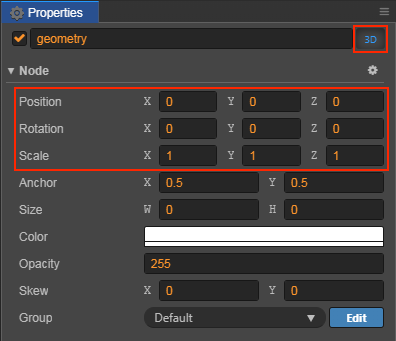

# 3D Node

> Authors: Xunyi, youyou

## Node API upgrade

Since Cocos Creator supports 3D features in v2.1, the API for the corresponding node also needs to be upgraded from 2D to 3D.

The most significant change is that the type of rotation will be changed from `Number` to `cc.Quat` in later versions, if you want to rotate nodes in 2D space as before, you can use the `angle` attribute. Correspondingly, the `setRotation` and `getRotation` will also be changed to use `cc.Quat`.

Please refer to the following table for specific upgrades:

API | v2.0.3 | v2.1 - 2.x | v3.x
------------ | ------------- | --------- | --------
rotationX, rotationY | KEEP `Number` | DEPRECATE,<br>USE `eulerAngles` | DEPRECATE
rotation | KEEP `Number` | DEPRECATE,<br>USE `angle` | GET `cc.Quat`
angle | ADD `-rotation` | `-rotation` | `-rotation`
scale | KEEP `Number` | KEEP `Number` | KEEP `Number`
getRotation() | KEEP `Number` | DEPRECATE,<br>USE `angle` | GET `cc.Quat`
getRotation(cc.Quat) | GET `cc.Quat` |  | 
setRotation | KEEP `Number` | DEPRECATE SET `Number`,<br>USE `angle` | SET `cc.Quat`
setRotation | SET `cc.Quat` | |
getScale() | KEEP `Number` | DEPRECATE,<br>USE `scale` | GET `cc.Vec2` / `cc.Vec3`
getScale(cc.Vec2/cc.Vec3) | GET `cc.Vec2` / `cc.Vec3` |  |
setScale | KEEP `Number` | KEEP `Number` | KEEP `Number`
position | KEEP `cc.Vec2` | GET `cc.Vec3` | GET `cc.Vec3`

## Open 3D node

After Cocos Creator v2.1 adds 3D support, the nodes are divided into 2D nodes and 3D nodes.
The difference between them is that 2D nodes are only considered in 2D space when doing matrix calculations or some property settings, which can save a lot of running overhead.

The newly created node is a 2D node By default, and there are two ways to set the node to be a 3D node:

- Click the **3D** button at the top right of the **Properties** to switch:

  

  As you can see, when a node is switched to a 3D node, the values that can be set in the rotation, position, and scaling, etc parameters change from two to three,increasing the Z-axis coordinates. This allows us to easily edit the 3D properties of the node in the **Properties**.

- Toggle in code

  ```js
  node.is3DNode = true;
  ```

**Note**: Color and Opacity properties of 3D nodes may not take effect on some renderer components.
