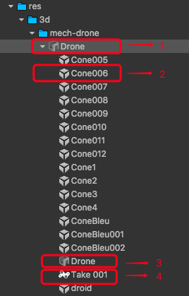
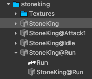
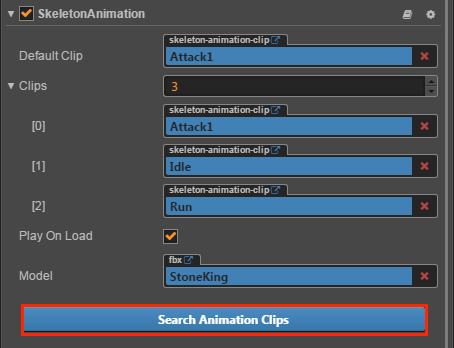

# Import Model

> Authors：Xunyi, youyou

Currently Cocos Creator supports importing 3D models using a very wide range of **.fbx** formats, and basically all 3D modeling software supports exporting this format.

The process of importing is simple, just drag the **.fbx** model resource into the **Assets**, and wait a moment to complete the import work. After the import is complete, you can see that the imported model resource is an expandable folder in **Assets**. When importing the model, When you import a model, the editor will automatically parses the contents of the model and generates resources such as **Prefab**, **meshes**, and **skeletal animations**.

- **1** is the model resource
- **2** is the grid resource
- **3** is the prefab resource 
    **Attention**: When importing, those automatically generated Prefab resources cannot be modified. If you need to modify them, you can drag the generated prefab into the **Scene** for editing. After editing, drag and drop it into the **Asset** to generate a new Prefab, and use this as your own Prefab.
- **4** is the skeleton animation resource

## Associated texture resources

Most models will have texture resources. When importing the model, these texture resources need to be placed in the specified location before they are found by the import system and associated with the Mesh Renderer

The import system will first search for the corresponding texture from the model folder. If it is not found, then go to **textures** or **Textures** under the model folder for look up.

**Attention**: The correct search for the texture needs to satisfy that the texture be imported before imported model, or to be imported with the model at the same time

## Associated skeleton animation resource

The skeletal animation clip can be placed in the model along with the grid resource, or it can be placed separately in another model and named after the **Model name@Animation name** name. A separately stored skeleton animation clip will be named with the specified name when it is imported.

If there is skeletal animation in the model, the import system will automatically add a [skeleton animation component](skeleton-animation.md) to the Prefab of the model

When you click the **Search Animation Clips** button in the component, the component will search for the model named after the **Model name@Animation name** format under the current model folder, and associate with the skeletal animation clips in it.

