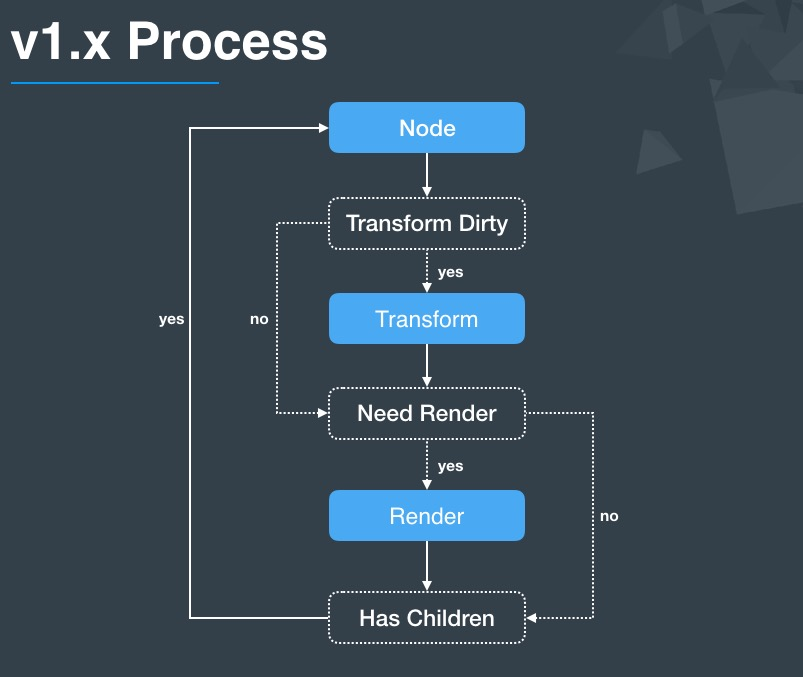
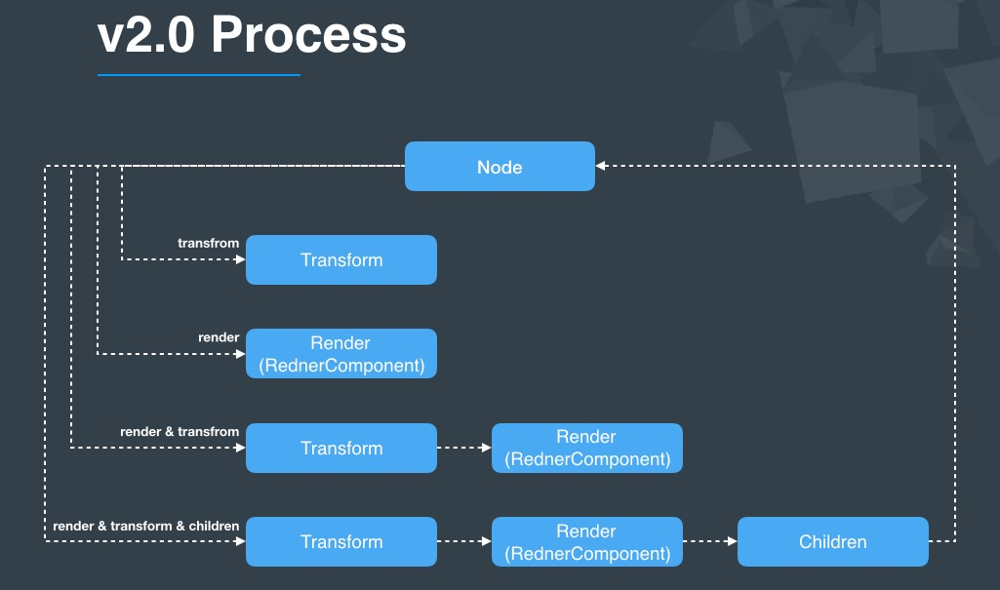

# RenderFlow

The RenderFlow is a new process in v2.0. Its role is to eliminate useless rendering branches, and only into the predefined rendering branches, which can effectively reduce a number of dynamic checks.

## v1.x Rendering Process

In v1.x, each rendering will do a lot of dynamic judgments, first to traverse all the child nodes, in the traversal of the child nodes to determine whether we need to update the matrix, whether we need to render. If there are lots of states, there will be many useless branch judgments. For example, the use of an empty node as a parent node is not need to render, but it was judged during the rendering process, which consumes a lot of performance.

## v2.x Rendering Process

In v2.x, RenderFlow divides multiple render states according to the frequency of calls in the rendering process, such as Transform, Render, Children and so on, and each render state corresponds to a function. During the initialization of the RenderFlow, the corresponding rendering branches are created in advance based on these states, which link the corresponding states in turn.

For example, if a node needs to update the matrix in the current frame and needs to render itself, then this node will update his flag as:

`node._renderFlag = RenderFlow.FLAG_TRANSFORM | RenderFlow.FLAG_RENDER`

When rendering this node, RenderFlow will enter the **transform => render** branch according to the `node._renderFlag` state of the node, and without any additional state judgment.

