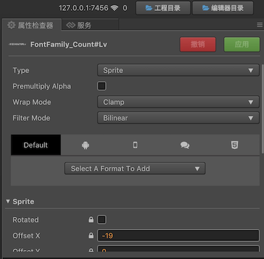
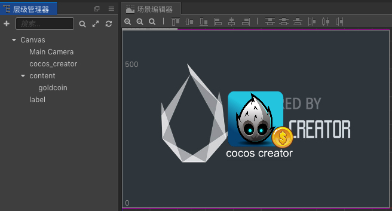
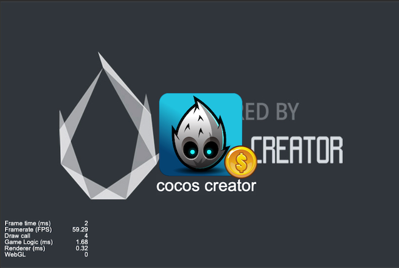

# UI Rendering Batch Processing Guide

## Foreword

In game development, Draw call is a very important performance indicator that directly affects the overall performance of the game. Draw call is the CPU call graphics API, such as OpenGL, command GPU to draw graphics. One Draw call represents one graphics drawing command. Due to the CPU and GPU rendering state switching consumption caused by Draw call, it is often necessary to reduce the number of Draw call calls by batch merging. The essence of batch merging is to ensure that the rendering state of consecutive nodes is consistent during the rendering process of one frame, and merge as many node data as possible into one-time submission. Thereby reducing the number of calls of drawing instructions and reducing the performance consumption caused by graphics API calls, and also avoiding The GPU performs frequent rendering state switching. The rendering state includes: Texture state, Blend mode, Stencil state, Depth Test state, and so on.

## Texture State

The texture states that can be edited in Creator include: Image resource, Filter Mode, Premultiply State, Wrap Mode. As shown below:



In order to ensure that the texture image resources used by the nodes are consistent, the engine provides two methods of texture merge, static and dynamic texture merge.

### Static Texture Merge

The static texture merge is the automatic atlas provided by the editor, and other third-party atlas packaging tools such as: TexturePacker. The image is merged at the resource level to ensure that the UI nodes use the same texture, because the texture state of the same atlas is consistent, so the batch rendering can be achieved.

For the Label component, in order to ensure that all Label nodes use the same texture, BMFont is usually used to package the UI text to be used in advance, and the automatic atlas is combined with the small image into a large texture, which can be combined with other adjacent Sprite nodes. For the creation and setting of Auto Atlas, you can refer to [Auto Atlas Resource](../asset-workflow/auto-atlas.md) to create a new Auto Atlas resource configuration, and then put all the UI images, BMFont and the art figures you want to compose drag to the directory where the Auto Atlas resources are located. BMFont's text production can use the BMFont font creation tool to generate commonly used art words or texts to generate a font image and its font mapping file. Then drag directly into the editor to use.

#### Best practices of static texture merge

Since the size of the texture is limited by different platforms, the maximum size is preferably controlled within `2048 * 2048`. In this way, the space of a single atlas is limited, and in order to avoid the problem that the loading is slow with the large atlas resources when the UI interface is opened. Usually, the image resource used by a single UI interface is put into a same folder and create an automatic atlas for the folder, which ensures that the texture image resources used by the same interface are consistent.  
If the size of Auto Atlas is large, but the current scene actually uses only a small part of the scatter, it may also cause **waste**, resulting in increased game load time and increased memory usage. In this case, static texture merge is not used, and dynamic mapping by the engine may be a better choice. The preview function of the Auto Atlas is as shown below:


When all nodes of the same interface use the same atlas, the Draw call will be **1** when it is optimal. When the interface is closed, the atlas resources used by the interface can be destroyed, so that the memory space occupied by the interface can be released in time to achieve optimal memory control, and avoided the program exit caused by the memory usage is too high.

### Dynamic Texture Merge

In addition to the previously mentioned waste of static drawing space, the limitations of static drawing are often reflected in the rendering process of dynamic text. For example, when the Label component uses system text, the text texture is dynamically generated by Canvas drawing according to the text content, and the atlas cannot be packaged in advance. Therefore, in addition to static texture merge, our engine also provides dynamic texture merge capabilities. 

At runtime, the engine ensures that the textures used by the nodes are consistent by adding fragmentation to the dynamic atlas. Since the dynamic atlas uses the default texture state, it can participate in the dynamic atlas only if the texture state of the broken image is consistent with the state of the dynamic atlas.

The Label component currently provides three Cache Modes: **NONE**, **BITMAP**, **CHAR**.
- In the NONE mode, the entire text content of the Label will be drawn once and submitted, but it will not participate in the dynamic atlas.
- In the BITMAP mode, the entire text content of the Label will be drawn once and added to the dynamic atlas for batch merge.
- In the CHAR mode, Label will split the text content, then draw a single character, and cache the character to a separate character atlas. When the same character is encountered next time, it will not be redrawn.

For a description of dynamic mapping, refer to [Dynamic Mapping Description](./dynamic-atlas.md).

#### Best practices of Dynamic Texture Merge

At present, there are two main types of dynamic atlases for the engine:
- One is a dynamic atlas for broken images and text using BITMAP mode. The maximum number is **5** and the size is `2048 * 2048`.
- The other one is a character atlas provided for text in CHAR mode. There is only **one** character atlas with a size of `2048 * 2048`.

These two dynamic atlases will be cleaned up when switching scenes. Due to the limited space of the dynamic atlas, there is a need for optimal utilization.
- For some static texts that do not change frequently, such as the title of the UI interface, the fixed text of the property bar, if using system text, can be set to BITMAP mode and will be cached into the dynamic atlas, so that continuous UI nodes can be batched merge. Since the image is generally packaged as a static atlas, and in order to maximize the batch of Labels in the interface, you can put these static text node levels in the interface on the top layer, and ensure that these Label nodes can avoid interrupting the other batch nodes.
- For some frequently changing texts, such as the countdown commonly used in games, if you use the BITMAP mode, a large amount of numerical text will occupy the dynamic atlas space, but the number of characters used is limited, only the numbers **0 - 9** are 10 characters, in order to avoid frequent drawing, you can set it to CHAR mode, perform character caching, and add single character text to the character map set. After caching once, all subsequent digit combinations can be obtained from the cached characters to improving performance. If consecutive Label nodes use the CHAR mode, because the same character atlas is used, it is also guaranteed that these nodes can be batch merged.

| Cache Mode | Label Texture | Best practices |
| ---------|--------|-------------|             
| NONE | A single Label uses a node-sized image | Appropriate text for frequent updates, such as chat |
| BITMAP  | Text modification needs to be redrawed, and will add to the general dynamic atlas of size `2048 * 2048` after drawing | Static text that does not change content, such as: interface title |
| CHAR | Each character is drawn once and added to a character map of size `2048 * 2048` | For text that is frequently updated and has limited text characters, such as: score, countdown |

## Blend Mode

The Blend Func of the rendering componentcan be edited in the Creator editor, Src Blend Factor and Dst Blend Factor, which represent the source and target color values of the color mixture. The color mixing formula is:

```js
FinalRed = (RS * RFactor) + (RD * RFactor)
FinalGreen = (GS * GFactor) + (GD * GFactor)
FinalBlue = (BS * BFactor) + (BD * BFactor)
FinalAlpha = (AS * AFactor) + (AD * AFactor)
```

| Constant | RFactor | GFactor | BFactor | AFactor | Description |
| ---------|--------|--------|--------|--------|-------------|           
| ZERO | 0 | 0 | 0 | 0 | Multiplies all colors by 0. |
| ONE  | 1 | 1 | 1 | 1 | Multiplies all colors by 1. |
| SRC_COLOR | RS | GS | BS | AS | Multiplies all colors by the source colors. |
| ONE_MINUS_SRC_COLOR | 1 - RS | 1 - GS | 1 - BS | 1 - AS | Multiplies all colors by 1 minus each source color. |
| DST_COLOR | RD | GD | BD | AD | Multiplies all colors by the destination color.  |
| ONE_MINUS_DST_COLOR | 1 - RD | 1 - GD | 1 - BD | 1 - AD | Multiplies all colors by 1 minus each destination color. |
| SRC_ALPHA | AS | AS | AS | AS | Multiplies all colors by the source alpha value. |
| ONE_MINUS_SRC_ALPHA | 1 - AS | 1 - AS | 1 - AS | 1 - AS | Multiplies all colors by 1 minus the source alpha value. |
| DST_ALPHA | AD | AD | AD | AD | Multiplies all colors by the destination alpha value. |
| ONE_MINUS_DST_ALPHA | 1 - AD | 1 - AD | 1 - AD | 1 - AD | Multiplies all colors by 1 minus the destination alpha value. |

In some cases, because the edge portion of the transparent image is sampled to the background color of the transparent area, there will be black edges. Usually, in order to solve the problem, the pre-multiplied state of the picture is set, and setting the Src Blend Factor to `ONE`, but the Blend mode is inconsistent will also interrupt the batch merge.

### Best practices of Blend used

Since the Blend mode is inconsistent, the batch merge will be interrupted, so the Blend mode change should also be minimized. For example, instead of switching Blend Func, the black border problem of the PNG image can be solved by expanded when the Atlas is packaged. If some performance effects require special settings, you should also ensure that the nodes with the same Blend mode are at the same level and continuous, avoiding the cross layout of nodes in different Blend modes when setting the UI layout level, thus effectively reducing the Draw call caused by the Blend mode switch.

## Stencil State

The Stencil state is the template test. The template buffer is used to achieve the specific effect. In Creator, the Mask component is implemented by this function. A Mask component and its controlled render node need at least three Draw calls. The first time the template test is started and call draw element once to refresh the template buffer, and then set the area to be tested by the template for the second time. At last draw the actual child content for the third time, end the drawing and then close the template test, so when you use the Mask component, the adjacent nodes can't be batched. But consecutive nodes inside the Mask component will still be batched if the merge rules are met.

### Best practices of Stencil used

If a large number of Mask components are used in the interface, the Draw call will increase dramatically, so the use of the Mask component should be minimized. If you have a node that uses the Mask component, you should try not to intersperse it in the node hierarchy that is continuous and can be batch merged. You can also try to avoid Mask interrupting a series of consecutive nodes that can merge batches.

## Rendering Frame Debugging

When the draw call is relatively high, it is not directly judged which factors cause the batch merge failure. You can print all the rendering instructions of the current frame by the debug tools, and then locate the problem according to the specific instructions, for further optimization can be combined with one Draw call. Common tools on the Web side such as Web Inspector, SpectorJs, etc., here take SpectorJs as an example: [SpectorJS official download address](https://spector.babylonjs.com), download and install the Chrome plugin.

Building a UI test for example:



Run the preview, we can see the specific Draw call value in the profile information in the lower left corner of the interface. The Draw call of this test case is 4.



Then we open SpectorJS to print the rendered frame of the current interface, and we can see the specific drawing information of each Draw call call, as shown below:


With each state transition in the middle of drawElements, we can see what is causing the batch to fail.

## Attention

1. Because the atlas merge step is done when exporting project, so the batch test should be carried out in the post-release project.
2. When import BMFont asset, you need put the associate `.fnt` file and `png` file in the same directory.
3. LabelAtlas is rendered the same as BMFont, so it's ok to batch it with UI elements and BMFont.
4. WeChat mini-game platform disables the dynamic atlas function by default due to the memory usage of Image. If the game requires less memory, you can open it by `cc.dynamicAtlasManager.enabled = true`. And set `cc.macro.CLEANUP_IMAGE_CACHE = false` to prevent image cache from being cleaned up. For details, please refer to the [Enable, disable Dynamic Atlas](./dynamic-atlas.md#enable-disable-dynamic-atlas).
5. The default spine batch is closed, you need to enable the enableBatch option. The Spine must be the same object created by the same Spine resource, and each Spine has only one mixed mode and one texture can be batch merge. Dragonbones have the same reason.
6. The Buffer data of a single Draw call is limited. When the data exceeds the Buffer length limit, the new Buffer will be re-applied, of course the different Buffers will be different batches.

## Reference

[Cocos Creator Performance Optimization: DrawCall [cn]](https://mp.weixin.qq.com/s/2fKhBciXoxZ85XuUL01iyg)
