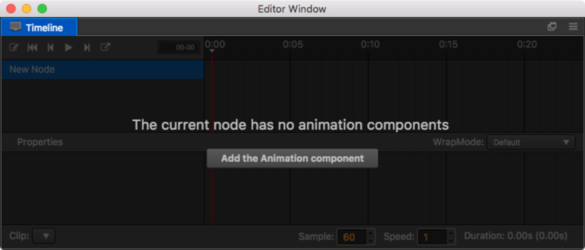
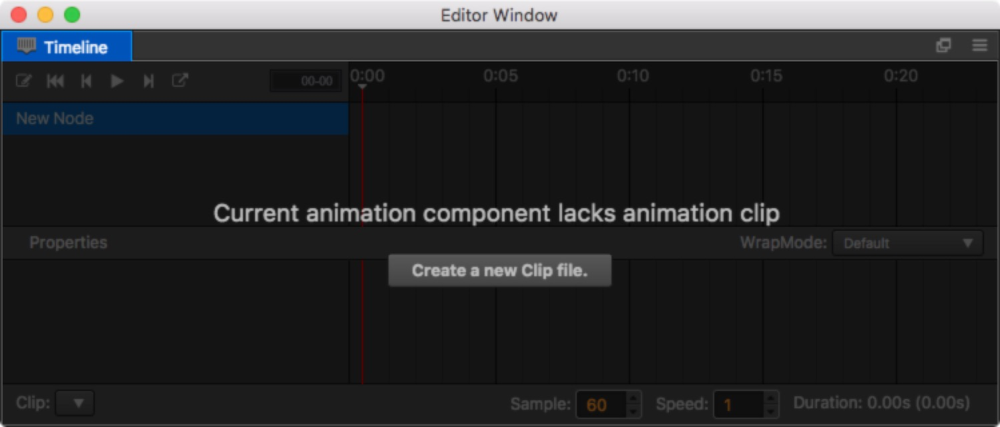

# Creating Animation components and animation clips

## Creating an Animation component

We can add different components to each Node. If you want to create an animation
on a Node, we must create a new Animation component for it.

There are 2 methods for creating an animation:

 - Choose the Node that you want to use. Click __+__ on the top right corner or
__Add component__ below in the Properties and choose __Animation__ in “other components”.

 - Open the animation editor. Choose the Node that you want to add the animation to in the arrangement manager. Click the __Add Animation component__ button.

## Create and mount animation clips

We have an Animation component on the Node, but we don't have the corresponding Animation clip data. There are 2 methods for creating an Animation clip:

 - Click __+__ on the top left corner in the Assets or right click in the blank area and choose __Animation Clip__. A clip document named 'New AnimationClip' will be created.

Creating it is not enough. You need to   click and choose the Node in the arrangement manager again and find __Animation__ in the Properties. The current value of Clips  will be 0. Change it to 1.

Drag the newly created 'New AnimationClip' from the Assets into the newly emerged __animation-clip choice box__.

 - If the Animation component hasn't been added to any Animation clip documents, you can click the __Create an Animation Clip__ button in the animation editor to create a new Animation clip document from the pop up window.

You need to pay attention! If you choose to cover the existing clip document, the contents of the covered document will be erased.

---

Continue on to read about [Animation Curves](animation-curve.md).
