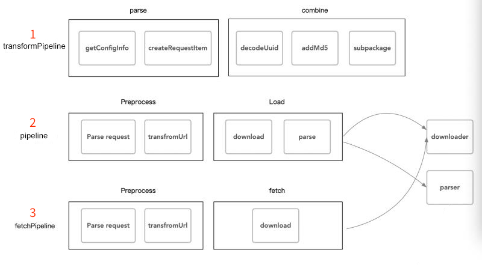

# Pipeline and Task

> Author：Santy-Wang
> This article is for advanced developers who have customization needs for their loading process

To make it easier to extend and modify the engine loading process, the bottom layer of Asset Manager loads resources using **Pipeline and Task**, **Download and parser**, and this article focuses on **Pipeline and Task**.

The `cc.loader` has been using the concept of pipelines for resource loading since before v2.4. In Asset Manager, we've refactored the pipeline to make the logic clearer and easier to extend, and you can extend existing pipelines or create custom ones using the `cc.AssetManager.Pipeline` class provided in the engine.

**Pipeline** (defined in `cc.AssetManager.Pipeline`) can be understood as a series of processes in series, and as a request passes through the pipeline, it is processed in turn by the various stages of the pipeline, with the result of the processing finally being output. The schematic is as follows:


The advantage of a pipeline over a regular fixed process is that all links in the pipeline are spliceable and combinable, which means you can insert new stages or remove old ones at any point in the existing pipeline, which brings great flexibility and allows you to make custom extensions to the existing process.

There are three pipelines built into Asset Manager, as shown in the figure:



1. The first pipeline is used to convert resource paths and find the real resource paths.
2. The second pipeline is a normal loading process.
3. The third pipeline is used for the preload process.

**Note**: The second line uses a downloader and parser, and the third line uses a downloader, see [Download and Parse](downloader-parser.md) documentation for details.

You can extend the built-in pipeline to achieve your own custom needs, for example:

```js
cc.assetManager.pipeline.insert(function (task, done) {
    task.output = task.input; 
    for (var i = 0; i < task.input; i++) {
        console.log(task.input[i].content);
    }
    done();
}, 1);
```

You can also build a new pipeline, for example:

```js
var pipeline = new cc.AssetManager.Pipeline('test', [(task, done) => {
    console.log('first stage');
    done();
}, (task, done) => {
    console.log('second stage');
    done();
}]);
```

Building the pipeline requires only a series of methods, each accepting a task parameter and a completion callback parameter. You can access everything about the task in the method, just call the completion callback on completion.

A request flowing in the pipeline is called a task, see `cc.AssetManager.Task` type for details, a task will include all its information including inputs, outputs, completion callbacks, [Optional Parameters](options.md), etc. As the task flows through the pipeline, each stage of the pipeline can take out the input of the task, make certain processing and save it back to the output. For example:

```js
cc.assetManager.pipeline.insert(function (task, done) {
    for (var i = 0; i < task.input.length; i++) {
        task.input[i].content = null;
    }
    task.output = task.input;
    done();
}, 1);
```