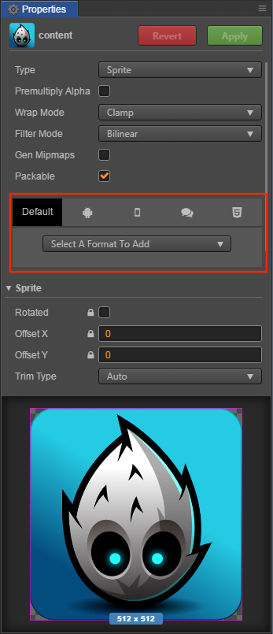
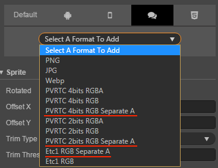

# Texture Compression

Cocos Creator allows you to set the compression method required by the texture directly in the editor, and then automatically compress the texture when the project is published. For the Web platform, support for exporting multiple image formats at the same time, and the engine will automatically download the appropriate format according to different browsers.

## Configuring Texture Compression

Cocos Creator supports importing pictures in multiple formats. However, in the actual game running, we do not recommend using the original image as a resource to load.

For example, on the mobile platform may only need the original image 80% or less image quality, or the .png which does not use a Alpha Channel, can be converted into JPG format. This reduces the storage space for a large portion of the image.

Picture Format | Android | iOS | WeChat Mini Game | Web
------------ | ------------- | --------- | -------- | --------
PNG | Support | Support | Support | Support
JPG | Support | Support | Support | Support
WEBP | Android 4.0 above native support Other versions can use the [resolver library](https://github.com/alexey-pelykh/webp-android-backport) | Use [resolver library](https://github.com/carsonmcdonald/WebP-iOS-example) | Unsupport | [resolver library](https://caniuse.com/#feat=webp)
PVR | Unsupport | Support iOS | Unsupport | Unsupport
PVR | Unsupport | Support | Support iOS | Support iOS
ETC1 | Support | Unsupport | Support Android | Support Android
ETC2 | Only support for generating resources, and the engine needs to be implemented by reference to pr: <https://github.com/cocos-creator/cocos2d-x-lite/pull/1685>

By default, Cocos Creator outputs the original image when it is built. If you need to compress an image at build time, you can select this image in the **Assets** and edit the texture format in the **Properties**.

## Texture Compression Details

Cocos Creator will find out if the compressed texture is configured when the image is built, if not, continue to find out if the default configuration is made, and if not, output the original image.

If the configuration of the compressed texture is found, texture compression is performed according to the configuration found. In one platform you can specify multiple texture formats, and when you build, each texture format generates a image in the specified format based on the original image compression.

These generated images are not all loaded into the engine, and the engine will select load the appropriate format image based on the configuration in [cc.macro.SUPPORT_TEXTURE_FORMATS](../../../api/en/classes/macro.html#supporttextureformats).

`cc.macro.SUPPORT_TEXTURE_FORMATS` lists all the image formats supported by the current platform, and when the engine loads the image, it will find the format with the highest priority in the list to load from the generated image.

You can customize the image resource support for the platform and the priority of the load order by modifying `cc.macro.SUPPORT_TEXTURE_FORMATS`.

## Example

In the example diagram above, the default platform is configured with compressed textures in PNG format, the Web platform is configured with PVR, PNG format, and other platforms do not add any configuration. Then when building a web platform, this image will be compressed into PVR, PNG two formats, and only PNG format images will be generated when building other platforms.

In the default setting of `cc.macro.SUPPORT_TEXTURE_FORMATS`, the support for the .pvr is only added to the iOS platform, so the PVR format image will only be loaded on the iOS browser, and the browser on other platforms will load the PNG format images.

## Separate Alpha

Both the ETC1 and PVR formats use a fixed space to store the color values for each pixel. When you need to store the 4 channels of the RGBA, the display quality of the texture can become very low.

So Creator provides a Separate Alpha option, which extracts the Alpha channels of the texture and merges them under the texture, and then compresses the entire texture in the RGB 3 channels format. This improves the storage space for each channel and the quality of the map improves.

