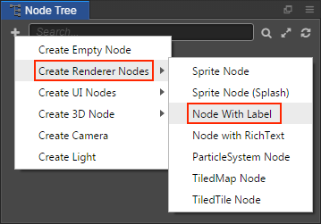
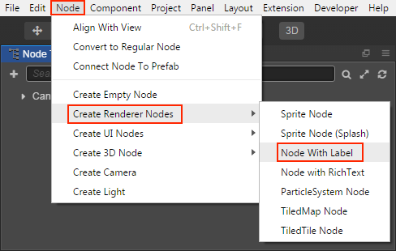
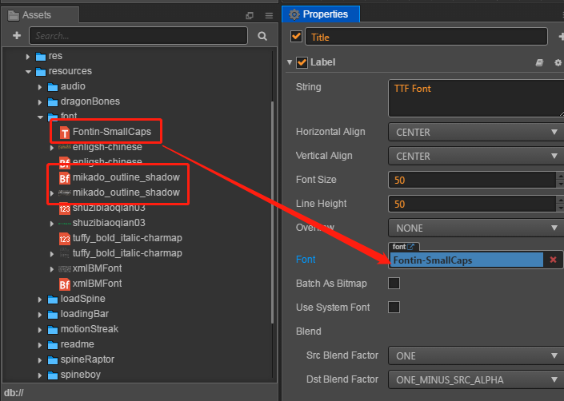

# Font

In Cocos Creator there're three types of font assets supported: System font, Dynamic font and Bitmap font.

System font is not include in the project, it's a special asset type that only tells the platform the game is running to provide the default font from operation system (such as Windows, Mac, Android, iOS...). By default all new Labels are using system font, you can make sure it's used by checking **Use System Font** property from [Label Component](../components/label.md).

## Import Font Asset

### Dynamic Font

Currently Cocos Creator only supports **TTF** format for dynamic font. Just drag font file (with `.ttf` extension) into **Assets** panel, the font asset will be imported.

### Bitmap Font

Bitmap font asset has two parts: `.fnt` font file and a `.png` image file. You can think of `.png` is a image map and `.fnt` is the index to each character in the map. This file combo can be generated with specific tools, please read [Bitmap font tool](../getting-started/support.md#tools-for-generating-bitmap-font).

When importing Bitmap font, please make sure `.fnt` and `.png` files are dragged together into **Assets** panel, and they should be put into the same folder.

Imported Bitmap font asset should looks like this in **Assets**:

**Note**: To make asset loading more effective, we recommend that you create a specific folder for all your Bitmap font assets.

## Using Font Asset

Font assets need **Label** components to render, here's how:

### Create Node with Label

In **Node Tree** click the top left **+** (Create Node) button and select **Create Renderer Nodes -> Node With Label**, this will create a node with **Label** component attached in the scene.

You can also create from main menu **Node -> Create Renderer Nodes -> Node With Label**.

### Assign Font Asset

If you create Label from menu, the label will use system font by default, you can drag your font asset from **Assets** panel to the `Font` property field of **Label** component.

This will make Label renders using the font asset we just assign. You can switch the font assets any time according to the project needs. It's recommend to use system font at the prototype phase and then replace them with better looking font assets when the UI interface is more solid.

When switching font assets the other properties in **Label** component will stay the same. You can also check `Use System Font` property any time to go back to using system font for your Label.

### Create Label by Dragging Font Assets

Another shortcut method to create font asset is to drag TTF or Bitmap font asset from **Assets** panel to **Node Tree** or **Scene** panel. The selected font asset will be automatically assigned to the `Font` property of Label component.

## Bitmap font bash renderig

If the texture used by the bitmap font and the other Sprite are the same, and the bitmap font and the Sprite do not have a render object that is inserted with another texture, the bitmap font can merge the rendering batches with the Sprite. When placing a bitmap font resource, place the .fnt file, the .png file, and the texture file used by the Sprite in a folder, and then reference the [Auto-atlas Asset](auto-atlas.md) to put the texture of the bitmap font and the texure used by the Sprite Into an atlas, the bitmap font bash rendering can be active in the native and WebGL environment automatically.

Continue to read about [Particle Asset](particle.md).
