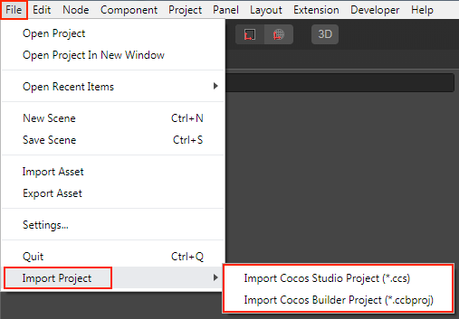
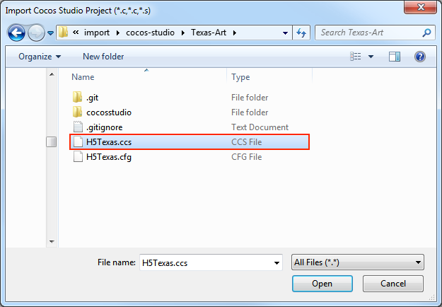

# Importing Projects from other Editors

You can import projects from other editors by the Main Menu **File -> Import Project**. Currently supported project types:

- Cocos Studio Projects (`*.ccs`)
- Cocos Builder Projects (`*.ccbproj`)

## Steps

1. Click the corresponding menu and select the project type you want to import, to open the file selection dialog.

2. Select a file with the specified extension like this:

	

3. When Cocos Creator is processing the import, logs will be output in **Console**. The log looks like this:

	
	
	Details:
	- 1 -- The full path of the imported project.
	- Log the file is now importing.
	- 2 -- When the importing is finished, you will see a line like this: `Import XXX project finished.`. (XXX should be the project type.)
	- 3 -- The url of imported resources will be shown.

The time of importing depends on the size of the project. When it's importing, please don't operate Cocos Creator. You should wait for the import to be finished.

## Details of Importing Cocos Studio Projects

- There are 3 kinds of `csd` files in Cocos Studio project:
	- Scene ---- Imported as a scene (`.fire`)
	- Layer ---- Imported as a prefab
	- Node ---- Imported as a prefab

- The animation data in the `csd` files will be imported as `.anim` files.

- The File Structure after the project imported:
	- The resources will be stored in a separate folder in assets. The folder name will be same with the Cocos Studio project name.
	- The File Structure will be same with the Cocos Studio project.
	- The animation files will be stored in a child folder. The folder name will be `[csd file name]_action`.

- Some controls from the Cocos Studio project are currently not supported in Cocos Creator. When these controls are imported, an x component will be added to the corresponding node and the control data will be stored in the x component.

- Some controls in Cocos Studio are currently not supported in Cocos Creator. The importing process will add a `StudioComponent` for the node with unsupported controls. The data of the controls will be stored in the `StudioComponent`. Unsupported controls including:
	- CheckBox
	- LabelAtlas
	- SliderBar
	- ListView
	- PageView

- The data of `StudioComponent` will be looks like this:

	

	1. The type of the component, corresponding to the control in Cocos Studio.
	2. The data of the control.

### Unsupported

- No support for importing skeletal animation data.
- No support for importing `csi` files. (Corresponding images are imported as separate images, rather than being merged into larger picture)
- No support for importing `SkewX` & `SkewY` properties of the `Node`.
- `Particle` does not support the `Blend Function` property, and animation editing of the Sprite and Particle also does not support animation with the `Blend Function` property.

### Special Instructions

The feature of importing a Cocos Studio project is developed & tested on Cocos Studio **v3.10**. If you want to import an old version project, please import it to Cocos Studio 3.10 first. Then import the Cocos Studio v3.10 project to Cocos Creator.

- New support for animation frame events

    Unified add default `triggerAnimationEvent` event, The parameter is the data set below:
    
    

- Import nested csd

    If the **csd** contains a nested prefab, a dummy node will be auto created with a `cc.StudioComponent.PlaceHolder` component attached. The `nestedPrefab` property of the component will save nested prefab resources, which are replaced by the current node at runtime. (If you need to operate on this node, it must be the runtime of the project, and the editor preview not supported at this time)

## Details of Importing Cocos Builder Projects

- All `ccb` files will be imported as a **prefab**.
- The animation data in `ccb` files will be imported as `.anim` file.
- The file structure after importing is the same as Cocos Studio above.

### Unsupported

- `CCControlButton` in Cocos Builder can set different color for different states, but Cocos Creator does not support this.
- `LayerGradient`.
- No support for importing `SkewX` & `SkewY` properties of the `Node`.
