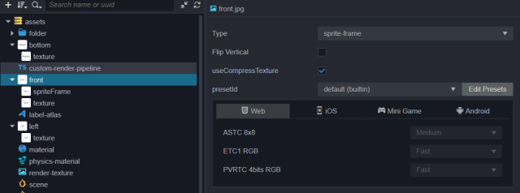
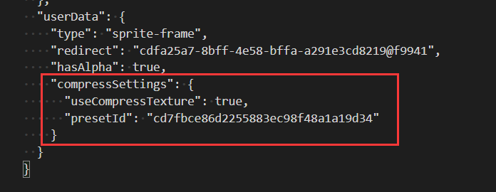
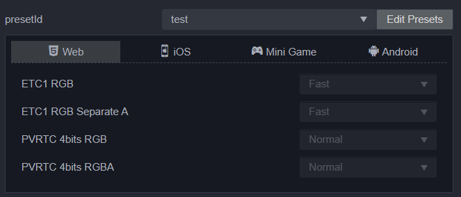

# Compress texture

**Cocos Creator** can set the compression method required for textures directly in the editor, and then automatically compress the textures when the project is released. Multiple image formats can be exported at the same time, and the engine will automatically download the appropriate format according to different devices.

## Configure compressed texture

**Cocos Creator** supports importing images in multiple formats (see the table below for details), but in an actual running game, we do not recommend using the original images as assets to load. For example, on a mobile platform, only 80% or less of the original image quality may be required, or a `.png` without the transparent channel can be converted into a `.jpg`, which can reduce the storage space required.

| Image format | Android | iOS | Mini Game | Web  |
| ------- | -------- | ------ | ----- | ------ |
| **PNG** | Supported | Supported   | Supported | Supported |
| **JPG** | Supported | Supported | Supported | Supported |
| **WEBP** | Native Supported for Android 4.0+ Other versions can use [this library](https://github.com/alexey-pelykh/webp-android-backport) | can use [this library](https://github.com/carsonmcdonald/WebP-iOS-example) | Supported | [Partially Supported](https://caniuse.com/#feat=webp) |
| **PVR** | Not Supported | Supported | Supported iOS  | Supported iOS |
| **ETC1** | Supported | Not Supported | Supported Android  | Supported Android |
| **ETC2** | Partially Supported | Not Supported | Not Supported | Supported Android |
| **ASTC** | Partially Supported  | Partially Supported | Not Supported | Partially Supported |

By default, **Cocos Creator** outputs the original image during build. If you need to compress an image during the build process, you can select this image in the **Assets** panel and then manage it in the **Inspector** to edit the compress texture format of the image.

The editor will provide a preset by default. If you need to add more presets, you can click the **Edit preset** button to open **Project Settings -> Compress Texture** to add and edit presets. The compression format here is readonly. For how to add texture compression presets, please refer to the [Project Settings](./editor/project/index.md) documentation.

The compress-texture options on the image asset will be stored in the asset's meta file. `PresetId` is the ID of the selected compressed texture preset.

## Detailed compression textures

If you want to use compressed textures, you need to turn on the **compressed texture option** when you build the project:

When **Cocos Creator 3.0** builds the image, it will find whether the current image has been already configured to use compressed textures. If not, it will output the original image.

If the configuration of the compressed texture is founded, the image will be compressed according to the configuration.The compress texture configuration in the project settings is divided into different platforms, and the support of in the actual platform is also difference. **builder** will make certain elimination and priority selection of the configured texture format according to the **actual build platform**and the current **image texture transparency channel**. You can refer to the following example to understand this rule.

Multiple texture formats can be specified on one platform, and each texture format is compressed to generate an image of the specified format when it is constructed.

These generated images will not all be loaded into the engine during runtime, the engine will choose to load the appropriate image according to the configuration in `macro.SUPPORT_TEXTURE_FORMATS`. `macro.SUPPORT_TEXTURE_FORMATS` enumerates all the image formats supported by the current platform. When the engine loads the images, it will find, from the generated images in this list, **the format with the highest priority** (that is, the order is higher) to load.

The user can customize the supported image assets for a platform and the priority of the loading order, by modifying `macro.SUPPORT_TEXTURE_FORMATS`.

## Example

**Example 1**: As the compress presets of the MiniGame platform shown in the figure, if the build target is **Huawei Quick Game** That only runs on Android devices, **Builder** will not package the **PVR** texture format. For more details about the support of platforms, please refer to [Details of compressed texture support for platforms](##Details of compressed texture support for platforms)

**Example 2**: In the example picture above, both **ETC1** and **PVR** types are configured with RGB and RGBA two types of texture formats. In this case, **Builder** will be **according to whether the current picture has a transparent channel to choose one of the same types of formats**. The image asset in the example is with a transparent channel, then **Builder** will only pack a compressed texture format with REGA type. Of course, if there is only RGB picture format in the configuration, even if the current picture is with a transparent channel, it will be packaged normally.

## Details of compressed texture support for platforms

Except for the `JPG` and `PNG` supported by all platforms, the details of other formats are as follows:

| Platform          | TextureCompressTypes |
| ----------------- | -------------------- |
| Web Desktop       | ASTC / ETC2 / ETC1 / PVR / WEBP |
| Web Mobile        | ASTC / ETC2 / ETC1 / PVR / WEBP |
| WeChat Game       | ETC1 / PVR           |
| AliPay Mini Game  | ETC1 / PVR           |
| Baidu Mini Game   | ETC1 / PVR           |
| OPPO Mini Game    | ETC1                 |
| vivo Mini Game    | ETC1                 |
| Huawei Quick Game | ETC1                 |
| Cocos Play        | ETC1                 |
| Xiaomi Quick Game | ETC1                 |
| iOS               | ASTC / PVR / WEBP / ETC1 / ETC2 |
| Android           | ASTC / ETC2 / ETC1 / WEBP |
