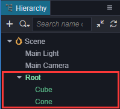
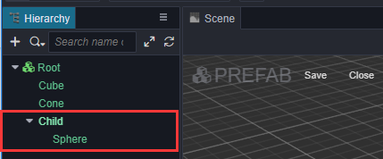
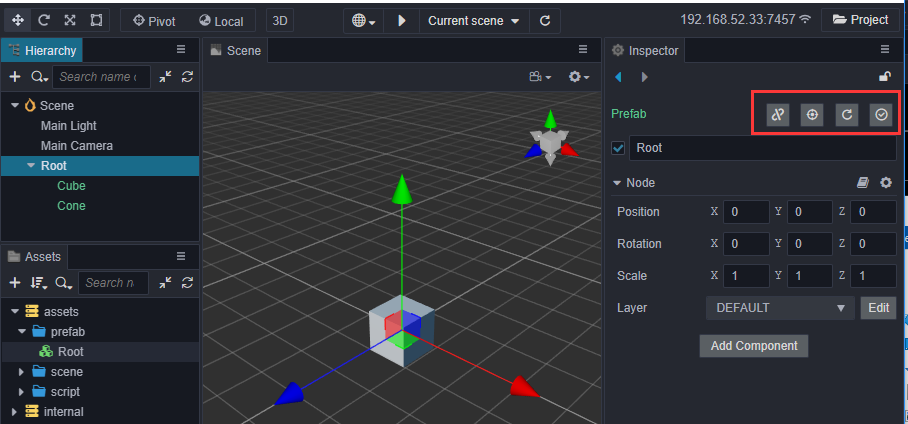
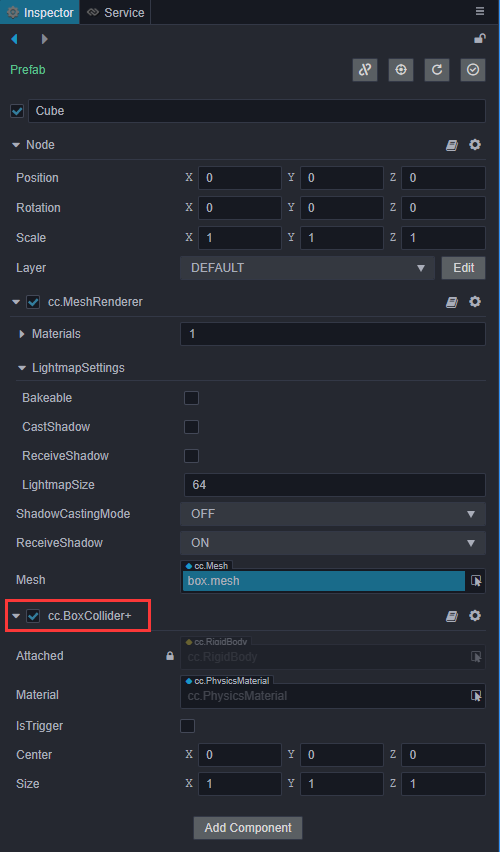
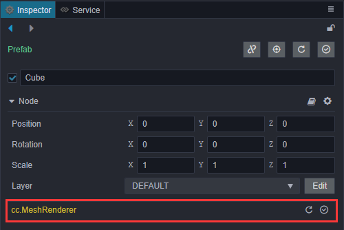

# Prefab

Prefab is used to store some scene objects that can be reused, it can contain nodes, components, and data in components. The instances generated by the prefab asset can not only inherit the data of the template, but also have it's own customized data modification.

## Basic Concepts

Name|Description|Example
:---|:---|:---
Prefab Asset|The asset of prefab in **Assets** panel, which is the serialize file of Prefab.|
Prefab Instance|When the __Prefab Asset__ is drag to the `Hierarchy` panel, it will generate a __Prefab Instance__. Its root node is currently marked in bright green, and its child nodes are dark green|
Prefab Editing Mode|Double-click the __Prefab Asset__ to enter the prefab editing mode. At this time, all non-nested prefab nodes are displayed in dark green|
Nested Prefab Instance|When a child node in a __Prefab Asset__ is an instance of another __Prefab Asset__, we call this child prefab a nested prefab instance|

## Creating a Prefab

After editing the __Node__ in the __Scene__, drag the __Nodes__ directly from the __Hierarchy__ panel to the __Assets__ panel to complete the creation of the __Prefab__. After the creation is complete, the original __Node__ will automatically become a __Prefab Instance__, its root node is currently marked in bright green, and its child nodes are dark green.

## Using Prefabs

Drag a __Prefab Asset__ from the __Assets__ panel to the __Hierarchy__ panel or __Scene__ panel to create a __Prefab Node__ in the __Scene__.

In the __Scene__, the __Prefab Instance__ objects data source comes from the deserialization of the __Prefab Asset__ , so its data is synchronized with the __Prefab Asset__ by default. If the attributes in the prefab instance are modified, the modified data will be stored In the __Prefab Instance__, it will not affect the __Prefab Asset__ and the data of other __Prefab Instance__ generated by it.

## Entering prefab editing mode

__Double-click__ the __Prefab Asset__ in the __Assets__ panel to switch from __Scene__ editing mode to __Prefab editing__ mode. You can edit the __Prefab Assets__ in the __Editor__. After editing, click __Save__ button in the __Scene__ panel to save the edited __Prefab Assets__. Next, click __Close__ button to return to the Scene editing mode.

## Status of prefab nodes

__Prefab Nodes__ in the __Inspector__ panel render __green__ to indicate normal association with assets and render __red__ to indicate that the associated assets no longer exist.

## Editing Prefab Nodes in a Scene

### General Operations

In the __Hierarchy__ panel, select the __Prefab Node__, and notice there are several buttons that can be clicked at the top of the __Inspector__ panel:

Icon|Description
:---|:---
|Revert to __normal node__. __Prefab Instance__ can become ordinary __Nodes__, that is, completely separated from the relationship between assets. This function is also available in the top-level menu `Node`.
|Locating assets.Its convenient to quickly locate __Prefab Asset__ in the __Assets__ panel.
|Restore from asset. Restore the data of the current __Prefab Instance__ to the data in the __Prefab Asset__, but the name, location, and rotation will not be restored.
|Update to asset. Update all data of the current __Prefab Instance__ to the associated __Prefab Asset__.

### Add New Node

A new node added under the __Prefab Instance__ will have a **+** sign in the lower right corner of the node name, and its data is stored under the __Prefab Instance__, so it will not affect the data of the associated __Prefab Asset__.

### Add New Component
A new component added under the __Prefab Instance__ will have a **+** sign in the end of the node name, and its data is stored under the __Prefab Instance__, so it will not affect the data of the associated __Prefab Asset__.

### Remove Component
A new component added under the __Prefab Instance__ will have a deleted data item show in the __Inspector__, its data is stored under the __Prefab Instance__, so it will not affect the data of the associated __Prefab Asset__.

It will show two buttons in the end of deleted data item:
Icon|Description
:---|:---
|revert the removed component
|apply the remove component operation to the associated __Prefab Asset__

## Some Current Restrictions
- It's not allow to delete the node created from the __Prefab Asset__ in the __Prefab Instance__
- It's not allow to change the hierarchical relationship of nodes created from the __Prefab Asset__ in the __Prefab Instance__
- Do not allow prefabs to nest themselves
