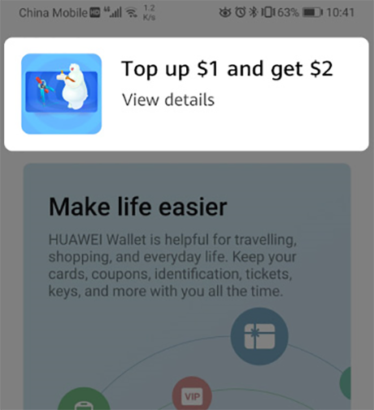
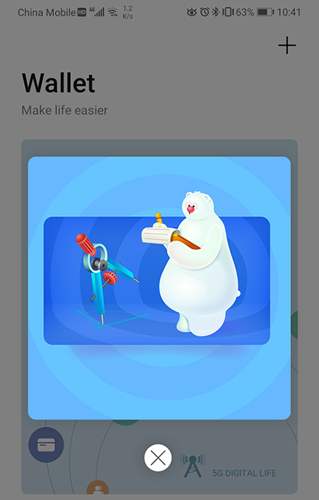
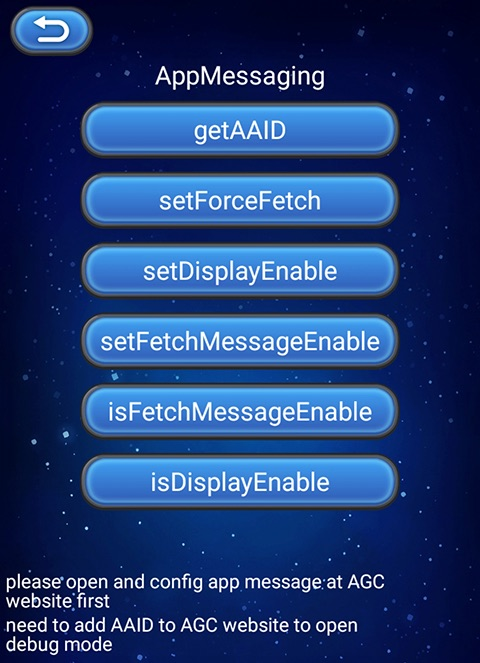

# App Messaging (AppGallery Connect) Quick Start

You can use [App Messaging](https://developer.huawei.com/consumer/en/doc/development/AppGallery-connect-Guides/agc-appmessage-introduction) of AppGallery Connect to send relevant messages to target users actively using your app to encourage them to use key app functions. For example, you can send in-app messages to encourage users to subscribe to certain products, provide tips on passing a game level, or recommend activities of a restaurant.

App Messaging even allows you to customize how your messages look and the way they will be sent, and define events for triggering message sending to your users at the right moment.

### Message Types

Currently, App Messaging supports **pop-up**, **image**, and **banner** messages, which have different content and layouts. You can customize the message content and layout as needed.

- A pop-up message can have a title and body and contain an image and up to two buttons. It is a better choice for you to send rich information to your users.

  

- A banner message is displayed on the top of the screen, containing a thumbnail and the message title and body. A user can tap the banner to access the specified page.

  

- An image message only contains an image. For example, an image message can be a poster well designed to promote an activity. A user can tap the image to access the activity details page.

  

### Working Principles

After you integrate the App Messaging SDK into your app, the SDK automatically synchronizes in-app messages published on the AppGallery Connect server and determines whether to display a specific in-app message based on the message's validity period and trigger. A default layout is provided to display an in-app message. You can also call relevant APIs of the App Messaging SDK to customize the message layout for personalized experience.

A user can tap an in-app message to access the destination specified during message creation. The App Messaging SDK reports the message display result to AppGallery Connect. You can view the statistics on message displays, taps, and conversion data in AppGallery Connect.

## Enable App Messaging Service

- Use Cocos Creator to open the project that needs to be connected to App Messaging service.

- App Messaging service works with the HUAWEI Analytics Kit, please enable the [Analytics Kit (HMS Core)](./hms-analytics.md) before integrating the App Messaging service.

- Click on **Panel -> Service** in the menu bar to open the Service panel, select **App Messaging** service to go to the service detail page, and then click on the **Enable** button in the top right to enable the service. For details, please refer to the Cocos Service [Operation Guide](./index.md#usage) documentation.

  

- Find your project from the project list and click the app for which you need to enable App Messaging service on the project card. Go to **Growing -> App Messaging**, if it is the first time that you use App Messaging service, click **Enable now** in the upper right corner.  

  

### Configs HUAWEI Config File

Most of HUAWEI Services need the `agconnect-services.json` configuration file. If there are operations such as newly opened services, please update the file in time.

**Note**: Please make sure that you have completed the [generating/configuring the signing certificate Fingerprint](https://developer.huawei.com/consumer/en/doc/development/HMSCore-Guides/config-agc-0000001050166285#EN-US_TOPIC_0000001054452903__section10260203515546) to config the SHA-256 certificate fingerprint. If you check **Debug Mode** in the **Build** panel, please configure the keystore file and infomation manually in the Android Studio project.

- Sign in to [AppGallery Connect](https://developer.huawei.com/consumer/en/service/josp/agc/index.html) find your project from the project list and select the app on the project card.

- On the **Project Setting** page, click the configuration file **agconnect-services.json** to download it. The `agconnect-services.json` file **must be copied manually** to the `settings` directory of the project directory after downloading or updating.

  

  **Note**: For Creator v2.4.3 and above, if you want to publish to the [HUAWEI AppGallery Connect](../publish/publish-huawei-agc.md), you can select the downloaded or updated configuration file directly in the **Build** panel, no need to copy it manually.

  

### Verify whether the service is integrated successfully

- Once the App Messaging service is integrated, we can verify the success of the App Messaging service integration by adding simple code to the script.

  ```js
  console.log("get AAID =", huawei.agc.appmessaging.appMessagingService.getAAID());
  huawei.agc.appmessaging.appMessagingService.setForceFetch();
  ```

- [Publish to the Android platform](../publish/publish-native.md) after the code is added. Please make sure that the **Package Name** on the **Build** panel is consistent with the **Package Name** set in the AppGallery Connect console.

- Run the project on a phone, get the **AAID** from **LogCat**.

  

- Creating an In-App Message in the AppGallery Connect console, please refer to [Creating an In-App Message](https://developer.huawei.com/consumer/en/doc/development/AppGallery-connect-Guides/agc-appmessage-create) documentation for details.

- Obtain the anonymous application identifier (AAID obtained previously) of the test device and set the in-app message to a test message. Please refer to [Testing an In-App Message](https://developer.huawei.com/consumer/en/doc/development/AppGallery-connect-Guides/agc-appmessage-debug) documentation for details.

- Run the project on a phone again, if the pop-up message appears, which means the integrate is successful.

## Sample Project

Developer can get a quick taste of the App Messaging service with the sample project.

- Click on the **Sample** button in the App Messaging service panel, clone or download, and open the project in Cocos Creator.

- After enabling the App Messaging service and configuring the HUAWEI configuration file as described above, you can open the **Build** panel to compile the project by clicking **Project -> Build** in the Creator editor menu bar. Cocos Creator v2.4.1 and above, you could [publish to HUAWEI AppGallery Connect](../publish/publish-huawei-agc.md). Below Creator v2.4.1 could [publish to the Android platform](../publish/publish-native.md).

- Need to test on Huawei or Honor brand phones with HMS Core service installed.

- Once the Sample project is running on the phone, click the **AppMessaging** button on the homepage for testing.

  

## Developer Guide

The App Messaging SDK obtains in-app messages from AppGallery Connect and displays the messages in your app when the specific trigger event occurs using the default message layout. The process is totally **coding-free**. You can also call APIs provided by the App Messaging SDK to personalize your in-app messages.

This document refers to the AppGallery Connect documentation - [Displaying an In-App Message](https://developer.huawei.com/consumer/en/doc/development/AppGallery-connect-Guides/agc-appmessage-display). When calling in JavaScript, please use this document and the [API documentation](https://docs.cocos.com/service/api/modules/huawei.agc.appmessaging.html) as a guide.

**Note**: Due to JavaScript layer limitation, the App Messaging plug-in does not support [Displaying an In-App Message](https://developer.huawei.com/consumer/en/doc/development/AppGallery-connect-Guides/agc-appmessage-display#h1-1586403550092) functions.

### Prerequisites for In-App Message Display

The prerequisites for the App Messaging SDK to display in-app messages are as follows:

1. The app must be running on the foreground.

2. A user triggers the event upon which an in-app message will be displayed. Then the App Messaging SDK synchronizes the message data from the AppGallery Connect server or obtains the message data from the local cache and determines whether to display the message.

    The App Messaging SDK allows you to enable or disable data synchronization from the AppGallery Connect server. The function is enabled by default.

    Call [setFetchMessageEnable](https://docs.cocos.com/service/api/classes/huawei.agc.appmessaging.appmessagingservice.html#setfetchmessageenable) to set whether to allow data synchronization from the AppGallery Connect server.

    ```js
    huawei.agc.appmessaging.appMessagingService.setFetchMessageEnable(true);
    ```
  
    **Note**:

    - The App Messaging SDK does not request messages from the AppGallery Connect server every time an event is triggered. Instead, it requests messages only once in a specified period (usually when the app is launched) and caches all messages locally. During the period, the matching locally cached messages are displayed upon events.
    - New in-app messages created during the period in AppGallery Connect will not be displayed since the App Messaging SDK has not obtained them.

3. Display an in-app message published in AppGallery Connect when the following conditions are met:

    - The system time of the device is later than the message start time and earlier than the message end time.
    - The display frequency has not met the upper limit.
    - An event contained in the trigger event list of the message occurs.

    The App Messaging SDK allows you to enable or disable the message display function. The function is enabled by default.

    Call [setDisplayEnable](https://docs.cocos.com/service/api/classes/huawei.agc.appmessaging.appmessagingservice.html#setdisplayenable) to set whether to enable message display.

    ```js
    huawei.agc.appmessaging.appMessagingService.setDisplayEnable(true);
    ```

### Interacting with Users

You can use the App Messaging SDK to customize app messaging behavior to respond to users promptly. The App Messaging SDK can listen on events including message display, message tapping, and message closing. Get the callback by `huawei.agc.appmessaging.appMessagingService.on` listener, or `huawei.agc.appmessaging.appMessagingService.once` listener for callback once.

```js
huawei.agc.appmessaging.appMessagingService.on(huawei.agc.appmessaging.AGC_APP_MESSAGING_LISTENER_NAME.ON_MESSAGE_CLICK, (result) => {
    console.log('getId: ', result.getId());
}, this);

huawei.agc.appmessaging.appMessagingService.once(huawei.agc.appmessaging.AGC_APP_MESSAGING_LISTENER_NAME.ON_MESSAGE_DISPLAY, (result) => {
    console.log('getMessageType: ', result.getMessageType());
}, this);
```

## Service Related Documentation

- [Creating an In-App Message](https://developer.huawei.com/consumer/en/doc/development/AppGallery-connect-Guides/agc-appmessage-create)
- [Publishing an In-App Message](https://developer.huawei.com/consumer/en/doc/development/AppGallery-connect-Guides/agc-appmessage-release)
- [Viewing In-App Message Statistics](https://developer.huawei.com/consumer/en/doc/development/AppGallery-connect-Guides/agc-appmessage-analysis)
- [App Messaging FAQs](https://developer.huawei.com/consumer/en/doc/development/AppGallery-connect-Guides/agc-appmessage-faq)

## API Reference

Please refer to the [App Messaging - API Reference](https://docs.cocos.com/service/api/modules/huawei.agc.appmessaging.html).
