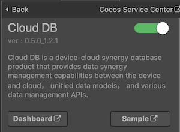
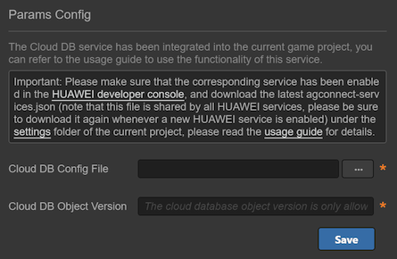
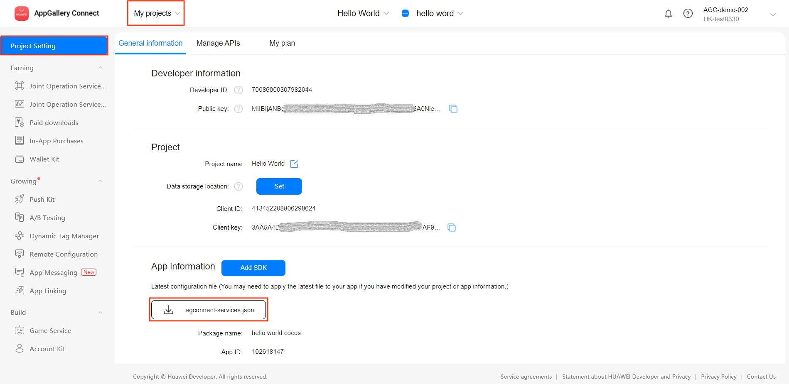

# Cloud DB (AppGallery Connect) Quick Start

In the traditional mobile application development, developers have to build each service from the ground-up, leading to heavy development workload and high technical requirements. In addition to writing application logic, developers need to perform data management, device-cloud data synchronization, and server deployment and maintenance.

[Cloud DB](https://developer.huawei.com/consumer/en/doc/development/AppGallery-connect-Guides/agc-clouddb-introduction) is a device-cloud synergy database product that provides data synergy management capabilities between the device and cloud, unified data models, and various data management APIs. In addition to ensuring data availability, reliability, consistency, and security, CloudDB enables seamless data synchronization between the device and cloud, and supports offline application operations, helping developers quickly develop device-cloud and multi-device synergy applications. As a part of the AppGallery Connect solution, Cloud DB builds the Mobile Backend as a Service (MBaaS) capability for the AppGallery Connect platform. In this way, application developers can focus on application services, greatly improving the production efficiency.

### Applying for Cloud DB

The Cloud DB service is still in beta state. Before using this service, download and fill in an [application form](https://communityfile-drcn.op.hicloud.com/FileServer/getFile/cmtyManage/011/111/111/0000000000011111111.20200820100918.76138629294381731909324437851176:50510820040619:2800:87124B14FD9DA9B4EA0EE9D1C79FA3B9750FC489D47C0B290205770EC05D0261.xlsx?needInitFileName=true), and send it as an attachment to [agconnect@huawei.com](agconnect@huawei.com).

Email title format: **[Cloud DB]-[Company name]-[Developer account ID]-[App ID]**. For details about how to query the app ID, see [Querying App Information](https://developer.huawei.com/consumer/en/doc/appgallery_queryappinfo).

After receiving your application, Huawei operations personnel will reply to you within 1 to 3 working days. This email address is for receiving AppGallery Connect service enabling applications only. Please do not send other consultation emails to this address.

### Charge

Cloud DB is a resource-consuming service and will be charged based on the number of data records, storage space, and network usage. Currently, Cloud DB is in beta test and free of charge. We will send an email to you to announce related charging policies and fee rate one month in advance of formal charge.

When you enable the Cloud DB zone service, the system provides the following free Cloud DB zone service quotas by default:

| Service Type | Quota |  
| :--- | :--- |  
| Storage capacity on the Cloud | 2GB | 
| Maximum number of concurrent connections | 150 | 
| Maximum number of operations per second in the Cloud DB zone | 10 | 

When you apply for the Cloud DB service for the first time, if your application requires more resources than the free quota, or if you have enabled the free Cloud DB service but the free resource quota cannot meet your application requirements, you can download and fill in an [application form](https://communityfile-drcn.op.hicloud.com/FileServer/getFile/cmtyManage/011/111/111/0000000000011111111.20200820100918.76138629294381731909324437851176:50510930080052:2800:18284CEBCBB25F6DF7FEC9639CEF797C13C6E5ACE32078EADF082AF53770BC74.xlsx?needInitFileName=true), and send it as an attachment to agconnect@huawei.com. Email title format: **[Cloud DB]-[Company name]-[Developer account ID]-[App ID]**. For details about how to query the app ID, see [Querying App Information](https://developer.huawei.com/consumer/en/doc/appgallery_queryappinfo).

### More info

Please refer to the following documents:

  - [Working Principle](https://developer.huawei.com/consumer/en/doc/development/AppGallery-connect-Guides/agc-clouddb-introduction#h1-1603975887838-0)
  - [Technical Specifications](https://developer.huawei.com/consumer/en/doc/development/AppGallery-connect-Guides/agc-clouddb-introduction#h1-1603848492635)
  - [FAQs](https://developer.huawei.com/consumer/en/doc/development/AppGallery-connect-Guides/agc-clouddb-faq)

### Version Update Description

- Latest Version: 0.5.0_1.2.1.301

    - Integrated Huawei AGC Cloud DB service.

## Enable Cloud DB Service

- [Applying for the Cloud DB Service](#applying-for-cloud-db) by sending E-Mail.

- Cloud DB service depends on Auth Service, please enable the [Auth Service (AGC)](./agc-auth.md) before integrating the Cloud DB service.

- Use Cocos Creator to open the project that needs to be connected to Cloud DB service.

- Click on **Panel -> Service** in the menu bar to open the Service panel, select **Cloud DB** service to go to the service detail page, and then click on the **Enable** button in the top right to enable the service. For details, please refer to the Cocos Service [Operation Guide](./index.md#usage) documentation.

  

- Please refer to [Managing Object Types](https://developer.huawei.com/consumer/en/doc/development/AppGallery-connect-Guides/agc-clouddb-agcconsole-objecttypes#h1-1594195740754) document, export object types file in **JSON** format, import into the **Cloud DB Config File** item at the bottom of the Cloud DB service panel.

  

### Configs HUAWEI Config File

Most of HUAWEI Services need the `agconnect-services.json` configuration file. If there are operations such as newly opened services, please update the file in time.

- Sign in to [AppGallery Connect](https://developer.huawei.com/consumer/en/service/josp/agc/index.html) find your project from the project list and select the app on the project card.

- On the **Project Setting** page, click the configuration file **agconnect-services.json** to download it. The `agconnect-services.json` file **must be copied manually** to the `settings` directory of the project directory after downloading or updating.

  

**Note**:

1. Please make sure that you have completed the [generating/configuring the signing certificate Fingerprint](https://developer.huawei.com/consumer/en/doc/development/HMSCore-Guides/config-agc-0000001050166285#EN-US_TOPIC_0000001054452903__section10260203515546) to config the SHA-256 certificate fingerprint.

2. If the **Debug Mode** is checked in the **Build** panel, the developer needs to configure the Keystore signature file in the `app/build.gradle` file of Android Studio.

    

3. For Creator v2.4.3 and above, if you want to publish to the [HUAWEI AppGallery Connect](../publish/publish-huawei-agc.md), you can select the downloaded or updated configuration file directly in the **Build** panel, no need to copy it manually.

    

### Verify whether the service is integrated successfully

- Once the Cloud DB service is integrated, we can verify the success of the Cloud DB service integration by adding simple code to the script.

  ```js
  //"test" should to be replaced with the name of Storage instance
  let db = huawei.agc.db;
  let config = db.AGCCloudDBZoneConfig.createConfig("test", db.SyncProperty.CLOUDDBZONE_CLOUD_CACHE);
  let query = db.AGCCloudDBZoneQuery.where("test", "queryTest");
  let zone = db.dbService.openCloudDBZone(config, true);
  let result = zone.querySync(query, huawei.agc.db.QueryPolicy.POLICY_QUERY_FROM_CLOUD_PRIOR);
  console.log('Cloud DB', 'query : ' + JSON.stringify(result));
  ```

- Download [database file](agc-clouddb/cdb-test.json) for test, import it into the console.

  

- [Publish to the Android platform](../publish/publish-native.md) after the code is added. Please make sure that the **Package Name** on the **Build** panel is consistent with the **Package Name** set in the AppGallery Connect console.

- Run the project on a phone, if you can see the data output in Logcat, which means the integrate is successful.

  

## Sample Project

Developer can get a quick taste of the Cloud DB service with the sample project.

- Click on the **Sample** button in the Cloud DB service panel, clone or download, and open the project in Cocos Creator.

- Configure an **Object Type Name** named `test` when [Enable Cloud DB Service](#enable-cloud-db-service).

- After enabling the Cloud DB service and configuring the HUAWEI configuration file as described above, you can open the **Build** panel to compile the project by clicking **Project -> Build** in the Creator editor menu bar. Cocos Creator v2.4.1 and above, you could [publish to HUAWEI AppGallery Connect](../publish/publish-huawei-agc.md). Below Creator v2.4.1 could [publish to the Android platform](../publish/publish-native.md).

- Once the Sample project is running on the phone, click the **DB** button on the homepage for testing.

  

## Developer Guide

This document refers to the AppGallery Connect documentation - [Getting Started](https://developer.huawei.com/consumer/en/doc/development/AppGallery-connect-Guides/agc-clouddb-get-started#h1-1594008574948).

### Initializing

When developers use Cloud DB service, they need to perform initialization operations first.

#### Set listener (optional)

If you need to handle the error return, you can set up the `error` listener.

**Example**:

```js
huawei.agc.db.dbService.on("error", data => console.log("Cloud DB", `error : [${data.zoneId}][${data.typeName}] ${data.errCode}:${data.errMsg}`), this);
```

| Parameter | Description |  
| :--- | :--- |
| zoneId | Name of Cloud DB zone, represents a unique data storage zone. |
| typeName | Name of Storage instance. |
| errCode | Error code, please refer to [getCode](https://developer.huawei.com/consumer/en/doc/development/AppGallery-connect-References/clouddb-agconnectclouddbexception#getCode) document. |
| errMsg | Error Message |

If you need to use the [Updating Listening in Real Time](https://developer.huawei.com/consumer/en/doc/development/AppGallery-connect-Guides/clouddb-deve_guide_updating_listening) function, you can set up `subscribe` listener.

**Example**:

```js
huawei.agc.db.dbService.on("subscribe", data => console.log("Cloud DB", `error : [${data.zoneId}][${data.typeName}][${data.queryId}][${data.subscribeId}] ${data.result}`), this);
```

| Parameter | Description |  
| :--- | :--- |  
| zoneId | Name of Cloud DB zone, represents a unique data storage zone. |
| typeName | Name of Storage instance. |
| queryId | Custom query ID, for query interface. |
| subscribeId | Subscribe listener id |
| result | Return message |

#### Open the Cloud DB zone

Open the cloud DB zone by calling the ʻopenCloudDBZone` method.

`openCloudDBZone(config: AGCCloudDBZoneConfig, isAllowToCreate: boolean): AGCCloudDBZone`

| Parameter | Description |  
| :--- | :--- |
| config | AGCCloudDBZoneConfig object, which is used to create or open a configuration file of Cloud DB zone. |
| isAllowToCreate | Specifies whether to allow Cloud DB zone object creation. |

**Example**:

```js
let config = huawei.agc.db.AGCCloudDBZoneConfig.createConfig("test", huawei.agc.db.SyncProperty.CLOUDDBZONE_CLOUD_CACHE);
this._zone = huawei.agc.db.dbService.openCloudDBZone(config, true);
```

### Inserting Data

Developer can use the **synchronized** `insertSync` method to insert or modify data.

`insertSync(objs : any[], typeName: string): number`

| Parameter | Description |  
| :--- | :--- |
| objs | Object list data to be written. |
| typeName | Name of Storage instance. |

**Example**:

```js
let objs = [{id: "1", name: "name1"}, {id: "2", name: "name2"}];
let count = this._zone.insertSync(objs, "test");
console.log('Cloud DB', 'insert count : ' + count);
```

### Querying Data

Developer can use the **synchronized** `querySync` method to query data.

`querySync(query: AGCCloudDBZoneQuery, policy: QueryPolicy): any[]`

| Parameter | Description |  
| :--- | :--- |
| objs | A AGCCloudDBZoneQuery object, which indicates the query condition. |
| policy | Query policy, which specifies the data source to be queried. |

**Example**:

```js
let query = huawei.agc.db.AGCCloudDBZoneQuery.where("test", "queryTest");
let result = this._zone.querySync(query, huawei.agc.db.QueryPolicy.POLICY_QUERY_FROM_CLOUD_PRIOR);
console.log('Cloud DB', 'query : ' + JSON.stringify(result));
```

It supports adding query conditions, supported methods can refer to [API document - AGCCloudDBZoneQuery](https://docs.cocos.com/service/api/classes/huawei.agc.db.agcclouddbzonequery.html).

**Example**:

```js
let query = huawei.agc.db.AGCCloudDBZoneQuery.where("test", "deleteTest").lessThan('id', "5");
```

### Deleting Data

Developer can use the **synchronized** `deleteSync` method to delete data, it supports adding query conditions.

`deleteSync(queryIdOrObjs: AGCCloudDBZoneQuery | any[], policy = QueryPolicy.POLICY_QUERY_FROM_CLOUD_PRIOR): number`

| Parameter | Description |  
| :--- | :--- |
| queryIdOrObjs | A AGCCloudDBZoneQuery object, which indicates the query condition, or list of CloudDBZoneObject should be deleted. |
| policy | Query policy, which specifies the data source to be queried, it is used in case of AGCCloudDBZoneQuery only. |

**Example**:

```js
let query = huawei.agc.db.AGCCloudDBZoneQuery.where("test", "deleteTest").lessThan('id', "5");
let count = this._zone.deleteSync(query, huawei.agc.db.QueryPolicy.POLICY_QUERY_FROM_CLOUD_PRIOR);
console.log('Cloud DB', 'delete count : ' + count);
```

Developer can also use the **synchronized** `deleteAllSync` method to delete all data of the Cloud DB zone.

`deleteAllSync(typeName: string): number`

| Parameter | Description |  
| :--- | :--- |
| typeName | Name of Storage instance. |

**Example**:

```js
let count = this._zone.deleteAllSync("test");
this.console.log('Cloud DB', 'delete count : ' + count);
```

## API Reference

Please refer to the [Cloud DB - API Reference](https://docs.cocos.com/service/api/modules/huawei.agc.db.html).


