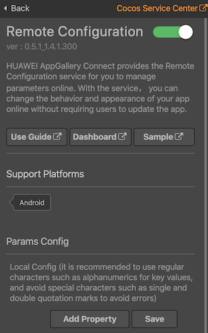
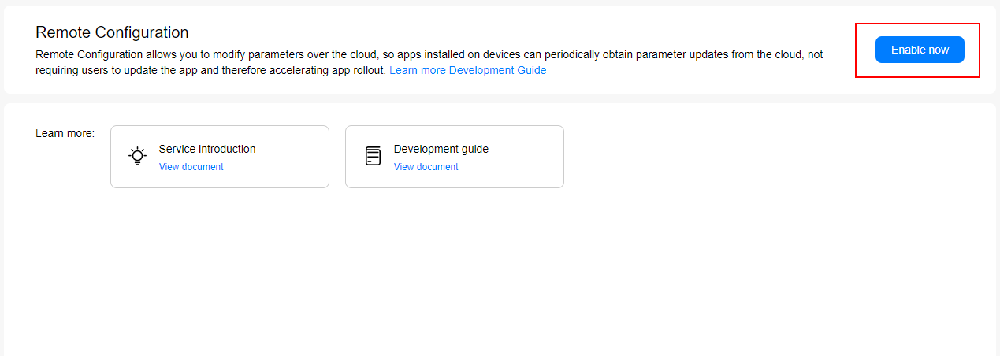

# Remote Configuration (AppGallery Connect) Quick Start

HUAWEI AppGallery Connect provides the [Remote Configuration](https://developer.huawei.com/consumer/en/doc/development/AppGallery-connect-Guides/agc-remoteconfig-introduction) service for you to manage parameters online. With the service, you can change the behavior and appearance of your app online without requiring users to update the app.

Remote Configuration provides cloud-based services, the console, and the client SDK. By integrating the client SDK, your app can periodically obtain parameter values delivered on the console to modify the app's behavior and appearance.

### Functions

- **Parameter management**: Includes adding, deleting, and modifying parameters, copying and modifying existing parameters as new ones, and setting conditional values.
- **Condition management**: Includes adding, deleting, and modifying conditions, and copying and modifying existing conditions as new ones. Currently, you can set the following conditions: version, language, country/region, audience, user attribute, user percentage, and time. More conditions will be available in the future.
- **Version management**: Supports management and rollback of up to 300 versions for parameters and conditions.
- **Permission management**: Allows the account holder, administrator, app administrator, R&D personnel, and operations personnel to access Remote Configuration by default.

### Use Cases

#### Displaying the Language by Country/Region

You can schedule a promotion by setting a trigger in Remote Configuration. More importantly, the promotion content can vary depending on the country or region as long as you set the locale information in Remote Configuration.

#### Displaying Different Content to Different Users

Remote Configuration can work with HUAWEI Analytics to personalize content displayed to different user groups. For example, office workers and students will see different products and UI layouts in an app.

#### Adapting the App Theme by Time

You can set the time condition, different app colors, and various picture materials in Remote Configuration to change the app theme for a special time. For example, during the graduation season, you can adapt your app to the graduation theme to attract more users.

#### Releasing New Functions

Releasing new functions to all users at the same time may be risky. Remote Configuration enables new function release by user percentage for you to slowly increase the target user scope, effectively helping you improve your app based on the feedback from users already exposed to the new functions.

## Enable Remote Configuration Service

- Use Cocos Creator to open the project that needs to be connected to Remote Configuration service.

- Click on **Panel -> Service** in the menu bar to open the Service panel, select Remote Configuration service to go to the service detail page, and then click on the **Enable** button in the top right to enable the service. For details, please refer to the Cocos Service [Operation Guide](./index.md#usage) documentation.

  
    
- Sign in to AppGallery Connect and select **My projects**. Find your project from the project list and click your app to enable Remote Configuration on the project card.

- Go to **Growing -> Remote Configuration**. Click **Enable now** to enable Remote Configuration.

  

- By default, the Remote Configuration API is automatically enabled when you enable the Remote Configuration service. To manually enable the API, please refer to [Enabling Services](https://developer.huawei.com/consumer/en/doc/distribution/app/agc-enable_service).

  

### Configs HUAWEI Config file

Most of HUAWEI Kits need the `agconnect-services.json` configuration file. If there are operations such as newly opened services, please update the file in time.

- Sign in to [AppGallery Connect](https://developer.huawei.com/consumer/en/service/josp/agc/index.html) find your project from the project list and select the app on the project card.
- 
- On the **Project Setting** page, click the configuration file **agconnect-services.json** to download it. The `agconnect-services.json` file **must be copied manually** to the settings directory of the project directory after downloading or updating.

  

### Verify whether the service is integrated successfully

When **Remote Configuration** service is intergrated and built to the Android project, it adds local configuration files `/res/xml/remote_config.xml`, a pair of key values are preset for testing and guiding developer. The key value can be obtained by calling the method `getValueAsString` to determine whether the service intervention is successful.


- Add simple code to the script.

  ```js
  let value = huawei.agc.rc.rcService.getValueAsString('test');
  console.log('Get config by key : test, value :' + value);
  ```

- You can [publish to the Android platform](../publish/publish-native.md) after the code is added. Please make sure that the **Package Name** on the **Build** panel is consistent with the **Package Name** set in the AppGallery Connect console.

- If you can see the value is **testValue** in LogCat, which means the integrate is successful.


## Sample Project

Developer can get a quick taste of the Analytics Kit with the sample project.

- Click on the **Sample** button in the Analytics Kit service panel, clone or download, and open the project in Cocos Creator.

- After enabling the Analytics Kit service and configuring the HUAWEI configuration file as described above, you can open the **Build** panel to compile the project by clicking **Project -> Build** in the Creator editor menu bar. Cocos Creator v2.4.1 and above, you could [publish to HUAWEI AppGallery Connect](../publish/publish-huawei-agc.md). Below Creator v2.4.1 could [publish to the Android platform](../publish/publish-native.md).

- Need to test on Huawei or Honor brand phones with HMS Core service installed.

- Once the Sample project is running on the phone, click the **Remote** button on the homepage for testing.

  

## Developer Guide

The document refer to AppGallery Connect - [Integrating Remote Configuration](https://developer.huawei.com/consumer/en/doc/development/AppGallery-connect-Guides/agc-remoteconfig-dev-guide). JS method calls are subject to this guide and [API documentation](https://docs.cocos.com/service/api/modules/huawei.agc.rc.rcService.html).

Because the `apply` from Java SDK returns a object, it cannot be passed in the JS method. When Remote Configuration plug-in integrated, the `applyDefault` and `apply` methods from Java SDK are discarded. And add the two methods `applyLastFetched` and `fetchAndApply` instead.

### Setting Parameter Values in Remote Configuration

Because the `applyDefault` from the Java SDK is discarded, all default configurations should be written in `/res/xml/remote_config.xml`.

### Fetching Parameter Values from Remote Configuration

#### fetchAndApply

`fetchAndApply(intervalSeconds?: number): void`

The Remote Configuration plug-in add the `fetchAndApply` method. It is recommended to use this method to fetching parameter values from the cloud.

Corresponding to `fetch` + `apply` methods from Java SDK. After the API is successfully called, data of the ConfigValues type is returned from Remote Configuration. Using the ConfigValues class, you can obtain only parameter values on the cloud. After obtaining parameter value updates, the app calls the apply() method immediately or at a specified time based on service requirements to override the values in the app by obtained values. The default value of intervalSeconds is -1, interval to call the fetch() method is 12 hours. 

If you call the `fetch` method to obtain configuration data but **callback failed**, the failure callback will be returned through the [setRemoteConfigListener](#setRemoteConfigListener) listener, and the user can choose whether to set up a listener. **Callback successful** In case of **no callback**.

**Parameter Description**:

| Parameter | Description | 
| :---------- | :------------- |  
|  intervalSeconds  | Interval for fetching data, the unit is seconds, default value is -1 for 12 hours | 

**Example**:

```js
huawei.agc.rc.rcService.fetchAndApply();
```

#### fetch

`fetch(intervalSeconds: number): void`

Developers can also call the `fetch` method to obtain the [setRemoteConfigListener](#setRemoteConfigListener) callback, and then call the [applyLastFetched](#applying-parameter-values-upon-the-next-startup) method to implement the parameter update process.

**Parameter Description**:

| Parameter | Description | 
| :---------- | :------------- |  
|  intervalSeconds  | Interval for fetching data, the unit is seconds, default value is -1 for 12 hours | 

**Example**:

```js
huawei.agc.rc.rcService.fetch();
```

#### setRemoteConfigListener

`setRemoteConfigListener(listener: RemoteConfigListener): void`

Set listener for `fetch` and `fetchAndApply`, optional.

If the `fetchAndApply` method is called, in the case of failed listener **only** callback will be given. Developers could consider whether they need to do for the callback.

If the `fetch` method is called, success or failure listener callback will be given. Developers can call the `applyLastFetched` method after success listener callback to update cloud parameter values.

**Example**:

```js
huawei.agc.rc.rcService.fetch();
```

### Obtaining Parameter Values by Data Type

```js
getValueAsBoolean(key: String): Boolean { return false; }

getValueAsDouble(key: String): Number { return 0; }

getValueAsLong(key: String): Number { return 0; }

getValueAsString(key: String): String { return ""; }
```

After default parameter values are set or parameter values are fetched from Remote Configuration, you can call any of these APIs provided by the SDK based on the data type to obtain the parameter values to use in your app.

Due to JS method limitation, the plug-in does not support `getValueAsBytArray` method from Java SDK.

**Parameter Description**:

| Parameter | Description | 
| :---------- | :------------- |  
|  key  | Key of a parameter specified in Remote Configuration. | 

**Example**:

```js
let values = huawei.agc.rc.rcService.getMergedAll();
console.log('Get all configs : ' + JSON.stringify(values));
```

You can call the `getSource` API to obtain the source of a value. The data sources are as follows:

- `huawei.agc.rc.rcService.RemoteConfigSource.STATIC = 0`: default value of the data type.
- `huawei.agc.rc.rcService.RemoteConfigSource.DEFAULT = 1`: in-app default value.
- `huawei.agc.rc.rcService.RemoteConfigSource.REMOTE = 2`: value obtained from Remote Configuration.

### Obtaining All Parameter Values

`getMergedAll(): any`

Returns all values obtained after the combination of the default values and values in Remote Configuration.

**Example**:

```js
let values = huawei.agc.rc.rcService.getMergedAll();
console.log('Get all configs : ' + JSON.stringify(values));
```

### Resetting Parameter Values

`clearAll(): void`

Clears all cached data, including the data fetched from Remote Configuration and the default values passed.

**Example**:

```js
huawei.agc.rc.rcService.clearAll();
```

### Loading Process

You can apply obtained parameter values in either of the following ways, refer to AGC Remote Configuration service - [Loading Process](https://developer.huawei.com/consumer/en/doc/development/AppGallery-connect-Guides/agc-remoteconfig-dev-guide#h1-1591760759854).

#### Applying parameter values immediately

Refer to [fetchAndApply](#fetchAndApply) function.

#### Applying parameter values upon the next startup

You can `fetch` parameter values at any time. However, the fetched values are not applied immediately but take effect when the app is started next time by calling the `apply` API. In this way, latest parameter values can be applied without asynchronous waiting.

Corresponding to the [fetch](#fetch) method, when [setRemoteConfigListener](#setRemoteConfigListener) is successfully callback, call the `applyLastFetched` method to update the cloud parameter value.

`applyLastFetched(): void`

Corresponding to `loadLastFetched` + `apply` methods from Java SDK. Obtains the cached data that is successfully fetched last time, and applies parameter values.

**Example**:

```js
huawei.agc.rc.rcService.applyLastFetched();
```

### Set Developer Mode

`setDeveloperMode(isDeveloperMode: Boolean): void`

Enables the developer mode, in which the number of times that the client obtains data from Remote Configuration is not limited, and traffic control is still performed over the cloud.

**Parameter Description**:

| Parameter | Description | 
| :---------- | :------------- |  
|  key  | Key of a parameter specified in Remote Configuration. | 

**Example**:

```js
huawei.agc.rc.rcService.setDeveloperMode(true);
```

## API Documentation

Please refer to the [Remote Configuration - API Documentation](https://docs.cocos.com/service/api/modules/huawei.agc.rc.rcService.html).