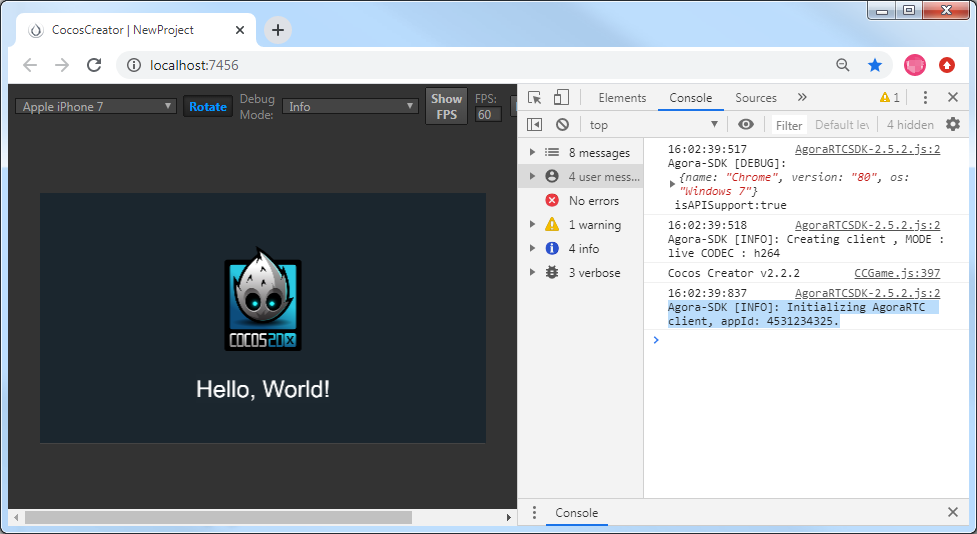

# Agora Voice Quick Start

Agora is a leading video, voice and live interactive streaming platform, helping developers deliver rich in-app experiences—including embedded voice and video chat, real-time recording, interactive live streaming, and real-time messaging.

[Agora Live Interactive Audio Streaming](https://docs.agora.io/en/Audio%20Broadcast/product_live_audio?platform=All%20Platforms) enables one-to-many and many-to-many audio live streaming with the Agora RTC SDK.

### Functions

Agora Live Interactive Audio Streaming boasts a flexible combination of functions for different scenarios.

| Function                        | Description                                                  | Scenarios                                                     |
| :------------------------------- | :------------------------------------------------------------ | :------------------------------------------------------------ |
| Co-hosting in one channel       | An audience switches to a co-host and interacts with the existing host. | <li>Large-scale live streams where hosts can invite the audience to interact with them. <li>Online games such as Murder Mystery and Werewolf Killing. |
| Co-hosting across channels      | Hosts interact with each other across channels.              | PK Hosting.                                                  |
| Audio mixing                    | Sends the local and online audio with the user's voice to other audience members in the channel. | <li>Online KTV. <li>Interactive music classes for children.  |
| Voice changer and reverberation | Provides multiple presets to easily change the voice and set reverberation effects, also supports adjusting the pitch and using the equalization and reverberation modes flexibly. | <li>Online KTV.<li>To change the voice in an online chatroom. |
| Spatial sound effects           | Sets the spatial sound effects for remote users to provide immersive experiences. | FPS games.                                                   |
| Modify the raw data             | Developers obtain and modify the raw voice data of the SDK engine to create special effects, such as a voice change. | <li>To change the voice in an online voice chatroom.<li>Image enhancement in a live stream. |
| Inject an online media stream   | Injects an external audio stream to an ongoing live interactive streaming channel. The host and audience in the channel can listen to or watch the stream while interacting with each other. You can set the attributes of the audio source. | <li>The host and audience listening to a concert together.   |
| Push streams to the CDN         | Sends the audio of your channel to other RTMP servers through the CDN:<li>Starts or stops publishing at any time.<li>Adds or removes an address while continuously publishing the stream. <li>Adjusts the picture-in-picture layout. | <li>To send a live stream to WeChat or Weibo.<li>To allow more people to watch the live stream when the number of audience members in the channel reached the limit. |

### Version Update Description

- Latest Version: 1.2.1_3.1.2

    - Adapt to Cocos Creator 2.4.x.

- v1.1.0_2.2.3.20_2.5.2

    - Adapt to Cocos Creator 2.3.x.

- v1.0.2_2.2.3.20_2.5.2

    - Fix some bugs.

- v1.0.1_2.2.3.20_2.5.2

    - Integrated Agora Voice service.

## Enable Agora Voice Service

- Use Cocos Creator to open the project that needs to be connected to Agora Voice service.

- Click on **Panel -> Service** in the menu bar to open the Service panel, select **Agora Voice** service to go to the service detail page, and then click on the **Enable** button in the top right to enable the service. For details, please refer to the Cocos Service [Operation Guide](./index.md#usage) documentation.

    

    **Charge**: Agora Voice services use the **prepaid** model. When your service usage exceeds the free portion of the service provider and the account balance is insufficient, the service will be stopped. At that time, you need to **pre-charge** in the Cocos Developer Console. 

After the service is activated, Cocos Service will automatically activate the Agora Voice service, connect Agora account, and integrate the Agora SDK into the game project.

### Verify whether the service is integrated successfully

- Once the Agora Voice service is integrated, we can verify the success of the Agora Voice service integration by adding simple code to the script.

- Click **Dashboard** button in the Agora Voice service panel, jump to [Agora Console](https://console.agora.io/). Then click  icon in the left navigation menu to enter the Project Management page and obtain the **App ID** of the corresponding game.

    

- Call the initialize method in the script and fill in the **App ID** obtained from the Agora console:

    ```js
    var appid = 'App ID obtained from the Agora console';
    agora && agora.init(appid);
    ```

- After the script is finished and saved, go back to the editor. Select the **Browser** and click the  [Preview](../getting-started/basics/preview-build.md) button. If you can see the initialization log in the browser console, which means the integrate is successful.

    

## Sample Project

- Click the **Sample** button in Agora Voice service panel, Clone or download **Voice-Call-for-Mobile-Gaming/Basic-Voice-Call-for-Gaming/Hello-CocosCreator-Voice-Agora** project and then open the project in Cocos Creator. The Sample project contains the following functions:

  - Join channel & leave channel.
  - Publish or subscribe stream.

- Enabling the Agora Voice service.

- Double click to open the **HelloWorld.js** in **Assets** panel, then replace **appid** in the `initAgora` method with the App ID obtained from the Agora console.

- After the script is finished and saved, go back to the editor. Select the **Browser** and click the  [Preview](../getting-started/basics/preview-build.md) button, you can debug the project in the browser.

  

  **Note**: If you find that the Sample project is successfully initialized during debugging in the browser, but there is no callback when you click **Join Channel**, please confirm whether you have enabled the Agora Voice service in the **Cocos Service** panel.

## Developer Guide

Please refer to [Agora Live Interactive Audio Streaming - Implementation](https://docs.agora.io/en/Audio%20Broadcast/start_live_audio_cocos_creator?platform=Cocos%20Creator#implementation) documentation.

## Reference Links

- [Agora Platform Overview](https://docs.agora.io/en/Agora%20Platform/agora_platform?platform=All%20Platforms)
- [Agora Live Interactive Audio Streaming Overview](https://docs.agora.io/en/Audio%20Broadcast/product_live_audio?platform=All%20Platforms)
- [Use an App ID for authentication](https://docs.agora.io/en/Agora%20Platform/token?platform=All%20Platforms) 

## API Reference

Please refer to the [Agora Voice API Reference](https://docs.agora.io/en/Audio%20Broadcast/API%20Reference/cocos_creator_voice/index.html) documentation.
