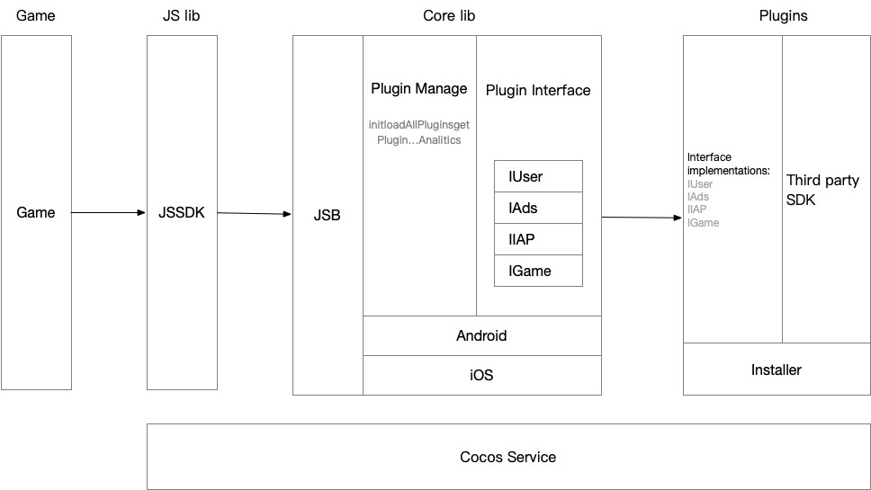
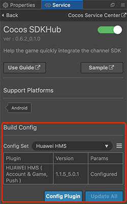
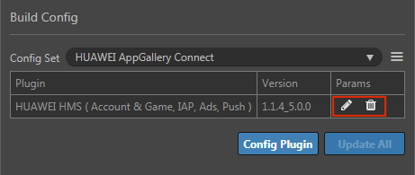
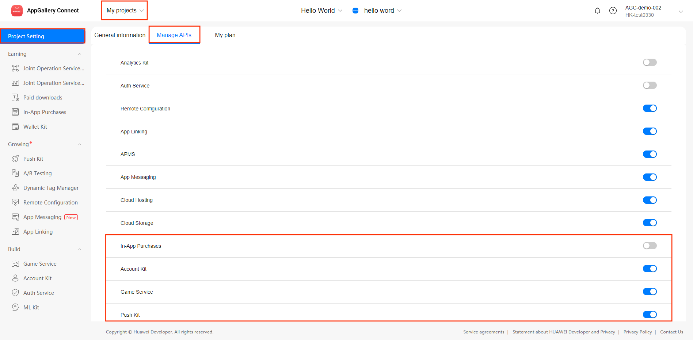
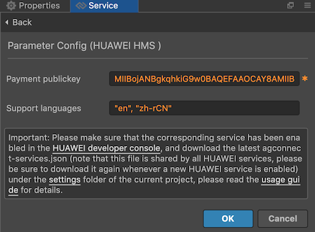
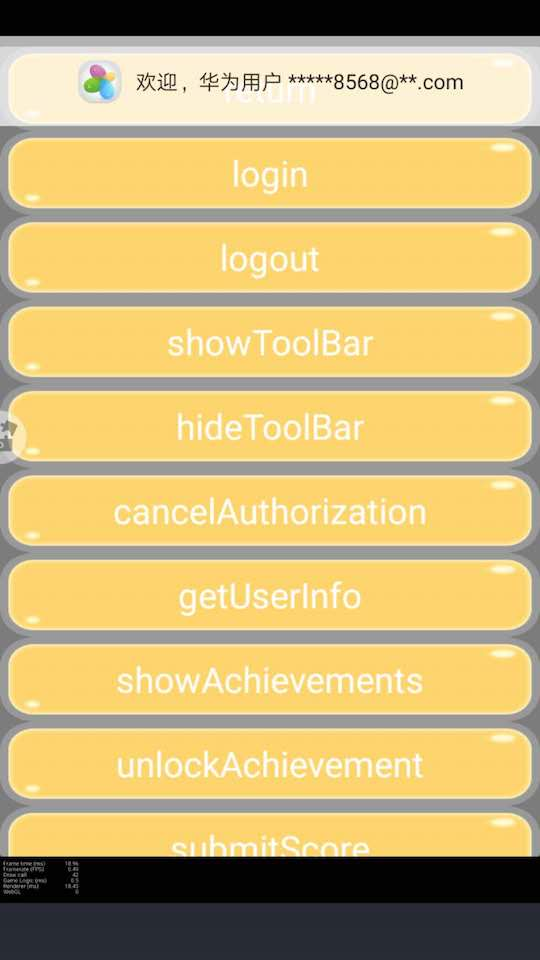

# SDKHub Quick Start

SDKHub is a set of access frameworks that help Cocos Creator users quickly access native channel SDKs.

When a game is finished and ready to be released to the channel, it usually needs to access the channel's SDK to integrate with the channel's account, IAP, advertising, game services, etc. When the game is to be released to multiple channels at the same time, the SDK interface is not the same from one channels to another, which makes it difficult for the developers to handle. Under the circumstances, developers would need to write lots of extra codes to ensure compatibility of the SDK integration. This is why there are many "super SDKs" that abstract these SDKs such as the Cocos AnySDK, which is an EOL product released by Cocos. 

The SDKHub is a feature developed by the engine team for Cocos Creators to solve this problem and can be used as a complete replacement for AnySDK.

The SDKHub allows Cocos Creator developers to quickly access native channel SDKs including: **Account & Game**, **IAP**, **Advertising**, **Push** and **Custom**. Developers would only need to turn on and integrate the SDKHub in Cocos Service panel, configure it via the Services panel, build the project, and then the required native SDKs can be quickly access.

## Product principles 

The SDKHub is divided into two main parts: the framework layer and the plug-in layer, which are controlled and configured by the SDKHub service panel.

- **Framework layer** implements the JSB bindings, plug-ins and callbacks unified management interface, the unified encapsulation interface of each plug-in system and the native platform implementation part.
- **Plugin layer** implements the interfaces defined in the framework layer, and various other interfaces required by the native platform SDKs, and unifies the encapsulation of the native platform SDKs callbacks. When building the project, the installation script is called to configure the native project for the native platform SDK.

At the game play layer, developers only need to call the methods in the SDKHub and handle the encapsulated callbacks, greatly simplifying the workload of developers accessing native SDKs.



## Service activation

Use Cocos Creator to open the project that needs to be connected to SDKHub. Click on **Panel -> Service** on the menu bar to open the **Service** panel, go to the SDKHub service detail panel, and click on the **Enable** button at the top right. Refer to [Cocos Service Operation Guide](index.md).


Once the service is turned on, the Cocos Service will automatically integrate the SDKHub framework into the game project.

### Verify whether the service is integrated successfully

- Once the SDKHub service is integrated, we can verify the success of the SDKHub integration by adding simple code to the script. The SDKHub will be initialized automatically, but it takes time to initialize. We use the `scheduleOnce` to call the login method of the SDKHub user system.

    ```js
    this.scheduleOnce(function(){
        SDKHub.AgentManager.getInstance().getUserPlugin().login();
    },2);
    ```

- After the script is finished and saved, go back to the editor. SDKHub debug, you need [publish to Android platform](./publish/publish-native.md). If you can see the login window in debug mode on your device, you can verify that the SDKHub is integrated.

    
    
## Platform SDK Configuration

The aforementioned operation only integrates the SDKHub's abstraction layer framework into the game, but does not substantially integrate what we call third-party SDKs. Which platforms the game needs to be released to and which SDKs need to be integrated that need to be added via the **Build Config** on the SDKHub service details page, which we will detail next.



The specific filling rules for the relevant parameter configuration are as follows:

- **Config Set Management**

  Config sets are an important feature of the SDKHub. When we need to publish a game to different platforms and integrate different SDKs for different platforms, we can create different "config sets" for them. We can even create multiple config sets for the same platform in order to manage multiple sets of different parameters. Then, when building the game, we can specify the corresponding config set in the **SDKHub Configuration** option of the **Build** panel to build a game project that integrates different SDKs. This makes our game integration SDKs a great way to work.

  How to create a config set?

  1. Click **New Config Set** as shown below.

      

  2. Enter the **Add Config Set** panel to configure the required parameters, and then click **OK**.

      

    - **Config Set Name**: Usually the platform name can be used directly, you can also use a name that’s more recognizable.
    - **Release Platform**: Used to set the platform for the config set to take effect, currently only HUAWEI AppGallery Connect is supported.
    - **Channel**: The target channel you need to build and release, SDKHub will usually add the SDK (plug-in) required by the channel for you automatically.

- **Plugin Management**

  After creating a configuration set, users need to select and configure the SDK (plug-in) that needs to be integrated under the set, and fill in the parameters required for the native platform SDK in order to use the features of the platform SDK in the built project. If you don't configure the plugins, the built project will not do much of anything and will automatically switch to debug mode when the SDKHub framework interface is called.

  

  - **Config Plugin**: Add plugins with the required functions, currently supports **Account & Game**, **IAP**, **Advertising** and **Push**.
  - **Update All**: If you have a downloaded plug-in with an online update version, click here to update all of them.
  - **Edit parameters button**: fill in the parameters required for the platform SDK. If you don't fill in all the parameters, it can't be built normally.

    

  - **Delete parameter button**: Delete the currently filled parameter configuration.

## Build and compile

After creating the config set and configuring the plugins and parameters for the set, we need to select the corresponding config set when building the game in order to finally compile the game project with the SDK.

Open **Project -> Build...** in the top menu of Cocos Creator, when you select **Android**, **iOS**, **HUAWEI AppGallery Connect** (currently SDKHub only supports these native platforms), it will show **SDKHub Configuration** item and list the config set you created in the Service panel (Cocos Creator 2.4.1 and above only, older versions before 2.4.1 will use the config set selected by the SDKHub panel in the Service panel by default), just select the corresponding config set.


Tips: If you are having problems with your builds, probably due to your Creator native compilation environment being incorrectly configured, try compiling the project directly in **Android Studio** or **Xcode** to get more debugging information.

## Sample project

You can get a quick taste of the SDKHub with the sample Project.

- Click on the **Sample** button in the SDKHub Service Panel, clone or Download, and open the project in Cocos Creator.

- Let's take the example of integrating **HUAWEI HMS Core**. The following prerequisites need to be completed:

  - Have registered a developer account with [Huawei Developer Center](https://developer.huawei.com/consumer/en/console) and created a game app with **Account Kit**, **In-App Purchases**, **Game Service** and **Push Kit** service enabled in the **API Management** page.
      
    

  - Configure the package name, generate and configure the SHA256 certificate fingerprint, and get the configuration file `agconnect-services.json` in the **My Project** page. Refer to the [AppGallery Connect Configuration](https://developer.huawei.com/consumer/en/doc/development/HMS-Guides/account-preparation) documentation for details.
      
  - Requires testing on a Huawei or Honor branded phone with the **HMS Core Service** installed.

- Enable the SDKHub service in the **Service** panel, and add a new config set to the SDKHub services panel.

  

- Enter the **Add Config Set** panel to configure the required parameters, and then click **OK**.

  
    
- After the config set is added, click the **Config Plugin** button and check the **HUAWEI HMS Core** related services plugin.

  
    
- Click the **Edit Parameters** button under the **Params** list.

  

  Enter the **Parameter Config** panel to configure the required parameters, and then click **OK**.

  
    
- Once the configuration is complete, you can build to the **HUAWEI AppGallery Connect** platform and select the config set you just created in the **Build** panel, then build and compile the project for testing.

  

- If you need to modify the project parameters or the JS code layer, you can rebuild it in the build panel after modification.

- If you need to delete the service plug-in configuration (e.g. remove the IAP function), it is recommended to delete the release package `build/jsb-link` or `build/jsb-default` directory generated after the project is built, and then rebuild.

## API documentation

Please refer to the [API documentation](https://docs.cocos.com/service/api/en/modules/_sdkhub_.sdkhub.html).
