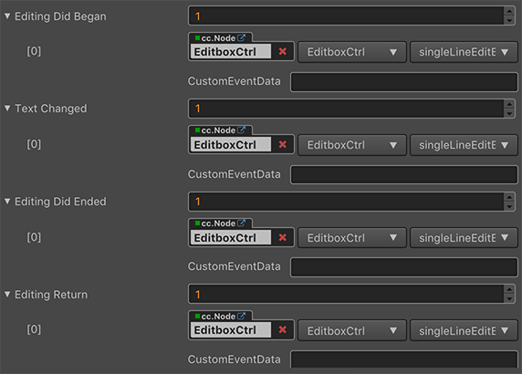

# EditBox component reference

EditBox is a text input component, you could use this component to gather user input easily.


Click **Add Component** button at the bottom of **Properties** panel and then select **EditBox** from **Add UI Component**, then you can add the EditBox component to the node.

For EditBox API reference, please refer to [EditBox API](../../../api/en/classes/EditBox.html).

## Upgrade for EditBox component

In v2.1.1, we've made some adjustment and optimization on EditBox component. The change mainly includes:
- Add `textLabel`,  `placeholderLabel`, `background` properties, users can configure the style of **EditBox** component more flexibly by attaching a custom **Label** or **Sprite** component.
- Deprecated `fontSize`, `fontColor`, `lineHeight`,  `placeholderFontSize`, `placeholderFontColor`, `backgroundImage`, `stayOnTop` properties, Cocos Creator will automatically upgrade these properties to the corresponding properties on the attached components.
- Deprecated the `setFocus()` method, add new methods `focus()` and `blur()`, which provides users with the ability to force ending editing editBox.

## Layout property

| Property              |   Function Explanation
| --------------        | ----------- |
| String                | The initial input text of EditBox.
| Placeholder           | The content string of placeholder.
| Background            | The Sprite component attached to the node for EditBox's background.
| TextLabel             | The Label component attached to the node for EditBox's input text label.
| PlaceholderLabel      | The Label component attached to the node for EditBox's placeholder text label.
| Keyboard Return Type  | The keyboard return type of EditBox. This is useful for keyboard of mobile device.
| Input Flag            | Specify the input flag: password or capitalize word. (Only supports Android platform)
| Input Mode            | Specify the input mode: multiline or single line.
| MaxLength             | The maximize input characters.
| TabIndex              | Set the tabIndex of the DOM input element, only useful on Web.

## EditBox Event



### Editing Did Began Event

| Property |   Function Explanation
| -------------- | ----------- |
|Target| Node with the script component.
|Component| Script component name.
|Handler| Assign a callback function which will be triggered before user starting to input text.

### Text Changed Event

| Property |   Function Explanation
| -------------- | ----------- |
|Target| Node with the script component.
|Component| Script component name.
|Handler| Assign a callback function which will be triggered when user is editing text.

### Editing Did Ended Event

| Property |   Function Explanation
| -------------- | ----------- |
|Target| Node with the script component.
|Component| Script component name.
|Handler| Assign a callback function which will be triggered after user finished input text. Usually when in single line input mode, it's triggered after user press return key or click the area outside of EditBox. When in multiline input mode, it's triggered only after user click the area outside of EditBox.

## Detailed explanation

- Keyboard Return Type is mainly designed for mobile device input. You could use this option to customize return key style of virtual keyboard.
- If you want to input password, you need set **Input Flag** to `PASSWORD` and the **Input Mode** mustn't be `ANY`, usually we use **Single Line**.
- If you want to enable multiline input support, the flag of `Input Mode` should be set to `Any`.
- The background image of EditBox support slice 9, you could customize the border as you did in Sprite component.

## Add a callback through the script code

### Method one

The event callback added by this method is the same as the event callback added by the editor, all added by code. First you need to construct a `cc.Component.EventHandler` object, and then set the corresponding `target`, `component`, `handler` and `customEventData` parameters.

```js
var editboxEventHandler = new cc.Component.EventHandler();
editboxEventHandler.target = this.node; // This node is the node to which your event handler code component belongs
editboxEventHandler.component = "cc.MyComponent"
editboxEventHandler.handler = "onEditDidBegan";
editboxEventHandler.customEventData = "foobar";

editbox.editingDidBegan.push(editboxEventHandler);
// You can also register other callback functions in a similar way.
// editbox.editingDidEnded.push(editboxEventHandler);
// editbox.textChanged.push(editboxEventHandler);
// editbox.editingReturn.push(editboxEventHandler);


// here is your component file
cc.Class({
    name: 'cc.MyComponent'
    extends: cc.Component,

    properties: {
    },

    onEditDidBegan: function(editbox, customEventData) {
        // The editbox here is a cc.EditBox object.
        // The customEventData parameter here is equal to the "foobar" you set earlier.
    },
    // Suppose this callback is for the editingDidEnded event.
    onEditDidEnded: function(editbox, customEventData) {
        // The editbox here is a cc.EditBox object.
        // The customEventData parameter here is equal to the "foobar" you set earlier.
    }
    // Suppose this callback is for the textChanged event.
    onTextChanged: function(text, editbox, customEventData) {
        // The text here indicates the text content of the modified EditBox.
        // The editbox here is a cc.EditBox object.
        // The customEventData parameter here is equal to the "foobar" you set earlier.
    }
    // Suppose this callback is for the editingReturn event.
    onEditingReturn: function(editbox,  customEventData) {
        // The editbox here is a cc.EditBox object.
        // The customEventData parameter here is equal to the "foobar" you set earlier.
    }
});
```

### Method two

Added by the way of `editbox.node.on('editing-did-began', ...)`.

```js
// Suppose we add an event handler callback inside a component's onLoad method and event handlers in the callback function:

cc.Class({
    extends: cc.Component,

    properties: {
       editbox: cc.EditBox
    },

    onLoad: function () {
       this.editbox.node.on('editing-did-began', this.callback, this);
    },

    callback: function (editbox) {
       // The parameter of the callback is the editbox component.
       // do whatever you want with the editbox.
    }
});
```

Similarly, you can register events such as `editing-did-ended`, `text-changed`, `editing-return`, etc. The parameters of the callback function for these events are consistent with the parameters of `editing-did-began`.
