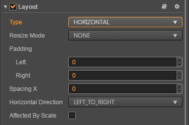
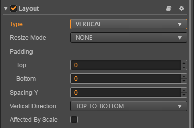

# Layout component reference

Layout is a container component. The container can unlock the auto-layout function to automatically arrange all the sub-objects according to the specifications so that the user can use it to make list, page turning and other functions conveniently.

- Horizontal Layout

- Vertical Layout

- Grid Layout

Click the **Add Component** button at the bottom of **Properties** panel and then select **Layout** from the **UI Component** to add the Layout component to the node.

## Layout property

| Property            | Function Explanation                                                                                                            |
| --------------       | -----------                                                                                                                     |
| Type                 | Layout type, currently has NONE, HORIZONTAL, VERTICAL and Grid.                                                                 |
| Resize Mode          | Resize strategies, currently has NONE, CHILDREN and CONTAINER.                                                                  |
| PaddingLeft          | The left padding between the sub-object and the container frame in the layout.                                                  |
| PaddingRight         | The right padding between the sub-object and the container frame in the layout.                                             |
| PaddingTop           | The top padding between the sub-object and the container frame in the layout.                                               |
| PaddingBottom        | The bottom padding between the sub-object and the container frame in the layout.                                            |
| SpacingX             | The separation distance between sub-objects in the horizontal layout. NONE mode doesn't have this attribute.                    |
| SpacingY             | The separation distance between sub-objects in the vertical layout.NONE mode doesn't have this attribute.                       |
| Horizontal Direction | When it is designated as horizontal layout, which side does the first child node start in the layout? The left or the right?    |
| Vertical Direction   | When it is designated as vertical layout, which side does the first child node start in the layout? The upside or the downside? |
| Cell Size            | This option is only available in Grid layout. The size to use for each layout element in the container.                         |
| Start Axis           | This option is only available is Grid layout. It specifies which primary axis to place elements along.                          |

## Detailed explanation

The default layout type is NONE after adding the Layout component. It indicates that the container won't change size and location of the sub-object. When the user places sub-object manually, the container will take the minimum rectangular region that can contain all the sub-objects as its own size.

You can switch the layout container type by altering `Type` in **Properties** panel, all the layout types support `Resize Mode`.

- When **Resize Mode** is **NONE**, the container and sub-objects' size is independent of each other.

- When **Resize Mode** is **CHILDREN**, the sub-objects' size will change with container's size.

- When **Resize Mode** is **CONTAINER**, the container's size will change with sub-objects' size.

When using Grid layout, the **Start Axis** is very important. When choosing **HORIZONTAL**, it will fill an entire row before a new row is started. When choosing **VERTICAL**, it will fill an entire column before a new column is started.

**Node**: After setting the Layout, the results need to be updated until the next frame, unless you manually `updateLayout` API.

---

Continue on to read about [Script development workflow](../scripting/index.md).
