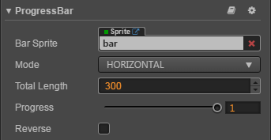

# ProgressBar component reference

ProgressBar is usually used to show the progress of a certain operation in the game. Add the ProgressBar component to a node and associate a
Bar Sprite to this component. The Bar Sprite can then be controlled to show progress in the scene.

Click the **Add component** button at the bottom of the **Properties** panel and select **ProgressBar** from **UI Component**. Then you can add the ProgressBar component to the node.

For the script interface of the ProgressBar, please refer to [ProgressBar API](../../../api/en/classes/ProgressBar.html).

## ProgressBar Property

| Property |   Function Explanation
| -------------- | ----------- |
| Bar Sprite   | The Sprite component needed for rendering ProgressBar. It can be linked by dragging a node with the **Sprite** component to this property.
| Mode         | Currently supports the **HORIZONTAL**, **VERTICAL** and **FILLED** modes. The initial direction can be changed by cooperating with the **Reverse** property.
| Total Length | The total length/total width of the Bar Sprite when the ProgressBar is at 100%. In **FILLED** mode, **Total Length** represents the percentage of the total display range for Bar Sprite, with values ranging from 0 to 1.
| Progress     | Floating point. The value range is 0~1, and values outside the range are not allowed.
| Reverse      | Boolean value. The default fill direction is from left to right/bottom to top, and when enable, it becomes right to left/top to bottom.

**Note**: The `Mode`, `Total Length`, `Progress`, and `Reverse` properties only work on **Bar Sprite** node.

## Detailed explanation

After adding the ProgressBar component, drag a node with the **Sprite** component from the **Node Tree** to the Bar Sprite property. Then you can control the display of the ProgressBar by dragging the progress sliding block.

Bar Sprite could be its own node, child node or any node that comes with the **Sprite** component. Also, Bar Sprite can freely choose the Simple, Sliced or Filled rendering modes.

The **Type** of Bar Sprite also needs to be set to **FILLED**, otherwise a warning will appear when the mode of the progress bar has already selected **FILLED**. Please refer to [Common UI Controls](../ui/ui-components.md#progressbar).

---

Continue on to read about [Mask component reference](mask.md).
