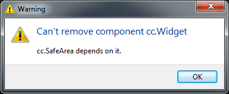

# SafeArea component reference

This component is used to adjust the layout of current node to the secure area of an special-shaped screen device such as the iPhone X. It can be adapted to both Android and iOS devices, and is generally used as a top-level node in the UI interaction area.

The concept of safe area is to give you a fixed inner rectangle in which you can safely display content that will be drawn on screen. You are strongly discouraged from providing controls outside of this area. But your screen background could embellish edges.

Click the **Add Component -> UI Component -> SafeArea** button at the bottom of the **Properties** panel to add the SafeArea component to the node. It should be noted that when adding a SafeArea component, the Widget component is also automatically added to the node (if there is no Widget component on the node) and cannot be deleted.

You only need to add the SafeArea component to the node without any other settings, this component will get the safe area of the current iOS or Android device via the API `cc.sys.getSafeAreaRect();` when enabled, and implements the adaptation by using the Widget component and set anchor.

For more details, please refer to the [SafeArea](https://github.com/cocos-creator/example-cases/tree/master/assets/cases/02_ui/16_safeArea) in the example-cases.
