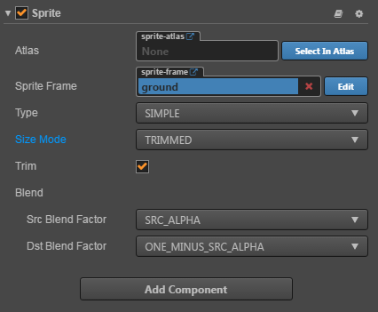
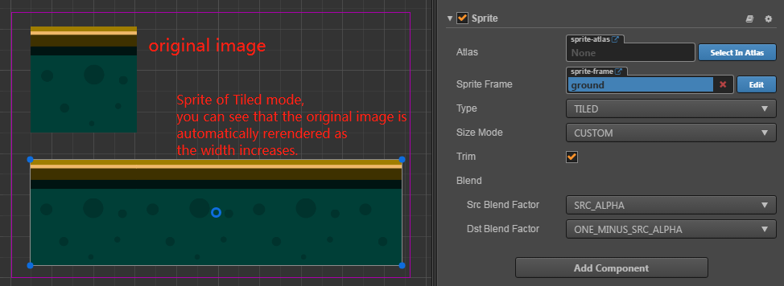

# Sprite Component Reference

Using `Sprite` is the most common way to display images in 2D games. By adding a `Sprite` component to a `Node`, you can display the images in the project's resources in the `Scene`.

You can add a `Sprite` component to the node by clicking the **Add Component** button below the **Properties** and selecting **Sprite** from the **Add Renderer Component** menu.

Please refer to [Sprite API](../../../api/en/classes/Sprite.html) for the script interface.

## Sprite Properties

| Properties | Description
| -------------- | ----------- |
| Atlas | [Auto Atlas](../asset-workflow/atlas.md) which the Sprite display image resource belongs to. ( **Select In Atlas** button after Atlas, this feature is temporarily unavailable and we will optimize it as soon as possible)
| Sprite Frame | [SpriteFrame image resource](../asset-workflow/sprite.md) which is used to render the Sprite. (The **Edit** button behind Sprite Frame is used to edit the nine rectangle grid cutting of the image resource, please refer to [Use a Sliced Sprite to make a UI image](../ui/sliced-sprite.md) for details)
| Type | Rendering mode, currently includes `Simple`, `Sliced`, `Tiled`, `Filled` and `Mesh` five rendering modes.
| Size Mode | Specify the size of the Sprite `Trimmed` automatically fit to the size of the sprite cropped `Raw` automatic fit for sprite original size `Custom` use the node preset size. When the user manually modifies `Size` properties, `Size Mode` will be automatically set to `Custom`.
| Trim | Whether the transparent pixel area is included in the node bounding box，which takes effect only when the Type is set to Simple. Please refer to [Auto Trim for SpriteFrame](../asset-workflow/trim.md).
| Src Blend Factor | The source image blend mode.
| Dst Blend Factor | the destination image blend mode. Together with the above properties, you can mix the foreground and background Sprite in different ways to render, and the effect preview can refer to [glBlendFunc Tool](http://www.andersriggelsen.dk/glblendfunc.php).

After adding the Sprite component, drag the Texture or SpriteFrame type resource from the **Assets** to the `Sprite Frame` attribute reference. Then, the resource image can be displayed through the Sprite component.

If this SpriteFrame resource is contained within an Atlas resource, then the `Atlas` attribute of the Sprite will be set up along with it.

**To dynamically replace spriteframe, you need to dynamically load the picture resource before you replace it, please refer to [Acquire and load asset: how to dynamically load](../scripting/load-assets.md#how-to-dynamically-load).**

## Rendering mode

Currently, the Sprite component supports five rendering modes:

- `Simple mode`: rendering the Sprite according to the original image resource. It is normally used along with `Use Original Size` to guarantee the image shown in the scene is in full accordance with the image designed by the graphic designer.
- `Sliced mode`: the image is cut up into a nine square grid and according to certain rules is scaled to fit freely set dimensions (`size`). It is usually used in UI elements or to make images that can be enlarged infinitely without influencing the image quality into images cut up into a grid to save game resource space. Please read [use Sprite editor to make a Sudoku image](../asset-workflow/sprite.md#-sprite-) for detailed information.
- `Tiled mode`: as the size of the Sprite increases, the image is not stretched, but it Will repeat according to the size of the original picture, paving the original picture to the size of the entire Sprite as tiled tiles.
 
- `Filled mode`: draws a portion of the original picture in a certain direction and scale, based on the origin and fill mode settings. Often used for dynamic display of progress bars.
- `Mesh mode`: Only support **.plist** file which is built by __TexturePacker__ (4.0 or higher version) with ploygon algorithm.

### Filled mode

When the `Type` property selects `Filled mode`, a new set of properties appears to be configured. So let's explain their roles in turn.

| Attribute |   Function Explanation
| -------------- | ----------- |
| Fill Type | Fill type selection, including `HORIZONTAL`, `VERTICAL`, and `RADIAL`.
| Fill Start | Normalized values for filling starting position (from 0 ~ 1, denoting the percentage of total population), when you select a horizontal fill, the `Fill Start` is set to 0, and it is populated from the leftmost edge of the image.
| Fill Range | Normalized values for padding ranges (same from 0 ~ 1). When set to 1, it fills up the entire range of the original image.
| Fill Center | Fill Center Point, this property appears only if the `Radial` type is selected. Determines which point on the Sprite is used as pivot when the FillType is set to RADIAL, the coordinate system used are the same as the [Anchor](../content-workflow/transform.md#-anchor-).

#### Fill Range Supplemental description

Under both the `horizontal` and `VERTICAL` fill types, the values set by `Fill Start` affect the total number of fills, if `Fill Start` is set to 0.5, even if `Fill Range` is set to 1.0, the actual padding is still only half the total size of the Sprite.

`Fill Start` in the `RADIAL` type only determines the orientation of the starting fill, when `Fill Start` is set to 0, start filling from the x axis positive direction. 
`Fill Range` determines the total amount of padding, which fills the entire circle when `Fill Range` is set to 1. A counter anticlockwise fill when `Fill Range` is positive, and is filled clockwise when negative.
