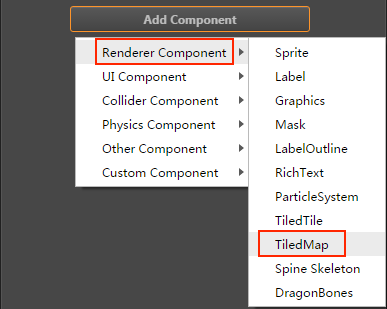
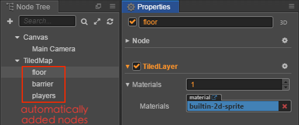

# TiledMap Component Reference

TiledMap is used for render a map with TMX format.


Click the **Add Component** button at the bottom of the **Properties** panel and select **TiledMap** from **Renderer Component** to add the **TiledMap** component to the node.



API reference: [TiledMap API](../../../api/en/classes/TiledMap.html).

## TiledMap Properties

| Properties |   Details
| -------------- | ----------- |
| Tmx Asset | Specify the asset of the TMX format map. |

## Details

- When a TiledMap component is added, you can render a map by drag a TiledMap asset from **Assets** panel to the property **Tmx Asset** of the TiledMap component.
- After you add the **Tmx Asset** property to the TiledMap component, the TiledMap component will add children node corresponding to the layers in the map. A TiledLayer component will be added for the children node. **Please DO NOT remove the TiledLayer component.**

  
- The Tiledmap component does not support `mapLoaded` callback, you can use TiledMap component in callback `start`.

## TiledLayer and Node Overlap

The TiledLayer component converts the coordinates of the nodes added to the map layer into the row and column coordinates of the map block.

When rendering a map block in the map layer in row and column order, if there are nodes in the row and column of the map block, the rendering of the map block will be interrupted and the nodes will be rendered instead.

After rendering the nodes in the map block, the map block will continue to be rendered to achieve mutual overlap between the nodes and the map layer.

**Node**: The overlap relationship is only related to the coordinates of the node, regardless of the size of the node.

Here is an example of how TiledLayer achieves overlap with nodes.

1. Create a new empty node in Node Tree and add the Spine component in Properties. When the property of the TiledMap component is completed, nodes with the TiledLayer component are automatically generated (that is the map layer).

2. Create [Prefab](../asset-workflow/prefab.md) to instantiate multiple nodes in the scene.

3. Create a new JavaScript script in **Assets** and double-click to open to write. The sample script code is as follows:

    ```js
    cc.Class({
        extends: cc.Component,
    
        properties: {
            // A prefab for instantiating nodes
            prefab:{
                type: cc.Prefab,
                default: null,
            },
    
            // TiledLayer component
            tiledLayer: {
                type: cc.TiledLayer,
                default: null,
            },
        },
    
        start () {
            // The developer can set the node's position as required
            let posArr = [cc.v2(-249, 96), cc.v2(-150, 76), cc.v2(-60, 54), cc.v2(-248, -144), cc.v2(-89, -34)];
            for (let i = 0; i < posArr.length; i++) {
                let shieldNode = cc.instantiate(this.prefab);
                // The node's position can be set as random, here only as an example.
                shieldNode.x = posArr[i].x;
                shieldNode.y = posArr[i].y;
                // Calling the addUserNode method of the TiledLayer component to add nodes to the corresponding map layer and create a mutual overlap relationship with the map layer.
                this.tiledLayer.addUserNode(shieldNode); 
            }
        },
    });
    ```

4. Mount the script component onto the Canvas, it means dragging and dropping the script into the **Properties** of the node. Then drag and drop the auto-generated node with TiledLayer component in the **Node Tree** and the prefab in the **Assets** to the corresponding property box of script component. And save the Scene.

5. Click the preview button at the top of the editor, we can see the effact that the nodes and the map layer mutual overlap. About the code, please refer to [ShieldNode](https://github.com/cocos-creator/example-cases/tree/master/assets/cases/tiledmap) for details.

    

If you want to remove a node in the map layer, call the `removeUserNode` of TiledLayer.

---

Continue on to read about [Workflow of script development](../scripting/index.md).
