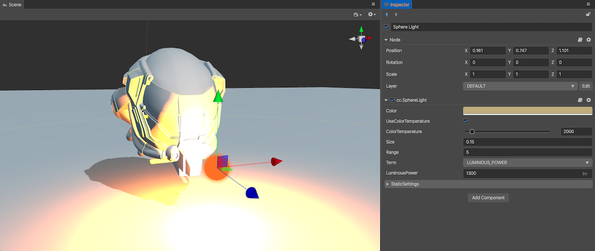
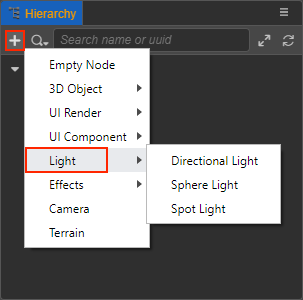

# Lighting

The __Light__ in the game represents an object with luminous ability that can illuminate the surrounding environment. Adding light in the scene can make the scene produce the corresponding light and shadow effects, and get better visual effects.

## Add Lights

There are two ways to add lights:

- Click on the __+__ button in the upper left corner of the __Hierarchy__ panel, and select __Light__, then select the light type as needed to create a node containing the corresponding type of light component to the scene.

  

- Select the node in the __Hierarchy__ panel where you want to add the lights, then clicking the __Add Component__ button below the __Inspector__ panel and selecting __Light__.

  

## Physically-based Lighting

__Cocos Creator__ uses optical measurement units to describe light source parameters. Based on optical measurement units, we can convert all relevant parameters of the light source into physical values in the real world. In this way, the designer can adjust the __light intensity__, __color__, __range__ and __other__ parameters according to the industrial standards of parameters and the physical parameters of a real environment. The overall lighting effect is more in line with the real natural environment.

For more information about the light and light parameters, please refer to the [Physically-based Lighting](./light/pbr-lighting.md).

## Types of Light

Light types include __Directional Light__, __Spherical Light__, __Spotlight__ and __Ambient Light__ four types. For more information, please refer to the following documentations:

- [Directional light](light/dir-light.md)
- [Spherical light](light/sphere-light.md)
- [Spotlight](light/spot-light.md)
- [Ambient light](./ambient.md)
