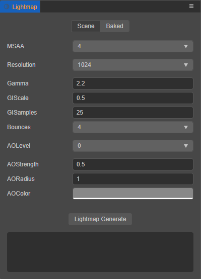
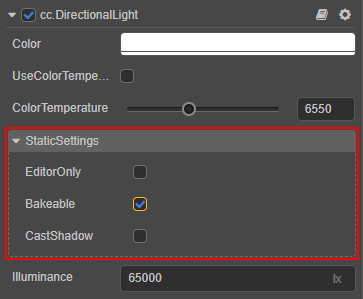
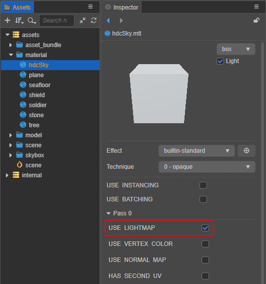
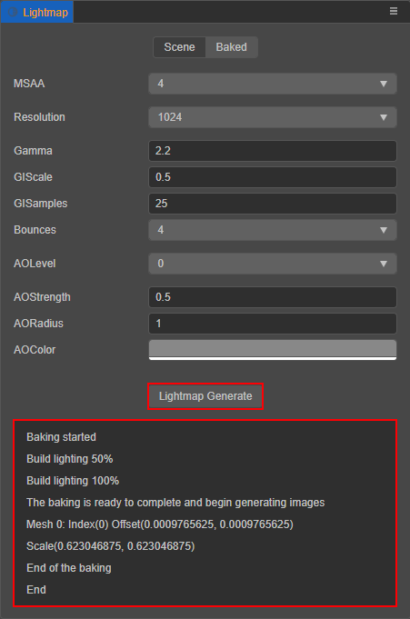
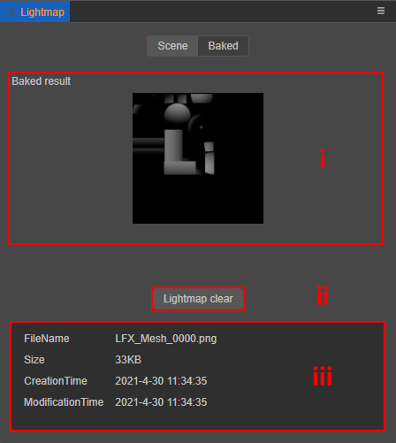

# Lightmapping

> **Note**: the Lightmapping feature is not currently supported on Apple M1 (Silicon) architecture devices and is expected to be supported in v3.1.2.

Lightmaps are generated by the **Baking System** by calculating the effect of all light sources in the scene on the model. In scenes with fixed light sources, using lightmapping instead of real-time lighting calculations can reduce resource consumption and thus improve the efficiency of scene operation.

## Lightmapping Panel

Click **Projects -> Lightmapping** in the editor menu bar to open the Lightmapping panel. The panel consists of two pages, **Scene** and **Baked**.

- **Scene**: mainly used to configure the parameters related to generating the lightmap.
- **Baked**: mainly used to display the generated lightmap and its related information.

For details, please see the **Generating Lightmaps** section below.

### Property Description

The description of each parameter on the **Scene** page is as follows:

| Property | Description |
| :--- | :--- |
| MSAA | Multiple Sampling, optional values include: 1, 2, 4, 8 |
| Resolution | The resolution of the generated lightmap, optional values are 128, 256, 512, 1024, 2048 |
| Gamma | Gamma correction value |
| GIScale | Global lighting scaling factor |
| GISamples | Global illumination sampling factor |
| AOLevel | AO (Ambient Occlusion) level |
| AOStrength | AO intensity |
| AORadius | AO radius |
| AOColor | AO color |

## Generating lightmaps

1. Select the light node (with light component) in the **Hierarchy** panel, then set the **StaticSettings** of the light component in the **Inspector** panel, and check the `Bakeable` property (currently multiple [main directional lights](./dir-light.md) are not supported).

    

    - **EditorOnly**: if or not it takes effect only in the editor

    - **Bakeable**: if or not to bake static lighting

    - **CastShadow**: if or not to cast static shadows

2. Select the model node (with [MeshRenderer component](./../../../engine/renderable/model-component.md)) in the **Hierarchy** panel to generate the lightmap, then set **LightmapSettings** in the **Inspector** panel and check the `Bakeable` property.

    

    - **Bakeable**: if or not to bake static lighting

    - **CastShadow**: if or not to cast static shadows

    - **ReceiveShadow**: if or not to receive static shadows

    - **LightmapSize**: the size of the model lightmap

    > **Note**: to generate lightmaps for a model, there are two requirements:
    >
    > 1. When the artist creates the model resource, in addition to the UVs of the model itself, another set of UVs for lightmapping needs to be included.
    > 
    > 2. The model's Materials need to have the **USE LIGHTMAP** rendering option turned on, for example:
    >
    > 

3. Open the **Lightmap** panel and set the corresponding parameters. Then click the **Lightmap Generate** button, a file storage dialog will pop up, you need to specify a folder (must be in the `assets` directory) to store the generated lightmap data information. Notice the baking progress log at the bottom of the **Lightmap** panel.

    

4. After baking, the generated lightmap, as well as the file name, size and other related information can be viewed on the **Baked** page of the **Lightmap** panel. The generated lightmaps are automatically processed by the engine and do not need to be manipulated by the developer.

    

    1. **Bake result**: shows the generated lightmap after baking.
    2. **Lightmap clear**: used to delete the generated lightmap and related information.
    3. **Information output panel**: displays the generated lightmap file name, size and other related information.
 
