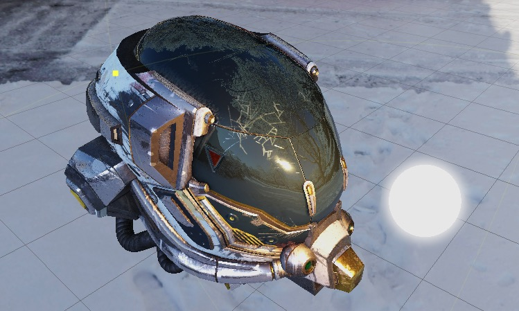
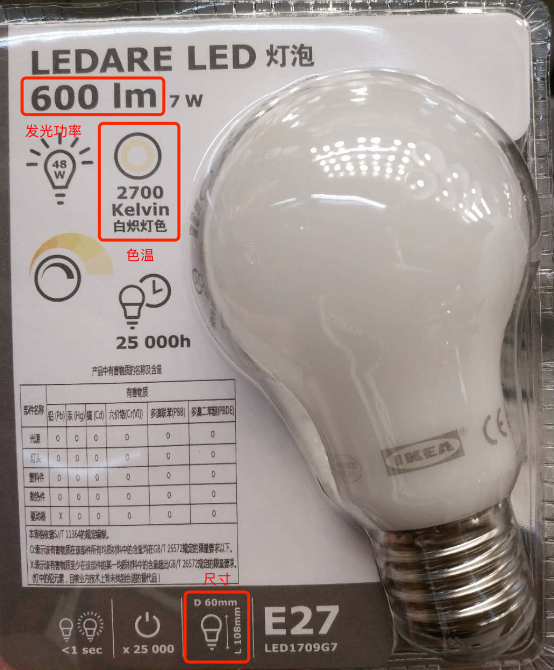
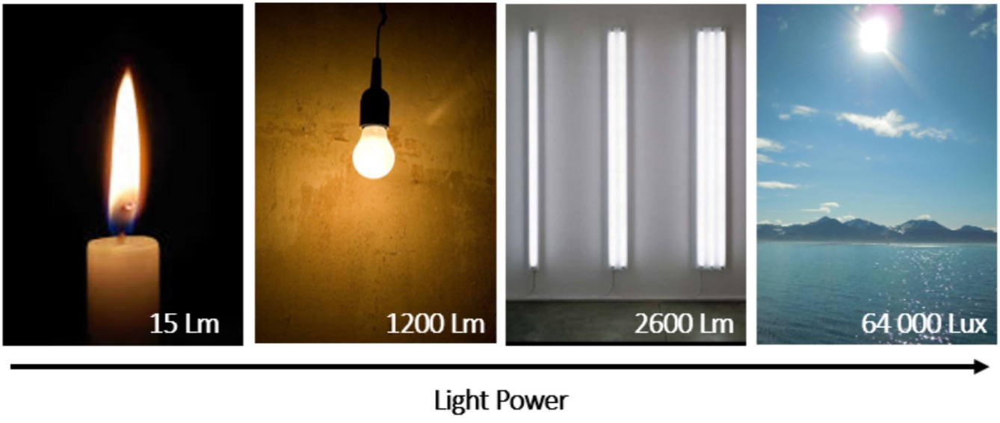

# Physical based Lighting

## Lights in the real world

Physical based lighting describes the light in the real world. In real environments, the lights we see have their own industrial parameters. First, let's look at a light bulb.💡

From the product packaging, we can understand several important industrial parameters of this bulb:

  - **luminous power**
  - **color temperature**
  - **size**

These three important parameters affect the performance of the light in the real world. Let's focus on the physical meaning of these three parameters.

## Luminous Power

**Luminous power** is what we usually call the lights intensity. __Cocos Creator 3.0__ uses **photometric units** to measure light intensity:

- **Luminous Power**

  Unit **Lumens (lm)**. 
  Describes the total amount of light emitted by the light from all directions. Changing the size of the light will not affect the lighting effect of the scene.

- **Luminance**

  Unit **Candela per square meter (cd/m2 or nits)**. 
  Describes the intensity of the light when light is measured from a point on the surface of the light to a point on the receiving surface. Changing the size of the light will affect the lighting effect of the scene.

- **Illuminance**

  Unit **lux (lx)** 
  Describes the total amount of light from a light measured at the receiving surface. This value is affected by the distance the light travels.

In the real world, because the important physical parameters describing lights are different, we usually use **luminous power** and **luminance** to describe lights that illuminate areas commonly used in life.

## Color Temperature

**Color temperature** refers to the color of the absolute black body after it has been heated from absolute zero (-273°C).

**Color temperature** is an important attribute that affects the color of the light. It is an optional attribute. When color temperature is enabled, the color temperature also contributes to the color of the light.

In a real world environment, the ambient color temperature at different times of the day also changes dynamically:

Please refer to the following table:

## Light Size

Lights in the real world have real physical dimensions. At the same time, the size of the light also affects the intensity of the light.

