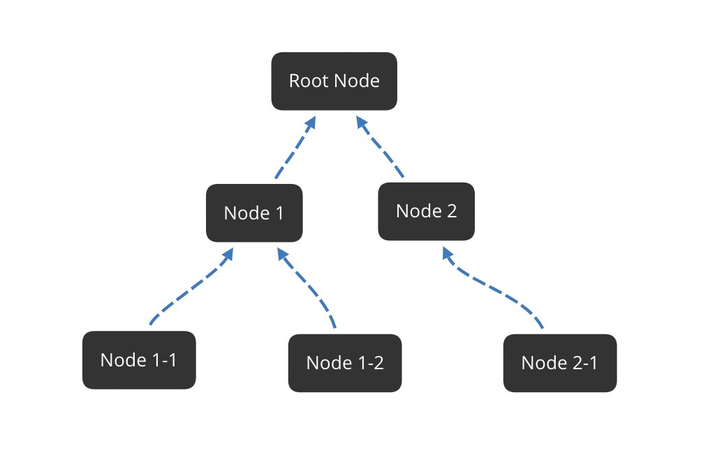
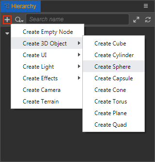
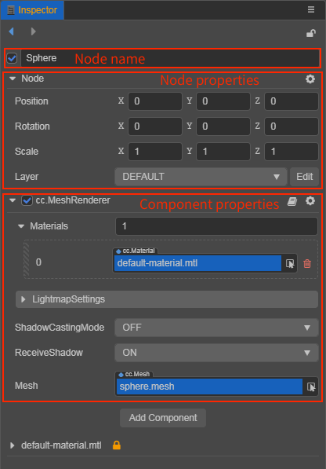
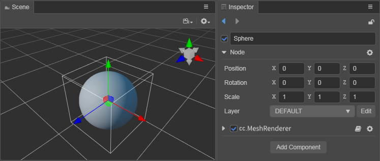
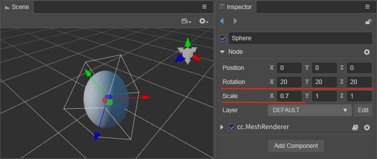
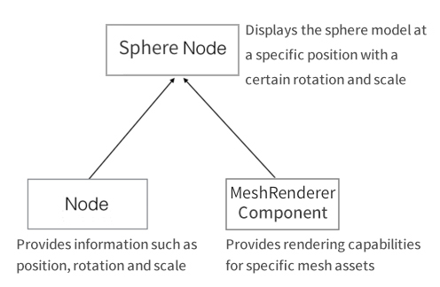
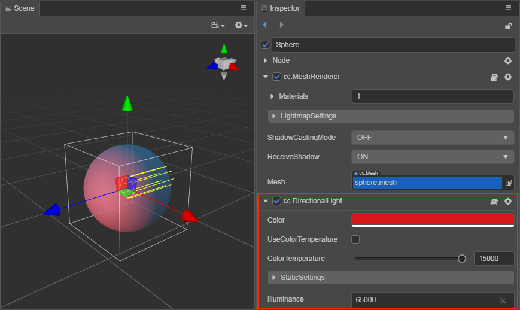

# Nodes and Components

The workflow of Cocos Creator 3.0 is centered on component-based development, also known as the **Entity-Component System**, which simply means that the various elements of the game are built in a combinatorial rather than an inherited manner.

In Cocos Creator 3.0, a **Node** is an entity that hosts a component, and we mount **Component** with various functions on it to give it a variety of representations and functions. Let's see how to create nodes and add components to a scene.

## Nodes

Nodes are the basic building blocks of a scene. Nodes are organized in a tree-like relationship, and each node can have multiple children:

Nodes have the following properties:
- A node contains a set of base attributes (Position, Rotation, Scale), and nodes are organized together by a set of relative transformation relationships, as described in [coordinate systems and node transformation properties](./coord.md).
- The update order between nodes is cascading. The update of child nodes depends on the parent node, and child nodes follow the parent node transformations.
- Components can be added to a node to associate multiple components with the node.

### Create Nodes

The quickest way to get a node with a specific function is to use the **Create Node** button in the top left corner of the **Hierarchy** panel. Let's take the simplest example of creating a Sphere node by clicking on the **+** Create Node button in the upper left corner and then selecting **Create 3D Object -> Create Sphere**.

Then we can see the newly added Sphere node in **Scene** and **Hierarchy** panel. The new node is named `Sphere` by default, indicating that it is a node whose functionality is primarily provided by the **Sphere** component. You can also try clicking the **Create Node** button again to select another node type and see that they will be named and behave differently. Note that creating a UI node automatically creates a Canvas node as the root node of the UI node, as described in the document [UI Structure Description](../../ui-system/components/engine/index.md).

For more information about the operations of single-select, multi-select, copy, delete, etc. of nodes in the hierarchy manager, please refer to [Hierarchy Panel](../../editor/hierarchy/index.md).

To create nodes dynamically in a script, refer to the document [Create and Destroy Nodes](../../scripting/create-destroy.md).

## Components

We just created a node, so now let's look at what components are and how they relate to the node.  
Select the `Sphere` node we just created and you can see in the **Inspector** panel that it shows.

The part of the **Inspector** panel that starts with the `Node` title is the node's properties, which include information about the node's `Position`, `Rotation`, `Scale`, and other transformations. We will cover this in detail in the [Coordinate Systems and Node Transformation Properties](coord.md) section.

The next section, starting with the `cc.MeshRenderer` title, is the properties of the **Sphere** component. In Cocos Creator, the **MeshRenderer** component is used to draw mesh resources, where the `Mesh` property is used to specify the mesh resources used for rendering. Since we just created the Sphere node, the default here is `sphere.mesh`.  
And the `Materials` property is used to specify the material used for rendering. You can try dragging any material from the **Assets** into the `Materials` property of the **Inspector** panel and you can see that the default material just became the specified material.

> Any resources set on the component, such as `sphere.mesh` in this case, will be loaded automatically at the same time as the scene loads. You can also declare the types of resources to be set and loaded automatically in your custom components, see [Getting and loading resources](../../scripting/load-assets.md).

In addition to adding components manually in the editor, you can also control components via scripts, see [Component creation and destruction](../../scripting/component.md).

### Effect of Node Properties on Components

Once the node and **MeshRenderer** component are combined, you can control the rendering of the mesh resources by modifying the node properties. You can adjust your node according to the properties marked by the red line in the figure below, and you can see that the rotation and scaling of the model have changed.

**Before Adjustment**:

**After Adjustment**:

We mentioned earlier that the component-based structure is combined to achieve functional extensions. The combination of the node and **MeshRenderer** component is shown in the following figure:

## Add Additional Components

Multiple components can be added to a node to add more functionality to the node. For example:

We can go ahead and select the node `Sphere` in the above example, then click the **Add Component** button at the bottom of the **Inspector** panel and select **Light -> DirectionalLight** to add a **Directional Light** component.

Then set the properties of the **Directional Light** component, e.g. adjust the `Color` property of the directional light to red, and you can see that the color of the sphere model has changed, i.e. the **DirectionalLight** component we added to the node has taken effect!

> Here is just a brief example of a more obvious effect. It is not recommended to add a **DirectionalLight** component to a sphere node.

For more details about other components, please refer to [components](../../editor/components/index.md) documentation.

## Summary

In the above example, we first combine the **MeshRenderer** component with the node, and with the mesh resource that can specify the rendering material, we can modify the node properties to display the model in different ways, such as scaling and rotation. Now we add the **DirectionalLight** component to the node so that the node can show different effects depending on the state of the directional light source. This is the workflow of Cocos Creator 3.0 component-based development, where we can combine different functions on a node in such a way that we can achieve more complex goals.

Note that only one rendering component can be added to a node. Rendering components include **MeshRenderer**, **Sprite**, **Label**, **Graphics**, **Mask**, **RichText**, **UIStaticBatch**, etc.