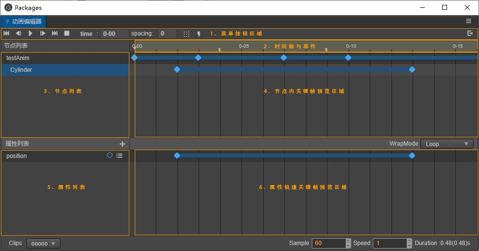
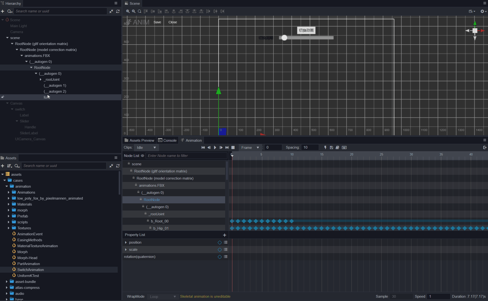
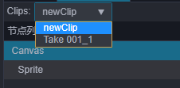
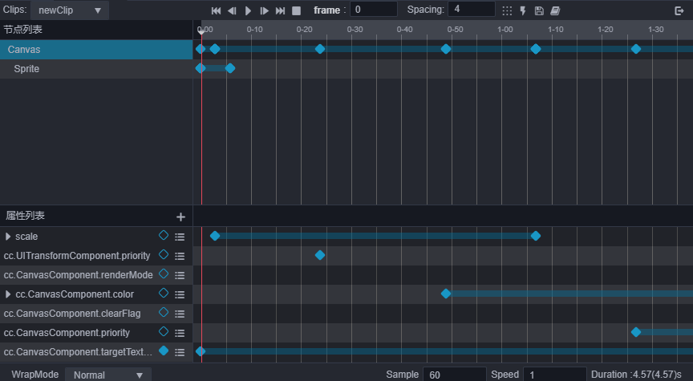
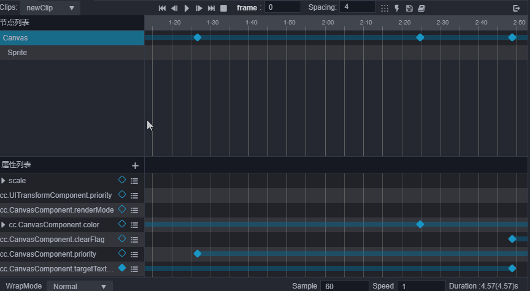
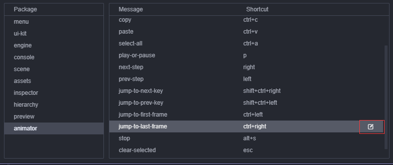

# Animation Editor

## Introduction to the main panel of the editor

The __Animation Editor__ can be divided into 6 main parts.

1. [Toolbar](###Toolbar)
2. [Timeline and Events](###b.TimelineandEvents)
3. [Node List](###NodeList)
4. [Keyframe preview in node](###Keyframepreviewinnode)
5. [Property List](###Propertylist)
6. [Property track keyframe preview](###Propertytrackkeyframepreview)

### Toolbar

The __Toolbar__ is responsible for displaying some commonly used functions that are triggered by buttons.

Function | Icon | Shortcut Key | Remarks
---- | --- | --- | ---
*Move to the first frame* |  | Ctrl/Cmd + Left | n/a
*Move to previous frame |  | Left | n/a
Play/Pause |  | Ctrl/Cmd + P | n/a
*Move to next frame* |  | Right | n/a
*Move to the last frame* |  | Ctrl/Cmd + Right | Move to the last frame in the effective range
*Stop animation* |  | Ctrl/Cmd + S | Click to stop the current animation, it will move to the first frame after stopping
*Add event keyframe* |  |-| Clicking will add an event keyframe at the current time control line position
*Exit animation editing mode* | |Ctrl + Q|Click to exit animation editing mode
*Switch the scale of time axis display* |  |-|The default is `00-00` mode, click to switch to`frame` (in keyframe number) display mode. For details about the time axis scale, please refer to the [Time axis scale unit representation](###Timeaxisandevents) documentation.
*Display the current time and jump to the corresponding time* |  | - | The specific time of the current time control line is displayed. You can also manually enter it to adjust the current time control line to the corresponding time. You can directly input the frame of `frame` or`00-00`.
*Adjust the default keyframe interval* | | - |The number of keyframe intervals filled in will be taken as the number of intervals when multiple keyframes are generated at the same time (for example: when creating a frame animation and dragging multiple pictures at once, the interval between the multiple keyframes added at this time will be taken as value)
*Arrange selected keyframes* | | - | The selected keyframes will be arranged based on the first frame and the values in the input box as intervals.
*Open the shortcut panel* |  | - | -

### Timeline and Events

The __timeline__, along with the added __custom event frames__ will mainly be displayed here. __Right-clicking__ will move the event control to the corresponding position. The __right-click__ menu can be used to *add/remove*, or *copy/paste* keyframes of the event. The effective length of the animation will also have a corresponding display effect.

#### Timeline scale representation

The __default__ notation for __ticks__ on the __time axis__ is `01-05`. The value consists of two parts. The preceding number indicates the current second, and the following number indicates the number of frames in the current second.

`01-05` means that the __scale__ is located on the __time axis__ at the time that __1 second__ and __5 frames__ have passed since the start of the animation.

Because the __frame rate__ (sample) can be adjusted at any time, the time indicated by the same scale will also vary with the frame rate.

- When the __frame rate__ is 30, `01-05` means __1 + 5/30 = 1.1667 seconds__ after the animation starts.
- When the __frame rate__ is 10, `01-05` means __1 + 5/10 = 1.5 seconds__ after the animation starts.

Although the time indicated by the current scale will change with the frame rate, once a keyframe is added at a position, the total number of frames where the keyframe is located will not change. If we change the frame rate to 01-05 when the frame rate is 30. A keyframe has been added to the scale, and this keyframe is located at the 35th frame after the animation starts. Then change the frame rate to 10, the keyframe is still at the 35th frame after the animation starts, and the scale reading of the keyframe position at this time is `03-05`. After conversion to time, it is exactly 3 times as before.

Click the button  You can change the scale to `frame` and toggle back and forth.

#### Key frame events

__Right-click__ on the __timeline position__ or __click__ the __timeline button__ to __add__ event __key frames__. __Click__ the event __key frame mail menu to align for removal, copy and other operations. At the same time, after selection, it also supports a series of copy and paste, delete shortcut keys.

### Node list

The __index node__ in the __animation data__ is based on the relative path of the node where the __Animation component__ is attached. Therefore, a node with the same name under the same parent node can only generate one copy of __animation data__, and can only be applied to the first node with the same name.

The nodes here and the nodes of the __Hierarchy__ panel are mapped one by one. Using this relationship, when the number of nodes in the node list is too large to be consulted, use the search function of the __Hierarchy__ panel to locate the nodes. Click on the node in the __Hierarchy__ panel, and it will also jump to the corresponding node position in the __Animation Editor__ to achieve a reasonable display effect.

Of course, __Animation Editor__ also supports node search and filtering.

#### Selected node icon

Since the __node list__ of the __Animation Editor__ is merged with the data in the clip. There may be more node information than the original node, but this part of the extra nodes is the lost node, which cannot be edited and used. The interface, which will be displayed as __yellow__ is also grayed out at the key frame track. At this time, you can transfer the lost node to other nodes through the migration data in the right-click menu.

### Keyframe preview within the node

This is mainly to display a preview of all frames on each node. Here, you can delete the key frame by __right-clicking__ the key frame position menu, and you can also move the key frame position. __Clicking__ the key frames of different nodes at the same time will select the corresponding node. __Double-click__ the key frame to move the time control line to this position. Without the selected property, `Ctrl/Cmd + Shift + Left/Right` can Move the time control line up/down to the next key frame position.

### Property list

Mainly displays the property list of the currently selected node participating in the animation. Each property display item has a key frame icon, corresponding to the current property track and the key frame status of the current time control line position. __Click__ to __add/remove__ the corresponding key frame. The __right-click__ menu can remove the current track or clear data. __Click__ on the plus button at the top to add an property track for the currently selected node.

Like the node, the property track may also be lost. The property recorded in the animation clip does not exist on the current node. This property is the property lost under the current node. The missing __Properties__ are also displayed in yellow. In this case, you can add the relevant __Properties__ to the corresponding node or directly remove the missing property track after exiting the editing mode.

### Property track keyframe preview

It mainly displays the specific key frame settings on each property track, and is also the main area for key frame editing. You can __right-click__ directly on the track to add key frames, or you can drag the time control line to the corresponding position and press enter to add. At the same time, it also supports frame selection and key frame selection to *move*, *copy*, *paste* and *other* operations in this area.

## Basic Operation Guide

### Switch between different animation clips for editing

__Click__ the clip option in the lower left corner of the __Animation Editor__ and select the clip to be edited:

### Change the keyframe display area

#### Change the timeline zoom

What should I do if I feel that the range displayed by the animation editor is too small during operation, and it needs to be scaled down to allow more key frames to be displayed in the editor?

- You can _zoom in_ or *zoom out* the display scale of the time axis by scrolling the mouse wheel in areas *b*, *d*, and *f* in the figure.

#### Navigate the display area

If you want to see the key frame on the right side of the __Animation Editor__ that is hidden beyond the editor or the key frame on the left side, you need to move the display area:

- __Press__ the __middle/right__ mouse button and drag in the areas b, d and f in the figure.

    

#### c. Drag to change the layout of the animation editor

The dividing line between the node list and the time, and the dividing line between the __Property List__ and the time axis can be used to drag and change the layout, and can be freely adjusted to the layout effect suitable for editing by dragging.

  

### Change the currently selected time

- You can change the current time node by clicking anywhere or dragging the time control line in the time axis (__Figure B area__) area.
- Drag and drop time control line.
- _Click_ the button that controls the time control line in the toolbar.
- _Double-click_ the key frame to jump the current time to the corresponding position.
- Use the shortcut keys to control the current time position _s_.

### Play/pause animations

- _Click_ the play button in the area of ​​__Figure A__, the button will automatically change to pause, __click__ again to play.
- In the playback state, operations such as saving the scene will terminate the playback.
- Shortcut key `Ctrl/Cmd + P` control

For more information about keyframe operations, please review the [Edit Animation Sequence](animation-clip.md) documentation.

## Shortcuts

### Modify shortcut keys

Click the shortcut button in the menu bar  to open the shortcuts windows, then you can directly modify the shortcut keys of the animation editor Here.

### Default Shortcut key summary

Function | Shortcut key | Description
--- | ---- | ----
*Enter/exit animation editor* | Ctrl/Cmd + E |-
*Save animation data* | Ctrl/Cmd + S |-
*Move forward one frame* | Left (←) | If it is already at frame 0, the current operation is ignored. When the key frame is not selected, the small red line moves, and after the node is selected, the key frame is moved;
*Move one frame backward* | Right (→) | When the key frame is not selected, the small red line is moved, and after the node is selected, the key frame is moved;
*Move to the first frame* | Ctrl/Cmd + Left (←) |-
*Move to the last frame* | Ctrl/Cmd + Left (←) | The number of effective frames in the current clip
*Delete the currently selected keyframe* | Delete/Cmd + Backspace |-
*Play/Pause Animation* | P |-
*Stop animation* | Alt + S | Current time will become 0
*Add key frame* | I | After selecting the property track, the key frame will be added at the position of the time control line, if it is not selected, it will be ignored
*Skip to the previous key frame* | Ctrl/Cmd + Shift + Left (←) | Move to the nearest key frame to the left of the time control line (select the property track or select the node)
*Skip to the next key frame* | Ctrl/Cmd + Shift + Right (→) | Move to the nearest key frame on the right of the time control line (selected on the property track or selected node)
*Select multiple keyframes* | Ctrl | Hold down Ctrl and click on keyframes to select multiple keyframes
*Select all keyframes of the track* | Ctrl/Cmd + A | Select all keyframes of the selected property track
*Copy selected animation data* | Ctrl/Cmd + C | Support copying selected key frames, property tracks, node data
*Paste the animation data of the last copy* | Ctrl/Cmd + V | Support pasting selected key frames, property tracks, node data
*Unselected key frame or event frame or property track* | Esc |-

> Most shortcut keys are invalid only when the animation editor is focused, except for the shortcut keys of `Enter and Exit Animation Editor` and `Save Animation`.
