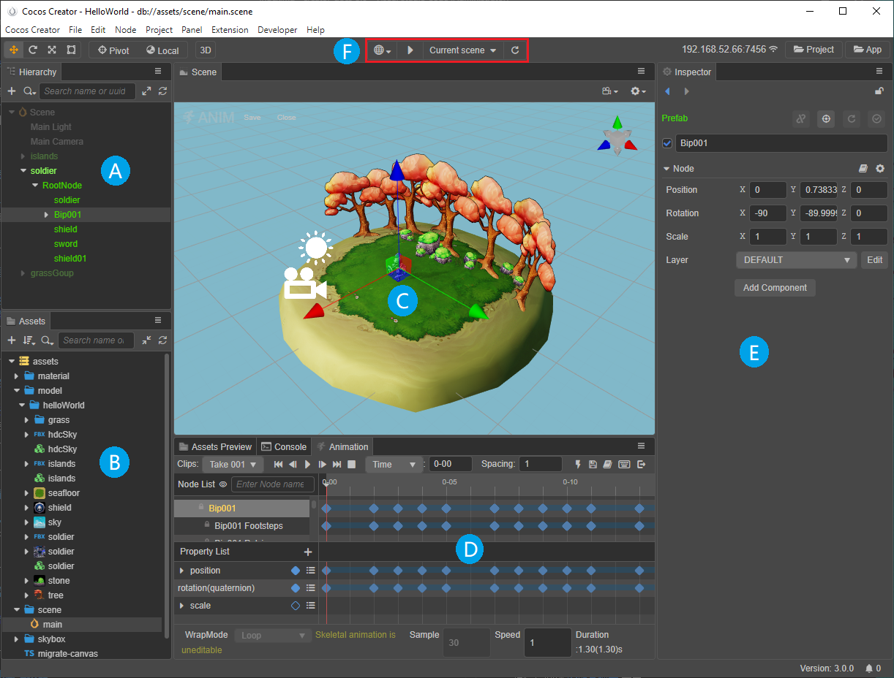
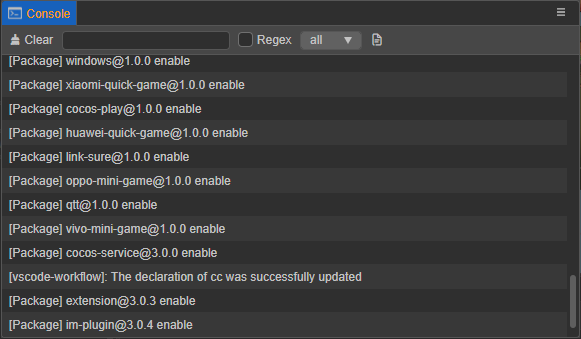
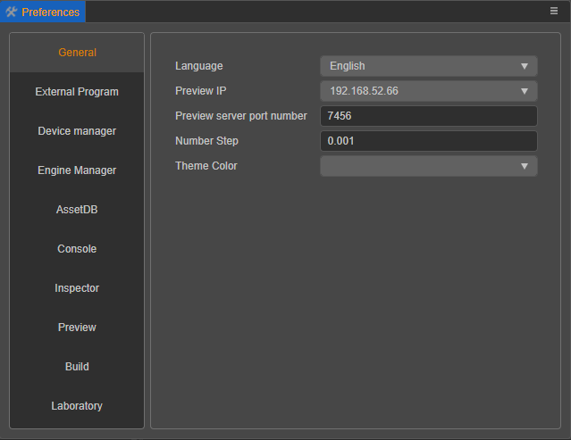
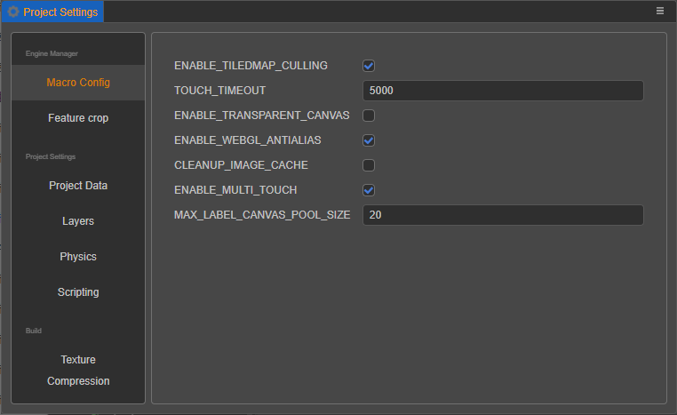
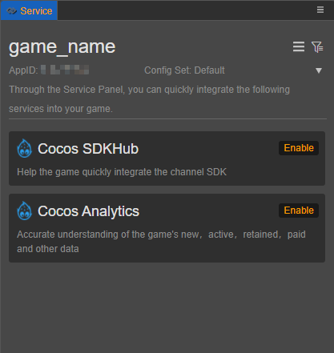

# Editor Interface Introduction

This chapter will introduce the editor interface and familiarize you with the panels, menus, and function buttons that make up the editor, which consists of multiple panels that can be freely moved and combined to suit the needs of different projects and developers. Taking the default editor layout as an example, notice the names and roles of each panel:

- (**A**) [Hierarchy](./hierarchy/index.md): show all the nodes in the scene and their hierarchy in the form of a tree list, all the contents seen in the **Scene** panel can find the corresponding node entries in the **Hierarchy** panel, the contents of these two panels will be displayed simultaneously when editing the scene, and we usually use both panels to build scenes.
- (**B**) [Assets](./assets/index.md): shows all assets in the project assets folder (`assets`). Here the folders are displayed in a tree structure and automatically synchronized with changes made to the project asset folder contents in the operating system. Drag and drop files directly from outside the project, or import assets using the menu.
- (**C**) [Scene](./scene/index.md): workspace for displaying and editing the visual content of the scene. Building the scene in the **Scene** panel allows to get a WYSIWYG preview of the scene.
- (**D**) [Animation](./animation/index.md): used to edit and store animation data.
- (**E**) [Inspector](./inspector/index.md): used to view and edit the working area of the currently selected node and component properties. This panel displays the property data from the script definition in the most appropriate form and allows the user to edit them.
- (**F**) [Preview](./preview/index.md): after the scene is built, preview the game in action on the Web or native platform.

Other important editor-based interfaces include:

- **Console**

    

    The **Console** displays error reports, warnings, or other editor- and engine-generated log messages. For details, please review the [console](console/index.md) documentation.

- **Preferences**

    

    **Preferences** provides various editor-specific global settings, including global settings for native development environment, game preview, other extensions, etc. For details, please read the section [Preferences](preferences/index.md).

- **Project Settings**

    

    **Project Settings** provides various project-specific personalization settings, including group management, feature cropping, project preview, custom engine, etc. For details, please review the [Project Settings](project/index.md) documentation.

- **Service**

    

    Cocos Service is a **Service** panel integrated within Cocos Creator. We select high-quality technology solution providers to provide cost-effective service access, and are committed to giving users a one-click access experience and providing corresponding technical support. At the same time, we will also rely on the Cocos developer community to get a more favorable price for developers.

    For details, please refer to the [Cocos Service Introduction](https://service.cocos.com/document/en/) documentation.
