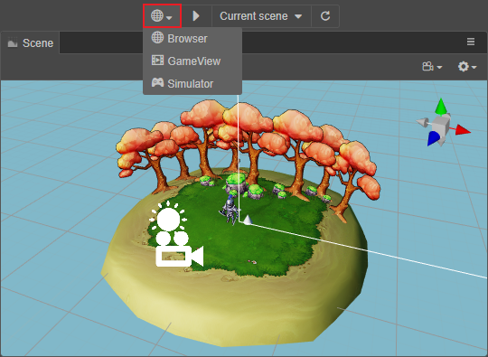
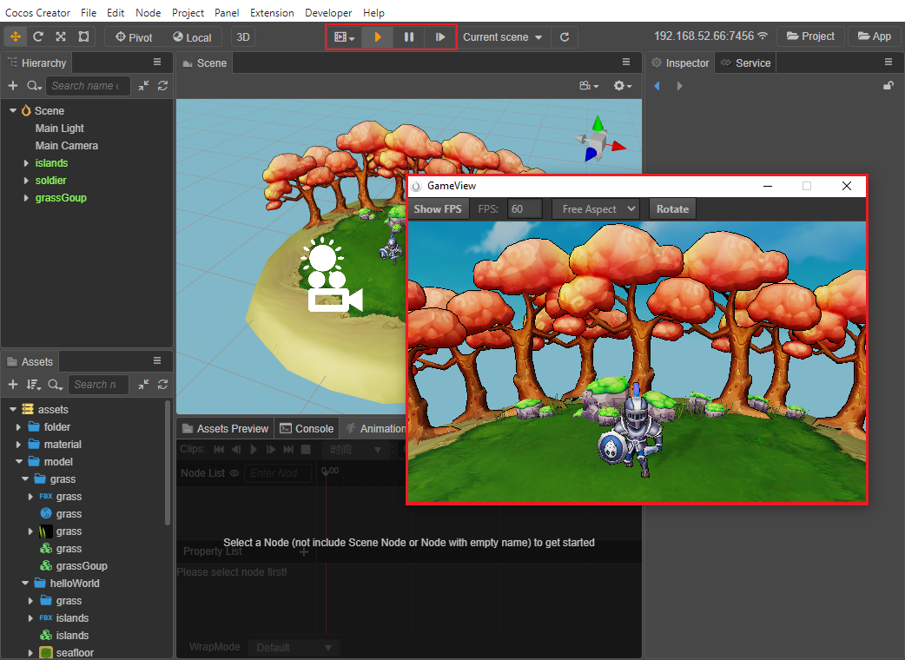
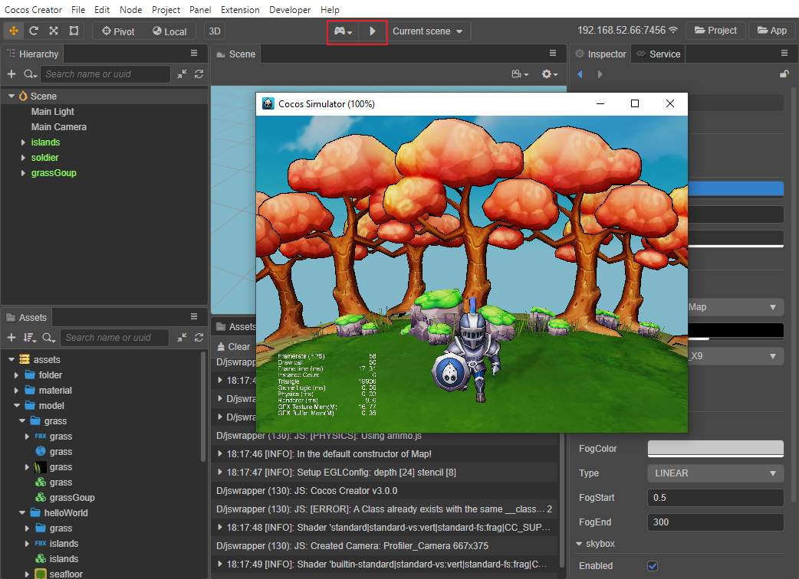

# Project Preview & Debugging

After using the main editor panel to import assets, build scenes, configure components, and adjust properties, we can now preview and build to see how the game will look when running on the Web or Native platform.

## Selecting the preview platform in the editor

At any time during game development we can click the **Preview** button at the top of the editor window to see the game in action.

- The left drop-down menu allows selecting the platform for previewing, currently **Browser**, **GameView** and **Simulator** are supported.
- : preview button, click it to run the preview
- On the right side of the **Preview** button you can select the scene to preview, the dropdown box will list all the scenes in the project, by default **Current scene** is used.

    

- : refresh button, click this button to refresh all opened preview pages. To refresh the preview page automatically after the save scene operation, select **Cocos Creator -> Preferences -> Preview** in the editor main menu, and then check **Refresh preview page when saving scene**.

> **Note**: double-click is needed to open the scene to preview the game content. If there are not any scenes open, or if an empty scene is created, no content will show.

### Browser

After selecting **Browser** to preview, click the **Preview** button next to it to run the web version of the game directly in the default desktop browser. It is recommended to use Google Chrome as the browser for previewing and debugging during development, as Google Chrome has the most comprehensive and powerful DevTools.

At the top of the browser preview screen there are a series of controls to control the preview effect:

- The leftmost menu is used to select the scale size of the preview window to simulate the display effect on different mobile devices, and the device resolution can be added manually in **Cocos Creator -> Preferences -> Device Manager**.
- **Rotate**: decide whether to display landscape or portrait screen
- **Debug Mode**: choose which levels of log in the script will be output to the browser console
- **Show FPS**: allows choosing whether to display debug information such as frames per second and number of drawcalls in the bottom left corner
- **FPS**: allows limiting the maximum number of frames per second
- **Pause**: pause the game

Creator  supports the feature of web preview customization, please refer to [web preview customization workflow](browser.md) for details.

#### Browser compatibility

The desktop browsers tested during Cocos Creator development include: **Chrome**, **Firefox** and **QQ Browser**, other browsers can be used normally as long as the kernel version is high enough.

Browsers tested on mobile devices include: **Safari (iOS)**, **Chrome (Android)**, **QQ Browser (Android)** and **UC Browser (Android)**.

#### Debugging with browser DevTools

Taking Google Chrome as an example, click **Developer -> Toggle DevTools** in the main menu of the editor to open the DevTools interface. DevTools, allow viewing the runtime log, using breakpoints to debug, viewing the value of each variable at each step in the call stack, and even performing asset loading and performance analysis.

To learn how to use DevTools for debugging, read the [Chrome DevTools User Guide](https://developers.google.com/web/tools/chrome-devtools), or the DevTools help for other browsers.

### GameView

Selecting to use the **GameView** preview opens a separate game preview window. The **GameView** is a game view feature embedded in the editor that allows running the game in the editor without opening the browser/simulator. The advantage of this is that the running game can be adjusted in real time by other extensions in the editor or Gizmo, such as the model and the running state of the game, so that what you see is what you get when the game is running.

After opening the **GameView**, you can see that the toolbar at the top of the editor has additional buttons for **play/stop**, **pause** and **step**.

- **Play/Stop**: used to toggle the running/stopping state of the game.
- **Pause**: used to pause the running game.
- **Step**: makes the game run in a stepwise manner for easy debugging.

**GameView** The buttons in the top toolbar function similarly to the browser's, except that the scale size of the custom preview window is configured manually in the pop-up window by setting it to **Custom**.

### Simulator

When you select **Simulator** preview, the current game scene will be run using Cocos Simulator (desktop simulator). When running the game with the simulator, log messages (printed with `cc.log`) and error messages from the script are displayed in the **Console** panel.

When using **Simulator** preview, it supports automatically opening debug window for debugging, which can be set in **Cocos Creator -> Preferences -> Preview**, please refer to [Preferences - Preview](../preferences/index.md).

## Mobile preview

There are the following ways to debug the preview effect on mobile phone:

- Use **Mobile Preview mode of Browser DevTools**

- **Scan the preview QR code**

  Move the mouse over the IP preview address on the left side of the editor toolbar, a preview QR code will be displayed, just scan it with your phone.

  

- Directly **Enter the preview address in your cell phone browser**

> **Note**: the phone needs to be on the **same network segment** as the computer. Since there may be more than one network for the computer, if the IP address of the editor preview URL is not selected correctly, change it in the main menu bar in **Cocos Creator -> Preferences -> General -> Preview IP**.

## Build

After previewing and debugging, if you are satisfied with your game, you can open the **Build** panel via **Project -> Build** in the main menu to package and publish the game to the target platforms, including Web, iOS, Android, various "mini-games", PC clients and other platforms. For the detailed build and publish process, please refer to the [Cross-Platform Game Publishing](../publish/index.md) documentation.

> **Note**: the effect of running the game with **Simulator** and the final release to the native platform may be somewhat different, for any important game features, please do the final test with the version after build and release.

## Other references

- [Introduction to the Preview Process and Common Error Handling](preview-guid.md)
