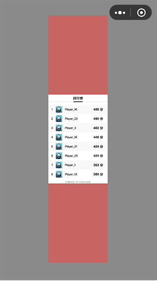
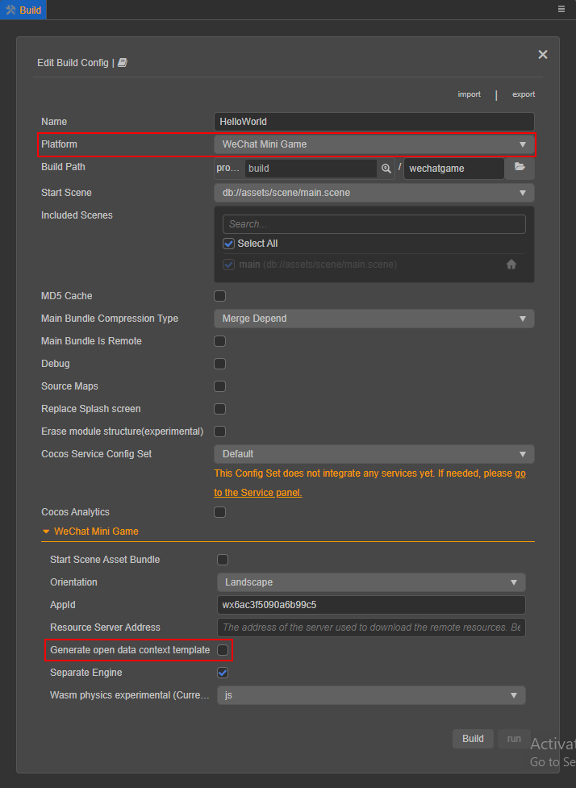

# Open Data Context

Currently, platforms such as **WeChat**, **Baidu**, and **ByteDance Mini Game** have added the concept of **Open Data Context**, which is a separate game execution environment, in order to protect their social relationship chain data. The resources, engines, and applications in the **Open Data Context** are completely isolated from the main context, and only in the **Open Data Context** can developers access the relationship chain data through the open interface provided by the platform to implement some features such as leaderboards.

In **Cocos Creator 3.0**, we deprecate the Canvas Renderer module and replaced it with a lightweight front-end Canvas engine based on **XML** + **CSS** designed by WeChat team. The engine is integrated into the **Cocos Creator 3.0**'s built-in **Open Data Context** project template, which allows developers to implement a leaderboard-like feature based on the template with a few basic front-end skills.

## SubContextView Component Description

Since the **Open Data Context** can only be rendered on the off-screen canvas called **sharedCanvas**, you need a node in your project to act as a container for rendering the **Open Data Context**, and add the `SubContextView` component to that node, which will render the **sharedCanvas** to the container node.

The `SubContextView` component contains two main properties, **Design Resolution Size** and **FPS**.


### Design Resolution Size

If you set the **Design Resolution Size** of the `SubContextView` component to **640 * 960**, the size of the **sharedCanvas** will be set to **640 * 960** during the component's `onLoad` phase. This means that after the build, the **Open Data Context Project** is rendered on an off-screen canvas of **640 * 960**. Then, when customizing the **Open Data Context** (see below), the maximum size of the tag style in `style.js` is **640 * 960**, otherwise the rendered content will be off the canvas. Example:

```js
// style.js
export default {
    container: {
        width: 640, // max width
        height: 960,  // max height
    },
}
```

To avoid this part of the data coupling, setting a percentage adaptation to the size is supported. Example:

```js
// style.js
export default {
    container: {
        width: '100%',
        height: '100%',
    },
}
```

In the actual rendering process, the engine will adopt the **SHOW ALL** adaptation policy to render the **sharedCanvas** to the `SubContextView` component node to avoid the UI distortion caused by stretching during rendering. For example, in the following two images, we are using `SubContextView` component nodes of different sizes, and the **Open Data Context** texture will not be stretched.




### Setting FPS

The **FPS** property is primarily used to set how often the main context will update the **sharedCanvas** on the `SubContextView` component to avoid performance loss due to frequent updates to the **Open Data Context** texture.

## Release Process

1. Open the project and double-click the scene, then add the `SubContextView` component to the node on which you need to render the **Open Data Context**.

2. After the scene is set, save the scene, and then open the **Build** panel in **Menu -> Project**, select the **WeChat** / **Baidu** / **ByteDance Mini Game** platform you want to release, check **Generate Open Data Context Template**, and then click **Build**.

    

3. After the build is complete, click the **Folder Icon** button at the end of **Buid Path**, you'll see an **openDataContext** folder (e.g. `build/wechatgame/openDataContext`), which is an **Open Data Context** project template built into Cocos Creator, in the distribution folder of the corresponding game platform.

    

    Developers can customize the required **Open Data Context** content based on this template, and the customization methods are described below. When built again, if the **openDataContext** folder exists in the `build` directory, it will be skipped directly and the developer does not have to worry about the customized **Open Data Context Project** being overwritten.

4. Open the build distribution (e.g. `build/wechatgame`) using the DevTools of the corresponding mini game platformer to open the mini-game project to view the **Open Data Context** content.

    

    > **Note**: in the **Open Data Context** of **Baidu** platform, since the image can only load player avatars returned from Baidu, the local avatar image may not be loaded in the generated template project.

## Customization on Open Data Context Project

Before customizing an **Open Data Context** project, developers need to know some basic information:
- [minigame-canvas-engine quick start[cn]](https://wechat-miniprogram.github.io/minigame-canvas-engine/api/guide.html#%E5%AE%89%E8%A3%85)
- [doT template engine use](http://olado.github.io/doT/?spm=a2c6h.12873639.0.0.36f45227oKu0XO)

With this basic information in mind, let's take a look at the **Open Data Context** template generated by default after the build, with the following directory structure:


- **render/dataDemo.js**: Simulates some random data of the leaderboards, where the developer can request the relational chain data from the platform and pass it to the **doT template engine** to generate relevant XML text
- **render/style.js**: To record CSS style text information, refer to [Style documentation [cn]](https://wechat-miniprogram.github.io/minigame-canvas-engine/api/style.html#%E5%B8%83%E5%B1%80)
- **render/template.js**: To record XML text information, the project uses the template engine to generate XML text by default. Refer to [Tag documentation [cn]](https://wechat-miniprogram.github.io/minigame-canvas-engine/api/tags.html#%E6%A0%87%E7%AD%BE%E5%88%97%E8%A1%A8).
- **render/avatar.png**: Header images for display in **Open Data Context** project template, can be deleted.
- **engine.js**: source code of Canvas engine
- **index.js**: **Open Data Context Project** entry file where the **Open Data Context** is rendered by passing XML text and CSS styles to the Canvas engine

## Recommended practices

1. Since the build directory generated after the build of the project is excluded from version control by default by git, if you want to include your custom **Open Data Context** in version control, you can put the `openDataContext` folder (e.g. `build/wechatgame/openDataContext`) into your project's `build-templates` directory. Please refer to [Custom Project Build Process](./custom-project-build-template.md) documentation.

2. In an **Open Data Context Project**, if you need to listen to messages from the main context, you need to first determine whether the message comes from the main context engine, using the WeChat interface as an example:

    ```js
    wx.onMessage(res => {
        if (!(res && res.type === 'engine')) {
            console.log('do something...');
        }
    });
    ```

    When the main context sends a message to the open data context, it is recommended to include a `type` message to avoid handling the wrong message source. For example, the `res.type === 'engine'` in the above code means that the message comes from the main context engine.

## Reference documentation

- [WeChat official document -- Canvas engine for mini games [cn]](https://wechat-miniprogram.github.io/minigame-canvas-engine/)
- [minigame-canvas-engine source code](https://github.com/wechat-miniprogram/minigame-canvas-engine)
- [doT template engine](http://olado.github.io/doT/?spm=a2c6h.12873639.0.0.36f45227oKu0XO)
