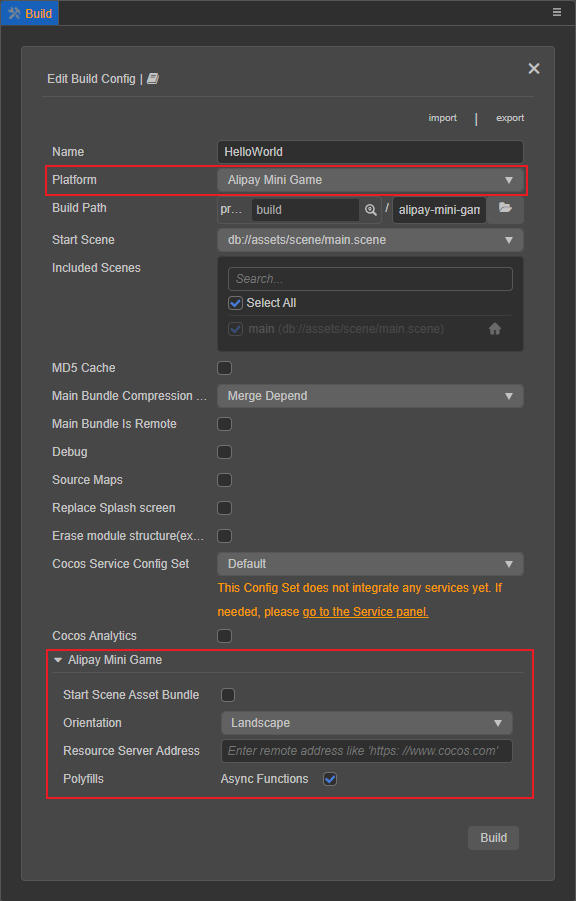
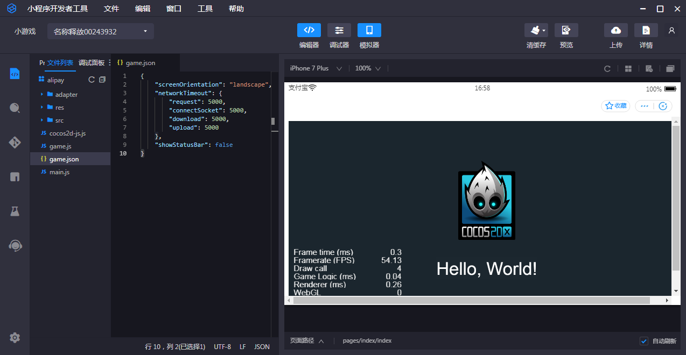

# Publishing to Alipay Mini Games

> **Note**: Some platforms only have Chinese documentation available when visiting the platforms website. It may be necessary to use Google Translate in-order to review the documentation.

**Cocos Creator** officially supports the release of games to the **Alipay Mini Games**.

## Environment Configuration

- Download [Alipay Mini Program Studio](https://render.alipay.com/p/f/fd-jwq8nu2a/pages/home/index.html) on the PC and install it.

- Download [Alipay](https://mobile.alipay.com/index.htm) and install it on your phone.

- The minimum supported version of Alipay on Android is **10.1.75**, on iOS is **10.1.78**.

## Release Process

**First**, use **Cocos Creator** to open the project that needs to be released. Select **Alipay Mini Game** in the **Platform** dropdown of the **Build** panel, and then click **Build**.

The specific filling rules for the relevant parameter configuration are as follows:

- **Polyfills** - **Polyfills** are optional. If this option is checked at build time, the resulting release package will have the corresponding polyfills in it, and will also increase the size of the package. Developers can choose polyfills on demand, but only `Async Functions` are currently available.

- **Remote URL** - **Remote URL** is optional. For details, please refer to the **Resource Management for Alipay Mini Game Environment** section below.

- **Start Scene Asset Bundle**

  This option is optional. 
  If set, the start scene and its related dependent resources are built into the built-in Asset Bundle — [start-scene](../asset-manager/bundle.md#the-built-in-asset-bundle) to speed up the resource loading of the start scene. Please refer to the [Start Scene Loading](#speed-up-the-loading-of-the-start-scene) for details.

**Second**, after the build is completed, click the **folder icon** button below the alipay-mini-game build task to open the `build` release path. If the Build Task Name is `alipay-mini-game`, you can see that the **Alipay Mini Game's** project folder `alipay-mini-game` is generated in the `build` directory, which has included Alipay Mini Game environment configuration file `game.json`.

**Third**, use **Alipay Mini Program Studio** to open **alipay-mini-game** directory. Next, you can open **alipay mini game project** to preview and debug game content.

## Resource Management for Alipay Mini Game Environment

**Alipay Mini Game** is similar to **WeChat Mini Game**. There are restrictions on the package size. Assets more than **4MB** must be downloaded via a network request.

It is recommended to only save script files in the mini-game packages, while other assets are uploaded to the remote server, and downloaded from the remote server as needed. The download, cache, and version management of remote assets, **Cocos Creator** has already done it for you. The specific implementation logic is similar to the **WeChat Mini Game**. Please refer to the [Resource Management for WeChat Mini Game Environment](./publish-wechatgame.md) documentation for details.

Specifically, developers need to:

  1. Set the **Remote URL** in the **Build** panel. And then click **Build**.
  2. When the build is complete, upload the `build/alipay-mini-game/res` folder to the server.
  3. Delete the `res` folder under the local release package directory.

## Alipay Mini Games Known issues

Currently, our adaptation of **Alipay Mini Games** has not been completely completed, and the following modules are still not supported:

- WebView
- VideoPlayer
- Subpackage Loading
- Custom Font

The above functions are expected to be gradually supported in future updates.
