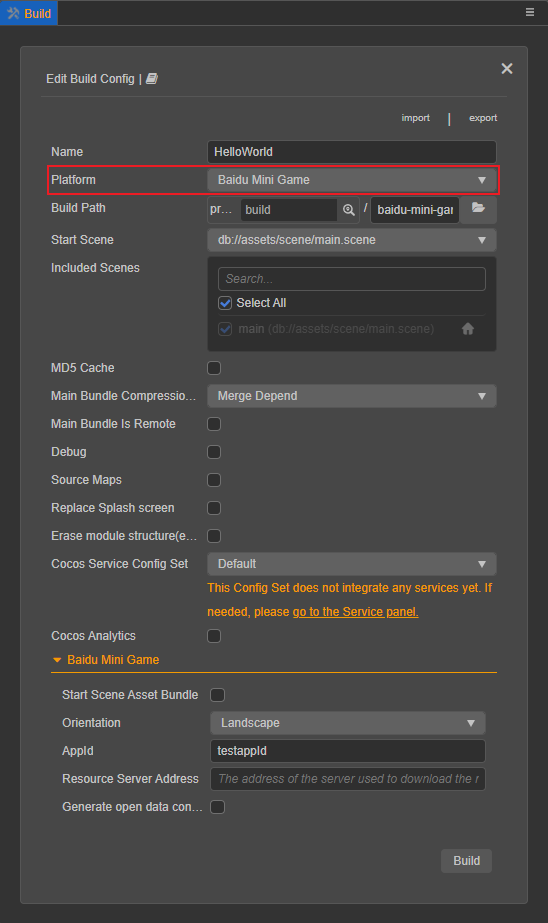
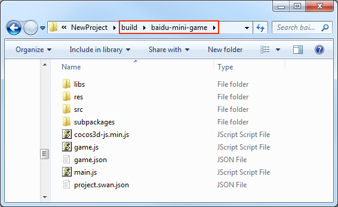
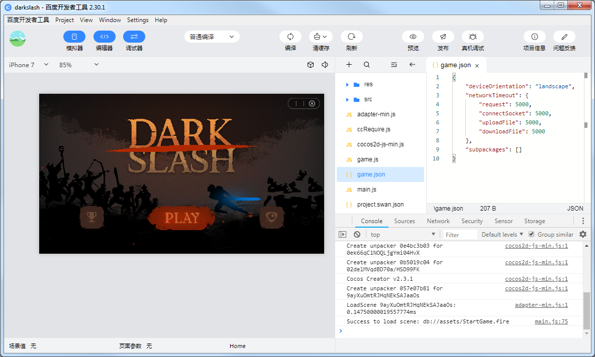

# Publish to Baidu Mini Games

> **Note**: some platforms only have Chinese documentation available when visiting the platforms website. It may be necessary to use Google Translate in-order to review the documentation.

**Cocos Creator** officially supports the release of games to the **Baidu Mini Games**.

The runtime environment of the Baidu Mini Game is an extension of the **Baidu Smart Mini Program**. This provides a WebGL interface encapsulation based on the mini program environment. This greatly improves the rendering capabilities and performance. However, since these interfaces are encapsulated by the Baidu team, they are not equivalent to the browser environment.

On the engine side, in order to make the developers' workload as easy as possible, our main tasks for developers include the following:

- The engine framework adapts to the Baidu Mini Game API, pure game logic level, developers do not need any additional modifications.
- The **Cocos Creator** editor provides a fast packaging process, released directly as a **Baidu Mini Game**, and automatically evokes the Baidu DevTools.
- Automatically load remote assets, cache assets, and cache asset version control.

Please refer to the [Baidu Mini Game Developer Documentation](https://smartprogram.baidu.com/docs/game/) documentation to review the game submission, the review, and the release process for a Baidu Mini Game.

## Publish Baidu Mini Games with Cocos Creator

### Prerequisites

- Download and install **Baidu DevTools** in the [Baidu DevTools](https://smartprogram.baidu.com/docs/game/tutorials/howto/dev/) documentation.
- Download and install the **Baidu App** in the app store of your phone.
- Log in to the [Baidu Smart Mini Progame Platform](https://smartprogram.baidu.com/developer/index.html) and find **App ID**.

  

### Release process

1. Select the **Baidu Mini Game** in the **Platform** of the **Build** panel, fill in the **appid**, and then click **Build**.

    

2. After a build is completed, a `baidu-mini-game` folder will be generated in the project's **build** directory (the name of the folder is based on the **Build Task Name**), which already contains the configuration files `game.json` and `project.swan.json` of the Baidu Mini Games environment.

    

3. Use the **Baidu DevTools** to open the `baidu-mini-game` folder to preview and debug the game. Please refer to the Baidu DevTools documentation for details. About how ​​to use Baidu DevTools, please refer to [Baidu DevTools Documentation](https://smartprogram.baidu.com/docs/game/tutorials/howto/dev/) for details.

    

    > **Note**: when previewing and debugging, if a prompt appears stating: `The current version of the developer tool can't publish mini program, please update to the latest devtools`. This means the **appid** filled in the **Build** panel is the **appid** of the **Baidu Smart Mini Program**, not the **appid** of the **Baidu Mini Game**, please re-apply for the **appid** of the **Baidu Mini Game**.

## asset Management for Baidu Mini Game Environment

**Baidu Mini Game** is similar to **WeChat Mini Game**. There are restrictions on the package size. Assets more than **4MB** must be downloaded via a network request.

It is recommended to only save script files in the mini-game packages, while other assets are uploaded to the remote server, and downloaded from the remote server as needed. The download, cache, and version management of remote assets, **Cocos Creator** has already done it for you. The specific implementation logic is similar to the WeChat Mini Game. Please refer to the [asset Management for WeChat Mini Game Environment](./publish-wechatgame.md) documentation for details.

When the **MD5 Cache** feature of the engine is enabled, the URL of the file will change as the content of the file changes. When the game releases a new version, the assets of the old version will naturally become invalid in the cache, and only the new assets can be requested from the server, which achieves the effect of version control.

Specifically, developers need to do the following:

1. When building, check the **MD5 Cache** in the **Build** panel.
2. Set **Remote server address** in the **Build** panel and then click **Build**.
3. After the build is complete, upload the `build/baidu-mini-game/res` folder to the server.
4. Delete the `res` folder under the local release package directory.

> **Note**: when Baidu loads the assets on the remote server on the physical device, it only supports access via HTTPS, so the asset file must be placed on HTTPS, otherwise the loading of the asset will fail.
> **Note**: if the cache asset exceeds the environment limit of Baidu, you need to manually clear the asset. Use the `remoteDownloader.cleanAllCaches()` and `remoteDownloader.cleanOldCaches()` interfaces to clear the cache in Baidu mini game. The former will clear all cache assets in the cache directory, please use it with caution. The latter will clear the cache assets that are not used in the current application in the cache directory.

## Baidu Mini Game Subpackage Loading

The subpackage loading method of **Baidu Mini Game** is similar to WeChat, with the following package restrictions:

- The size of all subpackages of the entire Mini Game can not exceed **8MB**.
- The size of a single subpackage / main package can not exceed **4MB**.

Please refer to the [Asset Bundle](../../asset/bundle.md) documentation for details.

## Platform SDK Access

In addition to pure game content, the **Baidu Mini Game** environment also provides a very powerful native SDK interface. These interfaces only exist in **Baidu Mini Game** environment, equivalent to the third-party SDK interface of other platforms. The porting of such SDK interfaces still needs to be handled by developers at this stage. Here are some of the powerful SDK capabilities offered by **Baidu Mini Game**:

1. User interface: login, authorization, user information, etc.
2. Baidu cashier payment
3. Forwarding information
4. File upload and download
5. Other: images, locations, ads, device information, etc.

## Baidu Mini Games known issues

Currently, the adaptation work of Baidu Mini Game is not completely finished, and the following components are not supported for the time being:

- VideoPlayer
- WebView

If needed, you can directly call Baidu's [API](https://smartprogram.baidu.com/docs/game/api/openApi/authorize/) as needed.

## Reference documentation

> **Note**: some platforms only have Chinese documentation available when visiting the platforms website. It may be necessary to use Google Translate in-order to review the documentation.

- [Baidu Mini Game Registration Guide](https://smartprogram.baidu.com/docs/game/)
- [Baidu DevTools documentation](https://smartprogram.baidu.com/docs/game/tutorials/howto/dev/)
- [Baidu Mini Game API documentation](https://smartprogram.baidu.com/docs/game/api/openApi/authorize/)
