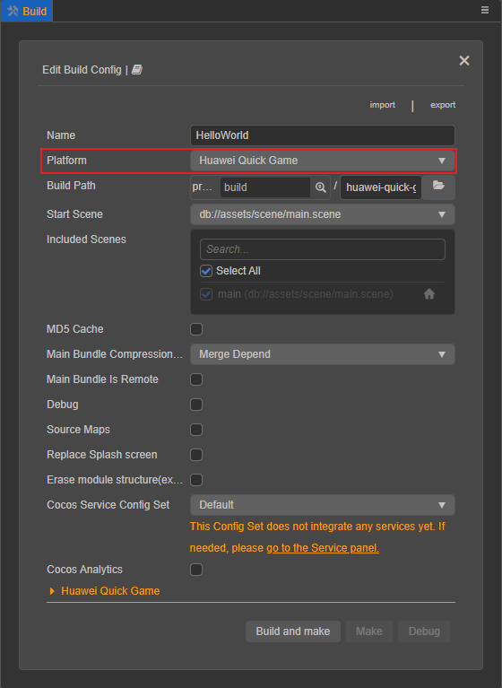
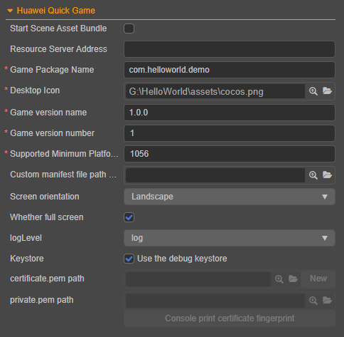
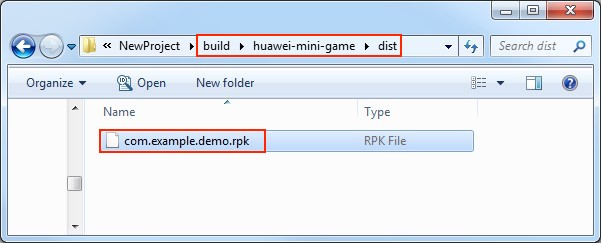

# Publish to Huawei Quick Games

> **Note**: some platforms only have Chinese documentation available when visiting the platform's website. It may be necessary to use Google Translate in-order to review the documentation.

__Cocos Creator__ officially supports the release of games to the **Huawei Quick Games**.

## Environment Configuration

- Download the [Huawei Quick APP Loader](https://developer.huawei.com/consumer/en/doc/development/quickApp-Guides/quickapp-installtool) and install it on your Android device (Android Phone 6.0 or above is recommended)

- Install [nodejs-8.1.4](https://nodejs.org/en/download/) or above, globally.

## Release Process

1. Use **Cocos Creator 3.0** to open the project that needs to be released. Select **Huawei Quick Game** in the **Platform** dropdown of the **Build** panel.

    

    Click on the **huawei-mini-game** below to expand the parameter configuration of **Huawei Quick Game**.

    

The specific filling rules for the relevant parameter configuration are as follows:

- **Game Package Name**

  **Game Package Name** is filled in according to the developer's needs. It's required.

- **Desktop Icon**

  **Desktop Icon** is required. Click the **search icon** button at the back of the input box to select the icon you want. When building, the **Desktop Icon** will be built into the **Huawei Quick Game** project. It is suggested that the **Desktop Icon** is a `.png` image.

- **Game Version Name**

  This item is required. **Game Version Name** is the real version, such as: 1.0.0.

- **Game Version Number**

  This item is required. **Game Version Number** is different from the **Game Version Name**, and the **Game Version Number** is mainly used to distinguish the version update. Each time when you submit audit, the game version number is at least 1 higher than the value of the last submitted audit. It must not be equal to or less than the value of the last submitted audit, and it is recommended that the **Game Version Number** be recursively incremented by 1 each time when the audit is submitted

  > **Note**: the **Game Version Number** must be a positive integer.

- **Supported Minimum Platform Version Number**

  This item is required. According to the requirements of Huawei Quick Games, this value must be greater than or equal to **1035**.

- **Custom manifest file path (optional)**

  This is an optional item, which is the expansion function of Huawei Quick Game. When used, you need to select a `JSON` file, and the data type in the file is required to be in `JSON` format.

  > **Note**: the `JSON` data is not available when the key value are `package`, `appType`, `name`, `versionName`, `versionCode`, `icon`, `minPlatformVersion`, `config`, `display`, otherwise it will be overwritten by data such as **Game Package Name**, **Game Name**, **Desktop Icon**, **Game Version Name**, **Game Version Number** during the build.

- **Small Packet Mode**

  This item is optional. The in-package volume of the mini-game contains code and assets that cannot exceed 10M, and assets can be loaded via network requests. **Small Packet Mode** is to help developers keep the script files in the mini game package, other assets are uploaded to the remote server, and downloaded from the remote server as needed. Cocos Creator has already helped the developer with the download, cache, and version management of remote assets. The developer needs to do is the following steps:

  1. When building, check the **Small Packet Mode** and fill in the **Small Packet Mode Server Path**.

  2. **First game asset package into the game package**, this item is optional.

      In the Small Packet Mode, due to too many assets on the launch scene, downloading and loading assets for a long time may result in a short black screen when entering the game for the first time. If **First game asset package into the game package** is checked, you can reduce the black screen time when you first enter the game. However, it should be noted that the `res/import` asset does not support split asset downloading at this time, and the entire `import` directory is also packaged into the first package.

      Developers can choose whether to check this item according to their needs. Then click on **Build**.

  3. After the build is complete, click the **Open** button after the **Build Path** to upload the `res` directory under the release path to the small packet mode server. For example, if the default release path is `build`, the **Build Task Name** is `huawei-mini-game`, you need to upload the `/build/huawei-mini-game/res` directory.

  At this point, the `res` directory will no longer be included in the built-up **rpk**, and the assets in the `res` directory will be downloaded from the filled **Small Packet Mode Server Path** through the network request.

- **Keystore**

  When you check the **Keystore**, the default is to build the **rpk** package with a certificate that comes with Creator. This certificate is used only for **debugging**.

  > **Note**: when the **rpk** package is to be used to submit an audit, do not check the **Keystore** to build it.

  If you don't check the **Keystore**, you need to configure the signature files **certificate.pem path** and **private.pem path**, where you build a **rpk** package that you can **publish directly**. The user can configure two signature files by using the **search icon** button to the right of the input box.

  There are two ways to generate a signature files:

  - Generated by the **New** button after the **certificate.pem path** in the **Build** panel.

  - Generated by the command line.

      The user needs to generate the signature file **private.pem**, **certificate.pem** through tools such as **openssl**.

      ```bash
      # Generate a signature file with the openssl command tool
      openssl req -newkey rsa:2048 -nodes -keyout private.pem   -x509 -days 3650 -out certificate.pem
      ```

      > **Note**: **openssl** can be used directly in the terminal in Linux or Mac environment, and in the Windows environment you need to install `openssl` and configure system environment variables. Restart **Cocos Creator** after the configuration is complete.

**2. Build**

After the relevant parameters of the **Build** panel are set, click **Build**. When the build is complete, click the **folder icon** button below the corresponding build task to open the build release path, you can see that a directory with the same name as the **Build Task Name** is generated in the default release path `build` directory, which is the exported Huawei Quick Game project directory and **rpk**, **rpk** package are in the `dist` directory.



**3. Run the built rpk to the phone**

Copy the **rpk** package generated by the build to the **sdcard** directory of the Android device. Open the **Huawei Quick APP Loader** that has been installed before, clicking the back button on the Android device will bring up a list, select the **Local Install**, select the path of place **rpk**, and then you can run the **rpk** on the Android device.

**4. Subpackage rpk**

Subpackage **rpk** can be used according to your needs.

Subpackage loading, which is, splitting the game content into several packages according to certain rules, only downloading the necessary packages when starting up for the first time. This necessary package is called **main package**. The developer can trigger in the main package to download other sub-packages, which can effectively reduce the time spent on the first boot.

To use this function, set the [Bundle Configuration](subpackage.md) in **Cocos Creator**, and the package will be automatically subpackaged when the setting is completed.

After the build is complete, the generated subpackages and main package are merged into one **rpk**, which is in the `build/huawei-mini-game/dist` directory.

> **Note**: currently, Huawei Quick Game does not support downloading multiple subpackages at the same time, please download them in order if you need to download multiple subpackages.

## Reference documentation

[Huawei Quick Game Development Guide](https://developer.huawei.com/consumer/en/doc/development/quickApp-Guides/quickgame-develop-runtime-game)
