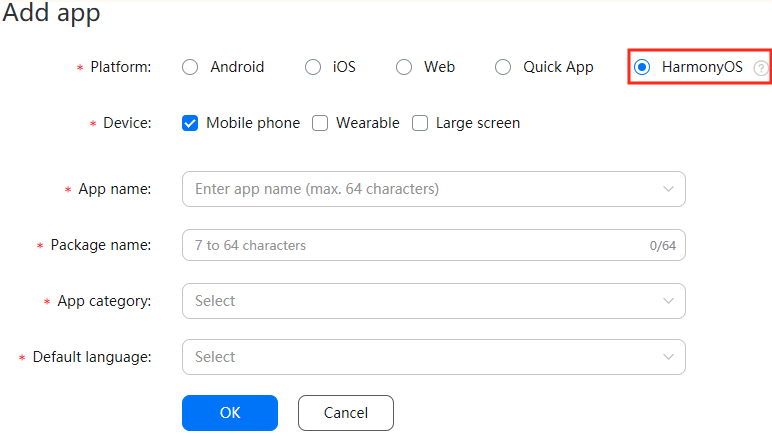
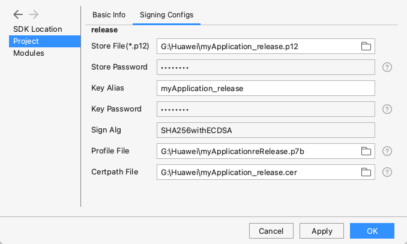
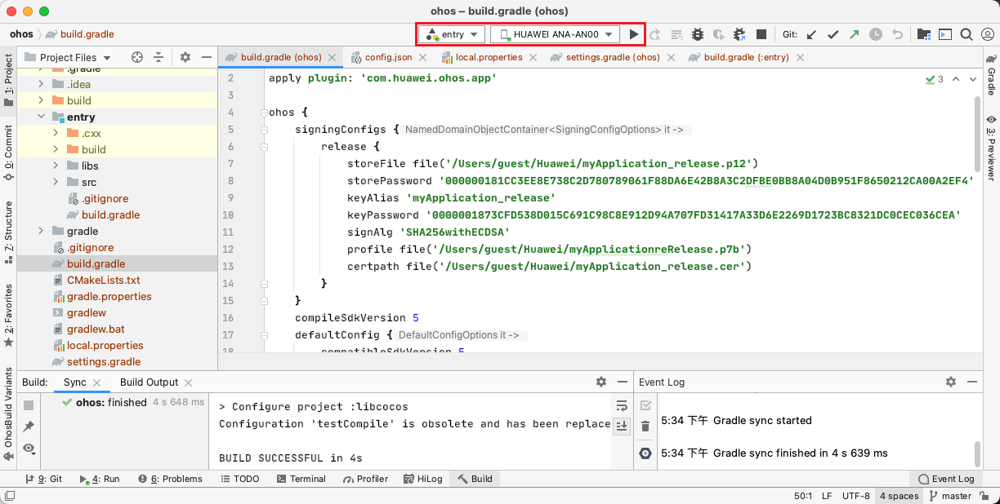

# Publish to Huawei HarmonyOS

> **Note**: some platforms only have Chinese documentation available when visiting the platform's website. It may be necessary to use Google Translate in-order to review the documentation.

Starting with v3.2, Cocos Creator supports packaging games as Huawei **HarmonyOS** (`.hap`) applications.

## Ready to work

- Enter [AppGallery Connect website](https://developer.huawei.com/consumer/en/service/josp/agc/index.html) to register for a [HUAWEI ID](https://developer.huawei.com/consumer/en/doc/start/registration-and-verification-0000001053628148), and real-name certification.

- After logging in, select [Create Project](https://developer.huawei.com/consumer/en/doc/distribution/app/agc-harmonyapp-createproject) and [Add HarmonyOS App](https://developer.huawei.com/consumer/en/doc/distribution/app/agc-harmonyapp-createharmonyapp), select the **Platform** as **HarmonyOS**.

  

- Download and install [HUAWEI DevEco Studio](https://developer.harmonyos.com/cn/develop/deveco-studio#download). After the installation is complete [Configure Development Environment](https://developer.harmonyos.com/cn/docs/documentation/doc-guides/environment_config-0000001052902427), download the HarmonyOS SDK, please check the SDK package in SDK Platforms **Java** and **Native**.

    

    Remember the directory indicated by **HarmonyOS SDK Location** shown at the top of the window, fill in the path of this SDK in the **Preferences** panel of Cocos Creator later.

## Release process

### Building with Cocos Creator

1. Use Cocos Creator to open the project that needs to be published, click **Cocos Creator -> Preferences -> External Programs** in the upper menu bar, configure **Hongmeng OS SDK** and **Hongmeng OS NDK** path:

    

    **Directory where the Hongmeng OS node executable file is located** This item is optional. Use the Node.js of DevEco Studio when opening the project with HUAWEI DevEco Studio.

2. Open the **Build Release** panel from **Menu Bar -> Project**. Select **Hongmeng** in **Release Platform** in the **Build Release** panel, and configure [Build Options](./native-options.md#%E6%9E%84%E5%BB%BA%E9%80%89%E9%A1%B9) as needed. Next, click the **Build** button at the bottom right.

    

    > **Note**: **App ID name** in the expanded item of **Hongmeng** needs to be consistent with the package name when adding the HarmonyOS application in the AppGallery Connect background.

3. Open the project directory after the build is complete, notice that the `ohos` folder is generated under the `native\engine` directory, which contains the Hongmeng project generated by the build.

    

### Compile and run through HUAWEI DevEco Studio

1. Open HUAWEI DevEco Studio and select **Open Project** to open the Hongmeng project generated after the build.

    

    After opening the project, select **Use DevEco Studio's Nodejs** in the pop-up window. There is no need to configure the directory where the Hongmeng OS node executable file is located in the **Preferences** panel of Cocos Creator.

    

2. Prepare the signature file. For the method of obtaining the signature file, please refer to the contents of the **Signature File** section below.

3. Configure the signature file. Click **File -> Project Structure -> Project** in the DevEco Studio menu bar, select the **Signing Config** page, and configure the project release certificate and other files and related information. For details, please refer to the [Configure Signature Information](https://developer.harmonyos.com/cn/docs/documentation/doc-guides/publish_app-0000001053223745#ZH-CN_TOPIC_0000001154985553__section280162182818) documentation.

    

    > **Note**: To use a real device to debug HarmonyOS applications before release, configure the debugging signature information in the **Modules -> entry -> Signing Config** page of **File -> Project Structure** . For details, please refer to the [Debug HarmonyOS Application](https://developer.harmonyos.com/cn/docs/documentation/doc-guides/ide_debug_device-0000001053822404#EN-CN_TOPIC_0000001154985555__section10491183521520) documentation.
    >
    > 

    After setting and saving, the release signature information configured in **Project -> Signing Config** can be viewed in the `native\engine\ohos\build.gradle` file in the project directory. The debugging signature information configured in **Modules -> entry -> Signing Config** can be viewed in the `native\engine\ohos\entry\build.gradle` file in the project directory.

4. After the configuration is complete, connect to the Huawei device of the Harmony OS system, and then click **Build -> Build APP(s)/Hap(s) -> Build APP(s)** in the menu bar to execute the compilation process . Another way is to directly click the run button above **DevEco Studio** to execute the compile and run process.

    

5. After compiling, notice the generated `.hap` file in the `native\engine\ohos\build\outputs\hap` directory of the project directory.

    

    The generation path of the `.hap` file for debugging is in the `native\engine\ohos\entry\build\outputs\hap` directory of the project directory.

    

6. Please refer to the official [Release HarmonyOS Application Guide](https://developer.huawei.com/consumer/cn/doc/distribution/app/agc-harmonyapp-releaseharmonyapp#h1-1598338018957) documentation for the specific process of publishing to the Huawei App Market.

### Signature file

HarmonyOS applications use digital certificates (`.cer` files) and HarmonyAppProvision files (`.p7b` files) to ensure the integrity of the application. First, use **DevEco Studio** to generate a key and certificate request file, and then use the certificate request file to apply for a digital certificate and profile file for publishing/debugging in AppGallery Connect.

#### Generate key and certificate request file

In **DevEco Studio**, click **Build -> Generate Key and CSR** in the upper menu bar to generate a key (`.p12` file), and then generate a certificate request file (`.csr`). For details, please refer to the [Generate Key and Certificate Request File](https://developer.harmonyos.com/cn/docs/documentation/doc-guides/publish_app-0000001053223745#EN-CN_TOPIC_0000001154985553__section7209054153620) documentation.

> **Note**: When specifying the file path, the file name needs to be added with the corresponding suffix, otherwise the submission will not be successful.

#### Generate and download a digital certificate (`.cer` file)

- Visit the [AppGallery Connect website](https://developer.huawei.com/consumer/cn/service/josp/agc/index.html), select **Users and Access -> Certificate Management**.

  > **Note**: Currently, only invited developers can access the **Certificate Management** menu. To apply, please send the developer's name, application background, supported device type, whether there is a request for app listing, and Developer ID to `agconnect@huawei.com`. Huawei operations staff will arrange a docking staff within 1-3 working days .  The developer ID query method is: log in to the AGC website, click **My Project**, select any project, and find the `Developer ID` in **Project Settings -> General**.

  

- Click the **Add Certificate** button in the upper right corner to fill in the information. **Certificate Type** Choose **Release Certificate**/**Debug Certificate** as required. The certificate request file is the `.csr` file generated in **DevEco Studio** in the previous step.

- After filling in the information, click **Submit**, a release/debugging certificate (`.cer` file) will be generated, and click the **Download** button behind the certificate to download it to the local.

For more information, please refer to the [Apply for Digital Certificate](https://developer.huawei.com/consumer/cn/doc/distribution/app/agc-harmonyapp-debugharmonyapp#h1-1598336089667) documentation.

#### Generate and download HarmonyAppProvision Profile file (`.p7b` file)

- Enter [AppGallery Connect website](https://developer.huawei.com/consumer/en/service/josp/agc/index.html), select **My Project**, select the HarmonyOS project and application created before.

- Click the **HarmonyOS Application -> HAP Provision Profile Management** item on the left, and then click the **Add** button at the top right of the page to create a `.p7b` file.

  > **Note**: Currently, only invited developers can access the **HarmonyOS App** menu. To apply, please send the developer's name, application background, supported device type, whether there is a request for app listing, and Developer ID to `agconnect@huawei.com`. Huawei operations staff will arrange a docking staff within 1-3 working days.

  

- When filling in the information, **Type** can be selected as needed **Release**/**Debug** type, but it must be consistent with the certificate type in the previous step. **Choose Certificate** Select the `.cer` file generated in the previous step.

  > **Note**: If the debugging type is configured, a device mist also be selected. For details, please refer to the [Registering Debugging Devices](https://developer.huawei.com/consumer/en/doc/distribution/app/agc-harmonyapp-debugharmonyapp#h1-1598520099105)documentation.

- After setting, click **Submit** to download the generated `.p7b` file to the local.

For more information, please refer to the [Application Profile](https://developer.huawei.com/consumer/cn/doc/distribution/app/agc-harmonyapp-debugharmonyapp#h1-1598336409517) documentation.
