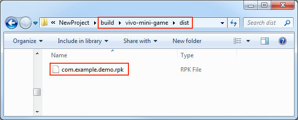
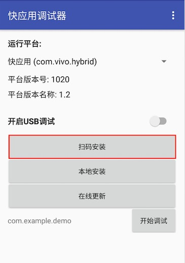

# Publish to vivo Mini Games

> **Note**: some platforms only have Chinese documentation available when visiting the platforms website. It may be necessary to use Google Translate in-order to review the documentation.

## Environment Configuration

- Download the [Quick App & vivo Mini Game Debugger](https://minigame.vivo.com.cn/documents/#/lesson/base/environment?id=%E5%AE%89%E8%A3%85vivo%E5%B0%8F%E6%B8%B8%E6%88%8F%E8%B0%83%E8%AF%95%E5%99%A8) and [vivo Mini Game Engine](https://minigame.vivo.com.cn/documents/#/lesson/base/environment?id=%E5%AE%89%E8%A3%85vivo%E5%B0%8F%E6%B8%B8%E6%88%8F%E5%BC%95%E6%93%8E) and install it on your Android device (recommended Android Phone 6.0 or above)

- Install [nodejs-8.9.0](https://nodejs.org/en/download/) or above, globally:

    > **Note**: after installing nodejs, you need to note whether the npm source address is <https://registry.npmjs.org/>

    ```bash
    # View current npm source address
    npm config get registry

    # If not, reset the npm source address
    npm config set registry https://registry.npmjs.org/
    ```

- Install `vivo-minigame/cli` globally:

    ```bash
    npm install -g @vivo-minigame/cli
    ```

    If `vivo-minigame/cli` installation fails, it may be caused by too low version of **nodejs**. Please check the version of **node** and upgrade.

## Build Options

For some general build options of platforms, please refer to the [General Build Options](build-options.md) documentation for details.

| Name | Optional | Default value | Description | Field name |
| :-- | :-- | :-- | :-- | :-- |
| **Start Scene Asset Bundle** | Optional | false | If set, the start scene and its related dependent resources are built into the built-in Asset Bundle — [start-scene](../../asset/bundle.md#the-built-in-asset-bundle) to speed up the resource loading of the start scene. | startSceneAssetBundle |
| **Remote server address** | Optional | Empty | This option is optional and used to fill in the address of the remote server where the resources are stored.If this option is left blank, the `build/vivo-mini-game/remote` folder in the release package directory will be packaged into the rpk package.Refer to the Resource Management section for more details. | remoteServerAddress |
| Game Package Name | required | (Project Name) | such as `com.example.demo` | package |
| Desktop Icon | required | (Cocos Logo) | Click the **search icon** button at the back of the input box to select the icon you want. When building, the **Desktop Icon** will be built into the vivo Mini Game project. It is suggested to use `PNG` images for the | **Desktop Icon**. | icon |
| Game Version Name | required | (Cocos version) | **Game Version Name** is the real version, such as: **1.0.0**. | versionName |
| Game Version Number | required | 1201 |  **Game Version Number** is different from the **Game Version Name**, and the **Game Version Number** is mainly used to distinguish the version update. Each time when you submit audit, the game version number is at least 1 higher than the value of the last submitted audit. It must not be equal to or less than the value of the last submitted audit, and it is recommended that the **Game Version Number** be recursively incremented by 1 each time when the audit is submitted. | versionCode |
| Supported Minimum Platform Version Number | required | 1035 | Please refer to [Official Documentation [cn]](https://minigame.vivo.com.cn/documents/#/download/engine?id=%E6%9B%B4%E6%96%B0%E8%AE%B0%E5%BD%95%EF%BC%9A) to check the latest version number of vivo engine. | minPlatformVersion |
| Orientation | - | landscape | Device direction, it will be written in `manifest.json`.| deviceOrientation |
| Use debug keystore | - | true | When you check **Use Debug Keystore**, it means that the rpk package built with the certificate that comes with Creator is used by default, and it is only used for **debugging**. when the rpk package is to be used to submit an audit, do not check the **Use Debug Keystore** to build it.| useDebugKey |
| Key certification path | - | - | The key store certificate, the quick game on the Huawei App Market, must be signed with the release version certificate, and the certificate fingerprint must be configured in the background of the Huawei Developers Alliance. For details, please refer to the following [Generate Signature File](###Generate Signature File) | privatePemPath、certificatePemPath |

### Generate signature file

If you don't check the **Keystore**, you need to configure the signature files **certificate.pem path** and **private.pem path**, where you build a rpk package that you can **publish directly**. The developer can configure two signature files by using the **search icon** button to the right of the input box.

There are two ways to generate a signature files:

- Generated by the **New** button after the **certificate.pem path** in the **Build** panel.

- Generated by the command line.

    The developer needs to generate the signature file **private.pem**, **certificate.pem** through tools such as **openssl**.

    ```bash
    # Generate a signature file with the openssl command tool
    openssl req -newkey rsa:2048 -nodes -keyout private.pem   -x509 -days 3650 -out certificate.pem
    ```

    > **Note**: **openssl** can be used directly in the terminal in Linux or Mac environment, and in the Windows environment you need to install `openssl` and configure system environment variables. Restart Creator after the configuration is complete.

## Run the rpk



There are three ways to run rpk on your phone:

- **Method One**

    Click the **Run** button at the bottom right of the `vivo-mini-game` build task in the **Build** panel and wait for the QR Code interface to be generated:

    

    Then open the **Quick App & vivo Mini Game Debugger** that was installed before on your Android device. Click the **Scan code install** button to scan the QR Code to open the **rpk**.

    

- **Method Two**

    Copy the generated mini game **rpk** file (located in the `dist` directory) to the `sdcard` directory of the mobile phone.

    Open the **Quick App & vivo Mini Game Debugger** that has been installed before on your Android device, click **Local Install**, then find the **rpk** file from the `sdcard` directory of your mobile phone and select Open.

    

- **Method Three**

    Specify to the editor installation directory `resources/tools/vivo-pack-tools` in the command line, and execute the command `npm run server` to generate URL and QR code using the vivo Mini Game Packer Commands.

    ```bash
    # Specify to the editor installation directory.
    cd F:/CocosCreator/resources/tools/vivo-pack-tools

    # Generate URL and QR code
    npm run server
    ```

    Then open the **Quick App & vivo Mini Game Debugger** that was installed before on your Android device.

    Finally, click the **Scan code install** button to copy the URL generated in the first step to the browser, and then directly scan the QR code on the web page to open the **rpk**.

## Subpackage Loading

The subpackage loading of vivo Mini Games is similar to WeChat Mini Games. Please refer to the [Mini Game Subpackage](subpackage.md) for details.

## vivo Mini Game Environment Resource Management

The part of vivo mini games that exceed the package size limit must be downloaded through the network.

Cocos Creator has helped developers to download, cache and manage remote resources. For details, please refer to [Resource Management](../../asset/cache-manager.md).

## Reference documentation

- [vivo Mini Games Development Documentation [cn]](https://minigame.vivo.com.cn/documents/#/lesson/base/start)
- [vivo Mini Games API Documentation [cn]](https://minigame.vivo.com.cn/documents/#/api/system/life-cycle)
- [Quick App & vivo Mini Game Debugger Download [cn]](https://minigame.vivo.com.cn/documents/#/download/debugger)
