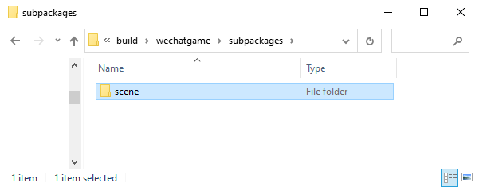
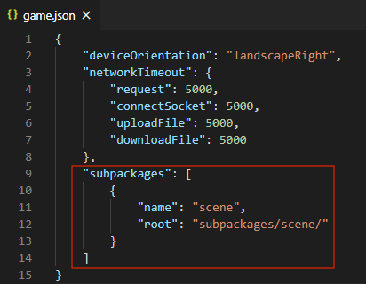

# Mini Game Subpackage

Some mini game platforms support subpackaging to divide resources, scripts and scenes. Including WeChat Mini Game, Baidu Mini Game, Xiaomi Quick Game, Bytedance Mini Game, Huawei Quick Game, OPPO Mini Game and vivo Mini Game.

Cocos Creator supports [Asset Bundle](../../asset/bundle.md) starting in v2.4, which allows developers to divide contents that need to be subpackaged into multiple Asset Bundles, and these Asset Bundles will be built into subpackages of the mini game. Only the necessary main packages will be downloaded when you startup the game, and these subpackages will not be loaded, but will be manually loaded by the developer during the game. This effectively reduces the time for the game startup.

## Configuration

The Asset Bundle is configured in **folders**. When we select a folder in the **Assets** panel, the **Inspector** panel will show a **Is Bundle** option, if set, the folder-related configuration options will appear:

In addition to the general [Asset Bundle Configuration](../../asset/bundle.md#configuration), the main settings to focus on for the mini game subpackage are:
- Set the **Target Platform** to the mini game platform that you want to subpackage, and set the **Compression Type** to the **Mini Game Subpackage**.
- The mini game subpackage can only be placed locally and cannot be configured as remote packages, so the **Is Remote Bundle** option cannot be checked.

Once configured, click the **Check** button on the top right and the folder will be configured as a Asset Bundle.

## Build

After the project is built, this Asset Bundle folder is packaged into the `subpackages` folder in the release package directory of the mini game platform. Each folder contained in this folder is an Asset Bundle.

**For example**, if the `assets/scene` folder in the Hello World project is configured as an Asset Bundle on the WeChat Mini Game, then after the project is built, a `scene` folder is generated in the `subpackages` folder in the release package directory, and the `scene` folder is an Asset Bundle.

## WeChat Mini Games

When building for the WeChat Mini Game, the configuration of the Asset Bundle will be automatically generated into the `game.json` configuration file of the WeChat Mini Games release package directory according to the rules.

> **Note**: WeChat Mini Games require a specific version to support the Subpackage feature. WeChat 6.6.7 client, 2.1.0 and above base library support, please update to the latest client version. Developer tools please use version **1.02.1806120** and above. After updating the developer tools, don't forget to modify the version of **Details -> Local Settings -> Debug Base library** to 2.1.0 and above in the WeChat DevTools:
>
> 

### Subpackage Load Packet Size Limit

At present, the size of the WeChat Mini Game subpackage has following restrictions:

- The size of all subpackage of the entire Mini Game can not exceed **16M**
- The size of single subpackage/main package can not exceed **4M**

Please refer to the [WeChat Mini Game Subpackage Loading](https://developers.weixin.qq.com/minigame/en/dev/guide/base-ability/sub-packages.html) documentation for details.

## vivo Mini Games

When building for the vivo Mini Game, the configuration of the Asset Bundle will be automatically generated into the `manifest.json` configuration file in the `vivo-mini-game/src` directory of the vivo Mini Game release package according to the rules.

> **Notes**:
> 1. Starting with **1051** version, **Quick App & vivo Mini Game Debugger** supports the subpackage loading of vivo Mini Game. Versions lower than 1051 do not support subpackage loading, but they are also compatible. If a subpackage is configured in the editor's **Properties** panel, it will not affect the normal operation of the game. Please refer to [vivo Mini Game Subpackage Loading -- Runtime Compatibility [cn]](https://minigame.vivo.com.cn/documents/#/lesson/base/subpackage?id=%e8%bf%90%e8%a1%8c%e6%97%b6%e5%85%bc%e5%ae%b9) for details.
> 2. Unlike other mini game platforms, the Asset Bundle folder for the vivo Mini Game will be generated in the `src` directory of release package `vivo-mini-game` directory after the project is built.
>
>     

### Subpackage Load Packet Size Limit

At present, the size of the vivo Mini Game subpackage has following restrictions:

- The size of all subpackage and main package of the entire Mini Game can not exceed **8M** (The compressed package after packaging contains whole package no more than **16M**, please refer to [vivo Mini Game Subpackage Loading -- Compatibility [cn]](https://minigame.vivo.com.cn/documents/#/lesson/base/subpackage?id=%e7%bc%96%e8%af%91%e6%97%b6%e5%85%bc%e5%ae%b9) for details.
- The size of single subpackage/main package can not exceed **4M**.

Please refer to the [vivo Mini Game Subpackage Loading [cn]](https://minigame.vivo.com.cn/documents/#/lesson/base/subpackage) for details.
