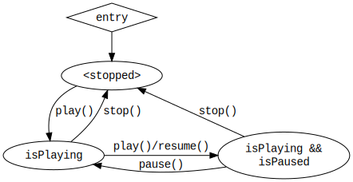

# Animation State

Animation clips describes animation data for specific kinds of objects and do not bind to individual target object. When the animation got to be played, target object is bound to the animation clip, the playback state is so called animation state. Animation states are somewhat similar to a player, which for example pause and alter the speed of animation.

Animation states are represented by [class `AnimationState`](../../../../api/en/classes/animation.animationstate-1.html).

## Playback Time

An animation state traces the **accumulated playback time** of an animation. The initial accumulated playback time is 0 and it's self accumulated while playing automatically. In the case of a looping playback, the accumulated playback time would be **duration * 2** when the second pass done.

At arbitrary time, the playback location of the animation is called as **progress time**. Obviously process time is always in the range `[0, duration]`.

The **accumulated playback time** and **progress time** can be accessed through `time` and `current` fields, whereas **accumulated playback time** can be manually set but **progress time** is read only.

The loop mode and loop count decide the correspondence of playback location and accumulated playback time. The **progress time** varies accordingly no matter the **accumulated playback time** is automatically accumulated or is changed manually.

## Loop Mode and Loop Count

The animation can be stopped once it had been played to the end or can be loop forever, or, can be played to the end and replay to the begin so forth. These are called loop modes, denoted by enumeration [`AnimationClip.WrapMode`](../../../../api/en/enums/animation.wrapmode.html):

| Loop Mode | Description |
| :--- | :--- |
| `AnimationClip.WrapMode.Normal`  | Play to the end and then stop. |
| `AnimationClip.WrapMode.Loop`    | Play to the end continuously. |
| `AnimationClip.WrapMode.PingPong` | Play to the end, and replay to the beginning from the end, back and forth. |

Besides, each loop mode in above table have a reversing edition:

| Loop Mode | Description |
| :--- | :--- |
| `AnimationClip.WrapMode.Reverse`  | Play to the beginning from the end and then stop. |
| `AnimationClip.WrapMode.LoopReverse`    | Play to the beginning from the end continuously. |
| `AnimationClip.WrapMode.PingPongReverse` | Play to the beginning from the end, and replay to the end from the beginning, back and forth. |

The initial loop mode is read from the animation clip. Assign to `wrapMode` would alter the loop mode.

> **NOTE**: the accumulated playback time is reset after change the loop mode.

Except for the `AnimationClip.WrapMode.Normal` and its responding `AnimationClip.WrapMode.Reverse`(thought they loop only once), other loop modes loop infinitely. You can retrieve and limit the loop count through `repeatCount` field of `AnimationState`.

> **NOTE**: you should set loop count after you set loop mode since the loop count is reset after you set loop mode. `AnimationClip.WrapMode.Normal` and its responding `AnimationClip.WrapMode.Reverse` would reset the loop count as 1. The others reset the loop count as `Infinity`(infinite count).

## Playback Control

Animation state provides the following methods to control the playing, pausing, resuming and stopping of a animation:

| Method | Description |
| :--- | :--- |
| `play()`  | Reset playback time as 0 and start to play the animation. |
| `pause()`    | Pause the animation. |
| `resume()` | Continue to play the animation starting from current playback time. |
| `stop()` | Stop the animation playing. |

The following fields can be used to query the playback status:

| Field(readonly) | Description |
| :--- | :--- |
| `isPlaying`  | Whether the animation is in playing status. |
| `isPaused`    | Whether the animation is in paused status. |
| `isMotionless` | Whether the animation is paused or stopped. |

The playback status and playback control is formatted as the following graph:

