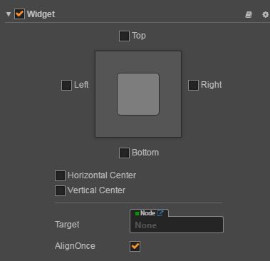

# Extends Inspector

Inspector is a component control interface that is displayed in the Propertes panel. Sometimes we need to define an Inspector for the Component we write, and display it in a custom way.For example, the special form of Widget component is desgined through by the inspector extends



The steps are as follows:

1. Include the custom Inspector entry file in the component
2. Create an extension package for the custom Inspector
3. Write the custom Inspector entry file in the extension package

## Register Inspector entry

First we need to define a Component script, and for this script that use the custom Inspector, as follows:

```javascript
cc.Class ({
  name: 'Foobar',
  extends: cc.Component,
  editor: {
    inspector: 'packages: //foobar/inspector.js',
  },
  properties: {
    foo: 'Foo',
    bar: 'Bar'
  },
});
```

**Note 1**: Here we define a `editor` field and define the `inspector` entry file in this field. Basis your `inspector.js` editor will generate the correspondence frame.

**Note 2**: In `inspector` we use the `packages://` protocol to define the path to the entry file. In Cocos Creator the `packages://` protocol plus the package name is mapped to extension package folder.

## Create a custom Inspector extension package

Now we create an extension package in the normal workflow. You can follow the [your first expansion package](your-first-extension.md) guide.
Let's say our extension package is called `foobar`.

Note that after creating the extension package, you need to restart Cocos Creator so that he can read the Inspector in extension package correctly (not required for other extension functions).

## Write a custom Inspector entry file in the extension package

Next we can define `inspector.js` in the` foobar` package: 

```javascript
Vue.component ('foobar-inspector', {
  template: `
    <ui-prop v-prop = "target.foo"> </ ui-prop>
    <ui-prop v-prop = "target.bar"> </ ui-prop>
  `

  props: {
    target: {
      twoWay: true,
      type: Object,
    },
  },
});
```

Cocos Creator's Inspector extension uses [vuejs](http://vuejs.org/) for UI. Here we define a vue component.
and set `props` in the component so that it contains `target` data to complete the entire Inspector data definition.

The `target` is an instance of our `Foobar` class in the Inspector.

## About target

The `target` instance mentioned in the previous section is the target that has been processed by Inspector. Its internal contains the processing of the properties.
When using `target`, we can not simply think that `target.foo` on behalf of the value of foo. If you go on in Chrome DevTools and check `target.foo` you will
find that it's an object rather than a 'Foo' string that we defined at the beginning. The object contains `attrs`,
`type`, `value` and other information. Where `value` is the value we want to get.

The purpose of doing so is to make Inspector better access to all aspects of data visualization information. For example, when you define the properties of cc.Class:

```javascript
properties: {
    //There is a Default, Get or Set value need to be assigned.
    foo: {
        default: 'Foo',
        readonly: true
    }
}
```

This time in the Inspector we can see `target.foo.value` is 'Foo', and `target.foo.attrs.readonly` is `true`.
This information helps to help you create various interface combinations.

## About attribute binding

Because this information is very cumbersome, In Cocos Creator we created some expansion for Vue directives, including `v-prop`, `v-value`, `v-readonly` and `v-disable`.

When you still want to use Cocos Creator's default scheme to display the data segment, you can use `v-prop` with the `<ui-prop>` control to do the binding,

```html
<ui-prop v-prop = "target.foo"> </ui-prop>
```

When you want to use the native control of `<ui-xxx>`, you can use `v-value` for data binding, such as:

```html
<ui-input v-value = "target.foo.value"> </ui-input>
```

When you want to apply readonly or disable behavior to a control, use `v-readonly` and `v-disable`. Such as:

```html
<ui-button v-readonly = "target.foo.attrs.readonly"> Foo </ui-button>
<ui-button v-disable = "target.bar.value"> Bar </ui-button>
```