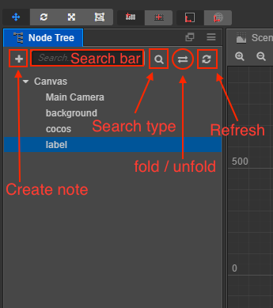

# Node Tree

**Node Tree** includes all nodes in current opened scene, no matter the node includes the visible image or not. You can choose, create and delete nodes in here and create set membership of node by dragging one node to another.

Click to choose node, and the selected node will be highlighted in blue. Current selected node will show with blue frame in **scene editor** and update contents in **Properties** panel.

- The  button in the upper left corner is used to create nodes.
- The text input box above can be used to search for filtered nodes
- The  button is used to filter the type of search. It is divided into two types: `Node` and `Component`.
- The  button toggles the expanded/collapsed state of the **Node Tree**.
- The panel body is a list of nodes, where you can add, delete or modify resources using the right click menu or drag and drop.
-  in front of the node is used to toggle the expand/collapse state of the node tree. When the user presses the Alt/Option and clicks the button, in addition to performing the expand/collapse operation of the node itself, the expand/collapse operation is also performed on all child nodes under that node at the same time.

## Create node

There are two ways to create node in Hierarchy:

- Click `+` button on the top left corner or right click the mouse to enter the **create node** submenu in right click menu. In this submenu, you can select different node types including Sprite, Label, Button and other nodes with different functions and expressions.
- Drag assets like image, font or particle from **explorer** to **Node Tree**. Then you can create corresponding image rendering node with the selected assets.

## Delete node

After select node, you can delete the selected node by the `delete` option in the right click menu or press the hot key <kbd>Delete</kbd>（Windows）or <kbd>Cmd + Backspace</kbd>. If the selected node contains child node, then the child node will be deleted along with it.

## Create and edit node parenting relationship

Dragging node A to node B makes node A the child node of node B. Similar with [Asset](assets.md), Hierarchy also show nodes' hierarchical relationship in tree view. Click the triangle icon on the left of node and you can unfold or fold the child node list.

## Change node's rendering order

Other than dragging one node to another, you can also keeps dragging node up and down to change the order of node in the list. The orange square indicates the range of parent node which the node belongs to and the green line represents the position the node will be inserted.

The order of nodes in the list determines the rendering order of node in the scene. the rendering order of the nodes displayed below is behind the upper nodes, that is, the lower nodes are drawn after the upper nodes. The bottom node is displayed in the top of the **scene editor**.

## Other operations

Right click the node, the popup menu also includes the following operation:

- **Copy/paste**：copy the node to the clipboard and then paste it to other places or open another scene to paste the node just copied.
- **Copy node**：generate node replication exactly the same with the selected node and they are at the same level.
- **Rename**：rename the node
- **Show UUID and path of node**：In complicated scenes, we sometimes need to get the complete path in the node tree to access it when running the script. Click this option so you can see the path of the currently selected node and its UUID in the **Console**.
- **Lock node**：move the mouse over the node and there will be a lock button on the left side. After the node is locked, it cannot be selected in the **Scene**.
