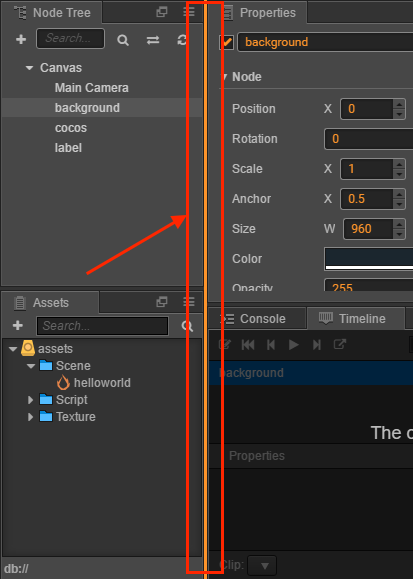
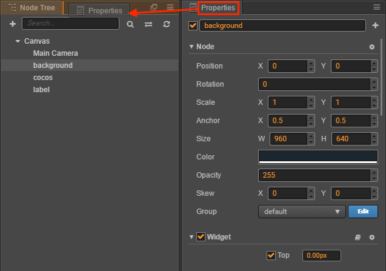
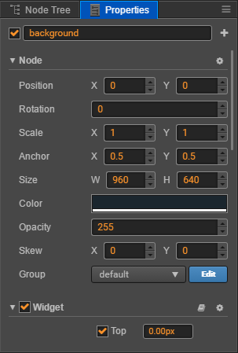

# Editor Layout

Editor layout refers to the position, size and stack of panels in Cocos Creator editor window.

Select the **Layout** menu from the main menu and you can choose the most suitable editor panel layout from the pre-set ones for your current project. You can adjust the position and size of each panel on the basis of the pre-set layout. Alterations to the layout will be auto-saved to the `local/layout.windows.json` file in the project folder.

## Adjusting panel size

Position the mouse on the border line of two panels and drag when the cursor changes shape to change the size of the two adjacent panels.

Some panels have a minimum size setting, so the panel size can't be reduced if it reaches its size limitation.

## Moving panels

Click the tab bar on the panel and drag to move the whole panel to any position in the editor window. The red box in the picture below shows the tab bar area that can be dragged and the arrow shows the drag direction:

The blue translucent box shows the position where the panel will be placed once the mouse is released when moving the panel.

## Stacking panels

Besides moving the panels, you can also move the mouse to the tab bar area of another panel when dragging the tab bar:

Release the mouse when the tab bar appears orange, so that the two panels can be stacked together. Only one panel can be displayed at a time:

Panels in a stack can be very practical when the desktop resolution is not enough or the panel layout usage rate is low. Panels in a stack can be dragged out at any time to recover the display of the panel that is placed at the top.