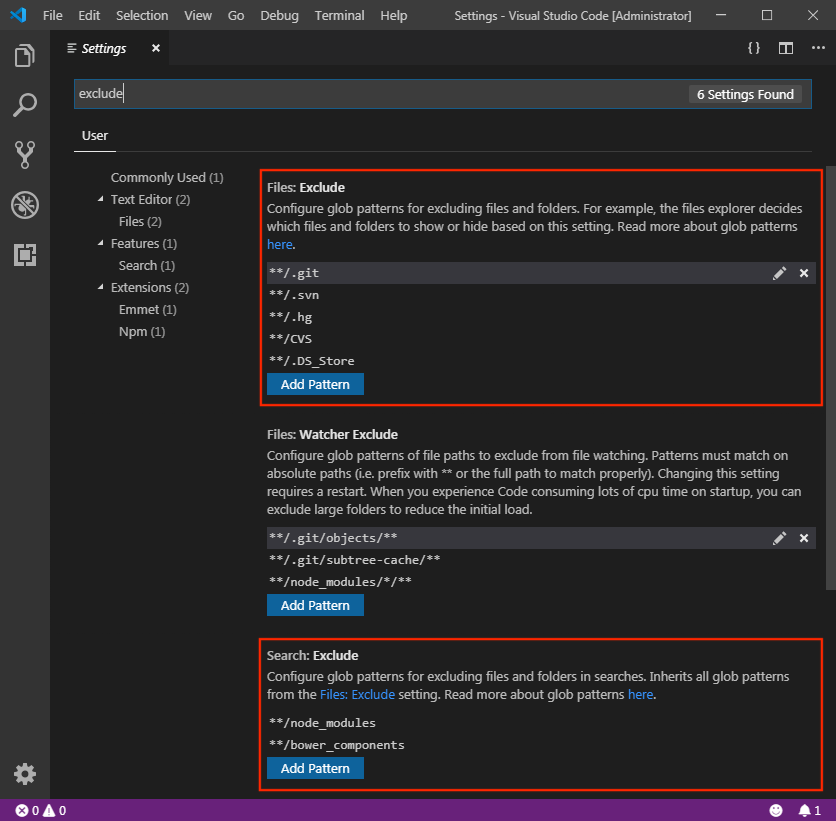
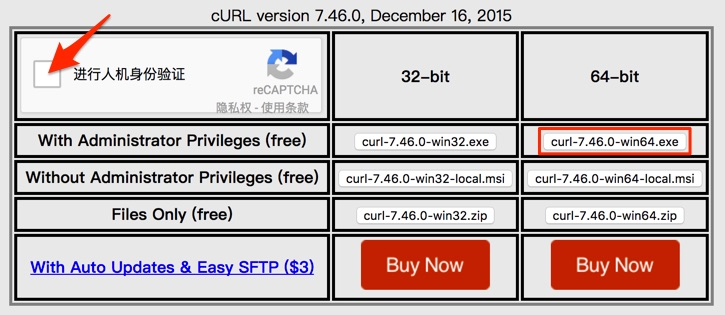

# Coding Environment Setup

In quick start tutorial we showed double clicking script file to edit them in builtin Code Editor. However the builtin Code Editor is only for quick edit and review of scripts and lack of many features we need for daily coding work. So we will introduce the recommended coding environment for Cocos Creator and how to set it up.

## Visual Studio Code

[Visual Studio Code](https://code.visualstudio.com/) （refer to as VS Code）is a cross-platform light weight development environment. Through the setting method described below, using VS Code to manage and edit project script code, you can easily achieve syntax highlighting, intelligent code prompt and other functions.

### Install VS Code

Go to [home page of VS Code](https://code.visualstudio.com/) and click the download button to get the software package.

Mac user can extract the software to anywhere you like, and double click `Visual Studio Code.app` to launch.

Windows user can run `VSCodeSetup.exe` to install it.

### Install Cocos Creator API Extension

Open your project in Cocos Creator, and choose `Developer -> VS Code Workflow -> Install VS Code Extension` from main menu.

This will install Cocos Creator API Extension to VS Code's extension library, usually with the path `.vscode/extensions` in your user home folder. You need to install this extension only once unless there's a update with Cocos Creator.

After the installation is successful, a green prompt `VS Code extension installed to ...` will appear in the **Console**. The main function of this plug in is to inject syntax matching prompts for Cocos Creator component script usage in the VS Code editing state.

### Generate API Source In Your Project

For syntax highlight and autocomplete you also need to generate API source to your project folder.

Choose `Developer -> VS Code Workflow -> Update VS Code API Source` from main menu. It will generate a `creator.d.ts` file to the root of your project (same level as `assets` folder). You'll see `API data generated and copied to ...` when it's complete.

This operation is only required when the API source is updated, or for some reason your project does not have a `creator.d.ts` file in it.

**Node**:

1. Since VS Code 0.10.11, you'll also need a `jsconfig.json` for your project to work. The above command will automatically copy a predefined `jsconfig.json` file along with `creator.d.ts` to your project. You can customize `jsconfig.json` according to [VS Code JavaScript guide](http://code.visualstudio.com/docs/languages/javascript) to better suit your habit.
2. If it is a JavaScript project, please do not click the `Add TypeScript Config` option. This feature generates `tsconfig.json` file at the project root, giving the TypeScript code intellisense, but invalidating the JavaScript code intellisense. Delete `tsconfig.json` if the problem occurs.

### Open Project With VS Code

Let's run VS Code, and choose `File -> Open...` from main menu, then select your project's root folder and click `Open`.

Now you can create a new script or edit existing script and enjoy autocomplete and syntax highlight.


**Attention**: `creator.d.ts` and `jsconfig.json` file must reside in the folder you open with VS Code to make the whole language and API autocomplete work.

### Setup File Tree and Search Filter

Choose `Code (Mac) / File (Windows) -> Preferences -> Settings` from VS Code main menu, or in the lower left corner of the  selection `Setting`. The `USER SETTINGS` file will be opened for edit. Let's add the following content:

```json
{
    "search.exclude": {
        "**/node_modules": true,
        "**/bower_components": true,
        "build/": true,
        "temp/": true,
        "library/": true,
        "**/*.anim": true
    },
    "files.exclude": {
        "**/.git": true,
        "**/.DS_Store": true,
        "**/*.meta": true,
        "library/": true,
        "local/": true,
        "temp/": true
    }
}
```

The above settings exclude folders generated and managed by Cocos Creator from search and file tree.

**Note**: The new version of VS Code may be in the UI interface state when opening user profile `USER SETTINGS`:


Next, enter the **exclude** in the search box above, and then click the **Add Pattern** button in the `search.exclude` and `files.exclude` modules to supplement the content:



### Use VS Code to activate script compilation

After modifying the project script by using an external text editor, you need to reactivate the Cocos Creator window to trigger script compilation. We have added a preview server API for the new version of Creator, which can be used to activate editor compilation by sending requests to a specific address.

#### Install cURL

First you need to make sure your operating system can run the [cURL command](https://curl.haxx.se/),
if you run `curl` on the command line of a Windows operating system and you are prompted that cannot find the command, then you need to first install curl to your system.

- To the <http://www.confusedbycode.com/curl/>
- Click the control shown in the following figure arrow to complete the Human machine authentication
    
- Click `curl-7.46.0-win64.exe` to start downloading and installing.

please use the default settings when installing, and you can open a command line window when the installation is complete. Enter `curl` and if the prompt `curl: try 'curl --help' or 'curl --manual' for more information` indicates that the installation was successful.

#### Add VS Code Compile Task

To activate script compilation in VS Code, you need to perform the following workflow:

1. In the Creator Editor main menu, execute `Developer -> VS Code Workflow -> Add Compile Task`. This operation will add the `tasks.json` task configuration file in the `.vscode` folder of the project.
2. Press <kbd>Cmd/Ctrl+p</kbd> in VS Code to activate **Quick open** input box, then enter `task compile`.
    
3. If the task runs successfully, the following results will be displayed in the output panel below the VS Code window:
    

VS Code can also configure shortcut keys for tasks, please open the `Code -> Settings -> Keyboard shortcuts` On the main menu and add the following entry in `Keybindings.json` on the right side:

```json
    {
        "key": "ctrl+p", //Please configure your own custom shortcut keys
        "command": "workbench.action.tasks.runTask",
        "args": "compile"
    }
```

Next, You can compile the project script in VS Code with one click! For more information on configuring and executing tasks in VS Code, see the [Integrate with External Tools via Tasks](https://code.visualstudio.com/docs/editor/tasks) documentation.

<!--
### Use VS Code to debug web games

VS Code has excellent debug capability, we can debug the Web version of the game program directly in the source project in VS Code.

First we need to install:

- [Chrome (Google Chrome)] (https://www.google.com/chrome/)
- VS Code extension: Debugger for Chrome

To install the VS Code extension, click on the 'Extensions' button in the left navigation bar of the VS Code to open the Extensions panel and enter `Debugger for Chrome` in the search box and click `Install` to continue. After installation, you may need to restart VS Code to take effect.

Next, in the Cocos Creator editor main menu, execute the `VS Code Workflow -> Add Chrome Debug Setting`. This menu command adds a `.vscode/launch.json` file to your project folder as the debugger configuration. Then in VS Code you can click `Debug` button on the left sidebar to open the Debug panel, and in the top of the debug configuration, select `Creator Debug: Launch Chrome`, and then click the green start button to start debugging.

Debugging process depends on the Cocos Creator editor built-in Web server, so you need to have the editor running for debug to work. If the editor uses non-default port to preview the game, you need to manually modify the `url` field in `launch.json` to add up the correct port.

We can directly add breakpoint in the source files, make changes, recompile and continue debugging process. This workflow is more convenient and friendly than using the built-in DevTools of Chrome.
-->

### Use VS Code to debug native projects

VS Code debugging native engineering please refer to [Native Platform Debugging](../publish/debug-native.md), but only support Creator v1.6 and below. If the Creator version is greater than v1.7, use Chrome or Safari for debugging, refer to [Debug JavaScript on Native Platform](../publish/debug-jsb.md).

### Learn More About VS Code

Go to the [documentation page of VS Code](https://code.visualstudio.com/Docs), to learn the editing, customization and extensions for VS Code.
