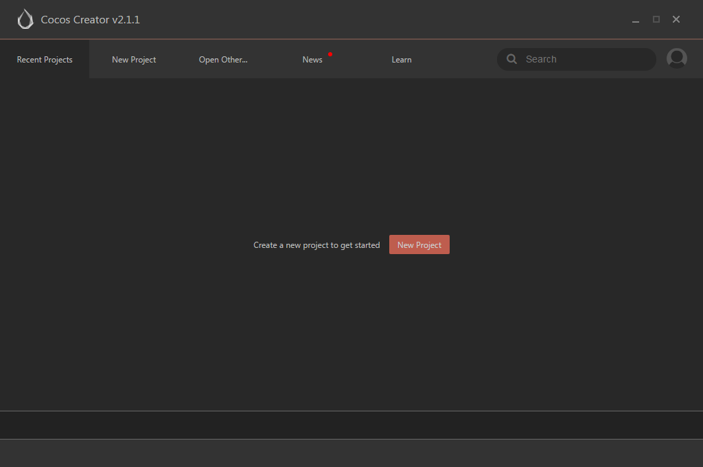
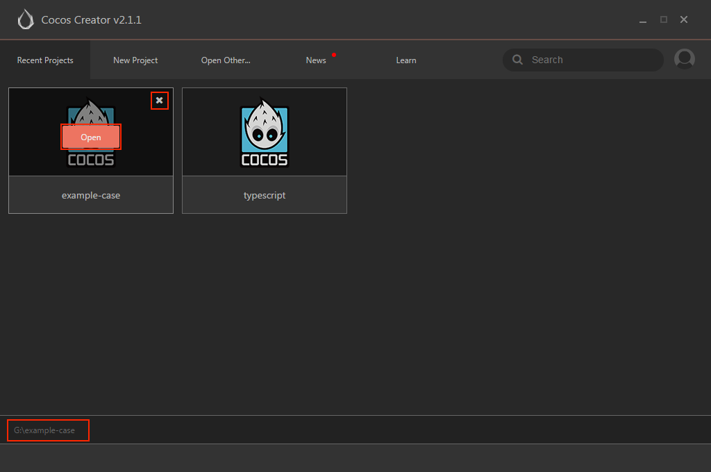
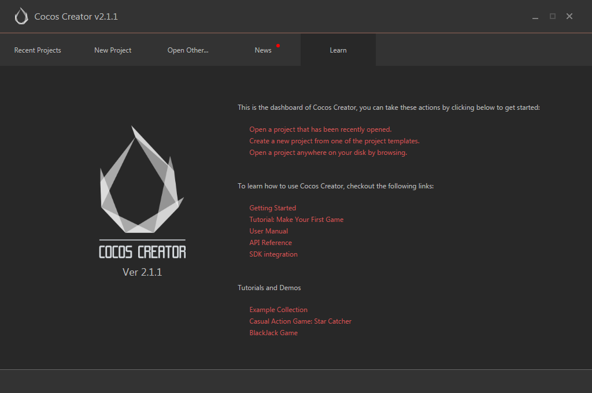

# Dashboard

After starting Cocos Creator and logging in with your Cocos developer account, the Dashboard interface will open. 
You can create a new project, open an existing project or obtain helpful information here.

## Overview of the interface

What is listed above is the dashboard interface of Cocos Creator, which includes the following types of tabs:

- **Recent Projects**: List projects that have been opened recently. When running Cocos Creator for the first time, this list is blank and a **New Project** button will appear for create a new project to get started.
- **New Project**: By clicking this tab, you can access the guide interface for creating a new project in Cocos Creator.
- **Open Other Projects**: If your project is not in the list of recently opened projects, you can click this button to browse and choose the project you want to open.
- **Learn**: Help information, which is a static page that includes various pieces of helpful information and guides for beginners and documents.

Next, we will introduce these subpages one by one.

### Recently Opened Projects

You can quickly access projects that have been opened recently by using **Recently Opened Projects**. When running Cocos Creator for the first time, this list is blank and a 'Creat a new project' button will appear on the interface. You can come back here after
having created some projects. And you will see the newly created project appearing on this list.

When you hover your mouse over the article of a recently opened project, the available operations on this article will appear:

- Click **Open** to open this project in Cocos Creator editor
- Click **Close** to remove this project from the list of recently opened projects. This operation will not delete the actual project folder.

Also, when you click or hover over a project, you can see the path of this project in the status bar underneath the Dashboard.

### Create a New Project

You can create a new Cocos Creator project with the **Creat a New Project** tab.

In the **Creat a New Project** page, we first need to choose a project template. The project template includes various kinds of basic game frameworks and sample resources and scripts for learning, which can help you start creative work quicker.

> **Note**: the early Cocos Creator edition doesn't include multiple optional project templates. Along with the improvement of Cocos Creator's functions, we will gradually add more templates to provide convenience for users.

Click a template, and you will see descriptions of this template at the bottom of the page.

At the bottom of the page, you will see the project name and the path that it's going to be saved to. You can manually input the project path and project name in the input field of project path. The last section of the path is project name.

You can also click the **Browse** button to open the input field of the browsing path. You can choose a place in your local file system to store the new project.

After everything is set up, you can click the **Create** button to finish creating the project. The Dashboard interface will be closed, and the newly created project will be opened in the main window of Cocos Creator editor.

### Open Other Projects

If you can't find your project on the **Recently Opened Projects** page, or if you just downloaded a project that you have never opened before, you can
browse and open the project in the local file system by clicking the **Open Other Projects** button.

After clicking **Open Other Projects**, a selective input field of the local file system will pop up. Choose your project folder in this input field and click "Open" and then you can open the project.

**Note: Cocos Creator uses a particularly structured folder as legitimate project marking, but not it is not a construction document. You only need to click the project folder when choosing the project.**

### Learn

You can visit Cocos Creator User Manual and other helping documents by clicking the **Learn** page.

