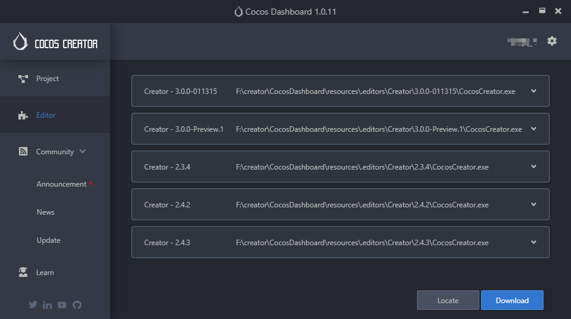

# Installing and Launching

Cocos Creator is equipped with a new Dashboard system, which allows developers to upgrade and manage multiple versions of the engine and projects at the same time! It also integrates a unified project management and creation panel, so developers can use different versions of the engine to develop projects at the same time!



## Downloading Dashboard

Download the Dashboard installation package by visiting the download link on the [Cocos Creator Product Page](https://www.cocos.com/en/creator).

Double-click the installation package after downloading.

### Installation Instructions for Windows

The installer for Windows is an `.exe` executable file, usually named **CocosDashboard-vX.X.X-win32-20XXXXXX.exe**, where **vX.X.X** is the version number of Cocos Dashboard, such as v1.0.11. The string of numbers after it is the version date number.

> **Note**.
> 1. If the version number installed on the current PC is the same as the version number of the installation package, the installation package with the same version number cannot be overwritten automatically, and it will be necessary to uninstall the previous version before continuing the installation.
>
>       The default installation path of the application is C:\CocosDashboard and can be changed during the installation.
>
> 2. If there is an error about the digital signature of CAB file, please try to install with administrator privileges.
> 
> 3. For some Windows PCs that are very old and have been on the intranet for a long time or have not been updated with OS patches for a long time, there may be some errors caused by missing dlls when running, try to install the system patch to solve: <https://support.microsoft.com/en-us/help/2999226/update-for-universal-c-runtime-in-windows>.
> 
> 4. If the "Access Denied" pop-up window appears during installation, please make sure that the operating system installed on your machine is the official version of Microsoft, not a customized or streamlined third-party version.

### Installation Instructions for MacOS

The installer for Cocos Dashboard for MacOS is a dmg image file. Double-click the dmg file, then drag and drop **CocosDashboard.app** into your **Applications** folder shortcut, or any other location. Then double-click the dragged **CocosDashboard.app** and you're ready to go.

> **Note**.
> 1. If you can't open it after downloading, it indicates that the dmg or app file is corrupted, from an unknown developer, or contains malware, etc. Please right-click the dmg or app file in the Finder and select **Open**, then click **Open** again in the pop-up dialog box. Then please go to **System Preferences -> Security & Privacy** and click **Open Anyway** so that it can be launched normally later.
>
> 2. If you get a "corrupted, can't open" message during the installation process, you need to check if there is any software like Xcode occupying the files in the Dashboard installation directory. If so, exit, then uninstall Dashboard and reinstall it.

### Operating System Requirements

The supported system environments for Cocos Dashboard are:

The minimum supported version of Mac OS X is OS X 10.9.
The minimum supported version of Windows is Windows 7 64-bit.

## Running Cocos Dashboard

On Windows, double-click the **CocosDashboard.exe** file in the `CocosDashboard` folder after unzipping to start Cocos Dashboard.

On MacOS, double-click the dragged out **CocosDashboard.app** application icon to launch Cocos Dashboard.

You can set a Quick Launch, Dock, or shortcut to the entry file as you like, so you can run it whenever you want.

### Checking the Graphics Card Driver

For some Windows operating systems and graphics card models, you may encounter error message like

```
This browser does not support WebGL...
```

This is due to the editor relying on GPU rendering, which is not supported by the graphics card driver. If this happens, you can usually fix it by making sure that the official driver for your graphics card is successfully installed.

## Login with Cocos Developer Account

When Cocos Dashboard is launched, you will be taken to the Cocos Developer Account login screen. Once you are logged in, you can enjoy our online services, product update notifications, and developer benefits.

If you don't have a Cocos Developer account, you can sign up using the **Register** button on the login screen to go to the **Cocos Developer Center**. Or go directly to the following link to register.

<https://auth.cocos.com/#/sign_up/register?language=en>

Once you've registered, you can go back to the Cocos Dashboard login screen and complete your login! After verifying your identity, we'll be in the Dashboard interface. In all cases, except for manual logout or expired login information, you will be automatically logged in with the information saved in your local session.
