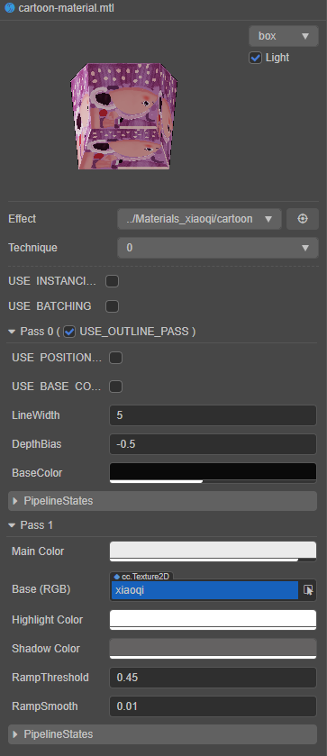
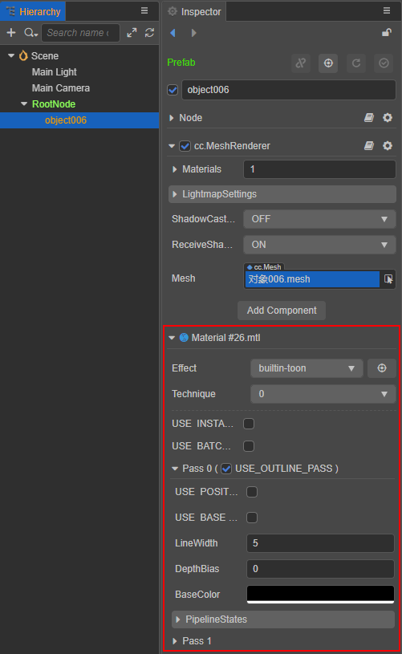
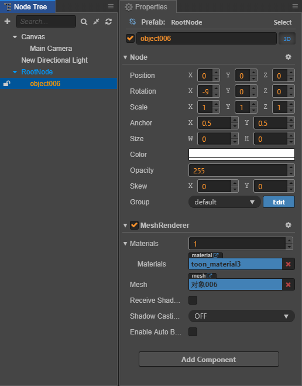
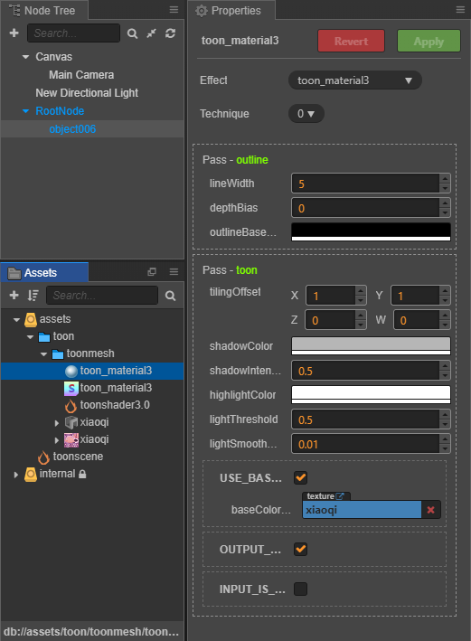
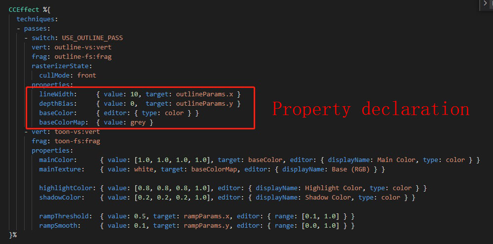
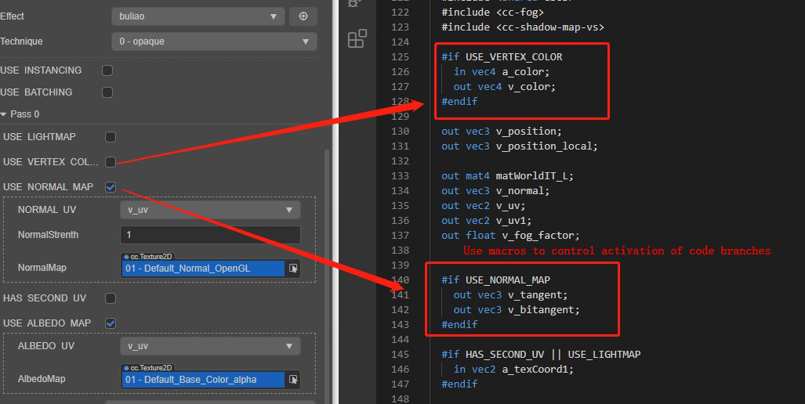

# Cocos Creator 3.0 Material Upgrade Guide

> This article will detail the considerations for upgrading Cocos Creator 2.x materials to v3.0.

## 1. Introduction to the base design of the material system

### 1.1 The material system framework of Cocos Creator

The material system consists of four core classes from top to bottom, Material, Effect, Technique and Pass, whose relationship can be understood by the following class diagram:


#### Material

The Material asset can be seen as an asset instance of the EffectAsset in the scene, and its own configurable parameters are effectAsset, technique, defines, states.

#### Effect

An Effect asset represents a material type and is the most important core asset in the material system. If you want to implement a custom shading effect in the engine, you need to write a custom Effect.

#### Technique

We refer to the solution to accomplish a final effect as a rendering technique, and a technique can be fused by one or more passes.

#### Pass

A Pass is a single GPU draw, typically including a vertex shader and a slice shader, and there are many optional configuration parameters for Pass in Creator.

### 1.2 Material Instance Panel

The Material instance panel is the most intuitive material editing window for all developers, and all actual material instances are configured through it.

The Material instance panel in Cocos Creator 3.0 is as follows:



The Material instance panel of Cocos Creator 2.x looks like this


As you can see from the above two figures, the instance panel in v3.0 is quite complex compared to v2.4, partly because of the increased complexity of the material configuration, and partly because of the enhanced functionality of the panel.

#### The configurable items of the material panel are divided into five main types

1. Effect asset: the drop-down box will list all the Effect assets in the current project, and developers can select the Effect asset used by the current material. Other properties will be updated when the Effect is switched.
2. Technique rendering technique selection: the drop-down box will list all the Technique in the Effect asset currently in use, and there may be multiple Technique in the Effect asset, each Technique is suitable for different situations. For example, the Technique with less effect but better performance is more suitable for mobile platform.
3. Macro options defined in Effect: these macros control whether certain code can be enabled or not (corresponding to pass by pass).
4. the list of properties defined in Effect (dynamically opened according to the macro definition) and the use of different input boxes to accommodate different types of properties. The editable properties of the editor are generally the mapping of a uniform in the shader, and from v3.0 onwards it is also possible to specify the mapping of a component (using the target parameter in Effect).
5. v3.0 also added the PipelineStates option, which is mainly used to define the pipeline states of material dependencies, such as DepthStencilState, BlendState, CullMode, etc.

### 1.3 Editor Experience

There are also some differences between v2.x and v3.0 in the editor experience of the material system.

In v3.0, after selecting the node containing the model and material in the **Hierarchy** panel, the **Inspector** panel will display the component properties and the detailed Material configuration panel as follows.



In v2.x, when the node containing the model and material is selected in the **Node Tree** panel, the **Properties** panel will only show the component properties, not the detailed Material configuration panel:



Instead, you need to jump to the **Assets** panel and select the Material asset before you can edit it in the **Properties** panel:



## 2. Effect Assets

This section describes the commonalities and differences between assets in v2.x and v3.0.

### 2.1 Effect format and content

For the Effect asset, both v2.x and v3.0 use the YAML1.2 standard syntax and parser, and there are few differences between the two versions. The Effect asset defines a material type, and by following the [syntax format](yaml-101.md), the following information can be defined:

- Technique list of rendering techniques
- A list of passes for each Technique
- A list of editable properties exposed to the editor in each pass (including data type designation within the editor, component mapping relationships, etc.)
- Shader programs for each pass, including vertex and slice shader programs

In terms of syntax details, such as Property declarations and macro definitions, the approach is the same:






### 2.2 Preset Material Types

There is a big difference between v2.x and v3.0 in terms of preset materials.

- The preset materials in v2.x include 2D Sprite, classic `blinn-phong` lighting materials, `unlit` materials, default `toon` materials, particle materials, etc.

- The preset materials in v3.0 are physics-based rendering system, including standard PBR materials based on physical lighting, Skybox, toon rendering materials, 3D particle materials (CPU & GPU), particle trailing materials, traditional 2D Sprite materials, etc.

The v3.0 default standard material supports the standard Physically Based Rendering (PBR) process, which contains a lot of mapping information to enhance the quality and realism of the material, such as diffuse mapping, normal mapping, metallic, roughness, ambient light oclusion, and so on. The whole algorithm is based on the standard BRDF lighting model, which is not available in v2.x. The overall performance of v3.0 is a step up from v2.x.

### 2.3 Effect Writing Details Differences

Although the syntax rules of Effect in Cocos Creator are basically the same in v2.x and v3.0, there are still differences in many built-in header files, variable names and function names.

For example, in v3.0, it was `cc_mainLitDir` and the header file `cc-global` was included. In v2.x, you need to use `cc_lightDirection[i]` to get the direction of the light source, and you need to include the header `cc-lights`. See the third point below in the **API Upgrade Guide** section for more details on the differences.

Some default shader functions are unique to v3.0, such as `CCStandardShading`, `CCToonShading`, etc., which are not available on v2.x. Again, see the third point below in the **API Upgrade Guide** section.

Regarding uniform declarations, v3.0 forces the use of UBO for organization, and the minimum unit for memory layout is vec4, which no longer supports separate declarations of float or vec3 types of uniform.

In terms of header files, v3.0 has built-in editor header assets in the `assets/chunks` directory of **Internal DB**. They can be referenced directly without adding directories, mainly including some common **tool functions** and **standard lighting model**. The header files of v2.x are built into the editor, so you can't see what they are.

### 2.4 New Pass Options

v3.0 adds some new Pass options:

- `PropertyIndex`: specify which `pass` this `pass`'s runtime uniform property data should be consistent with, e.g. a `pass` such as `forward add` needs to be consistent with the `base pass` to ensure proper rendering. Once this parameter is specified, the material panel will no longer display any properties of this `pass`.

- `embeddedMacros`: specifies additional constant macros to be defined on top of the `shader` for this `pass`. This parameter can be used to reuse `shader` assets when only the macro definition differs in multiple `pass` `shaders`.

For more details on the pass parameters, please refer to the [parameter list](./pass-parameter-list.md) documentation.

## 3. API Upgrade Guide

### 3.1 Built-in Uniform Difference List

If you want to use built-in variables in shader, you need to include the corresponding header file. The following table is a summary of commonly used functional uniforms, many of which are the same as v2.x and v3.0, and some of which are different.

| v2.x Header & Name | v3.0 Header & Name| Type | Usage | Version Difference |
| :------ | :------ | :----- | :------ | :------ |
| `cc-local.chunk` & `cc_matWorld` | `cc-local.chunk` & `cc_matWorld` | mat4 | Model space to world space matrix | no difference |
| `cc-local.chunk` & `cc_matWorldIT` | `cc-local.chunk` & `cc_matWorldIT` | mat4 | Model space to world space inverse substitution matrix | no difference |
| `cc-global.chunk` & `cc_time` | `cc-global.chunk` & `cc_time` |vec4 | x: global time in seconds since start<br>y: incremental time of current frame<br>z: total number of frames since start |no difference |
| `cc-global.chunk` & `cc_screenSize` | `cc-global.chunk` & `cc_screenSize` | vec4 | xy: screen size<br>zw: inverse of the screen size | no difference |
| `cc-global.chunk` & `cc_screenScale` | `cc-global.chunk` & `cc_screenScale` | vec4 | xy: screen scale<br>zw: inverse screen scale | no difference |
| none | `cc-global.chunk` & `cc_nativeSize` | vec4 | xy: the size of the actual shading buffer<br>zw: the inverse of the size of the actual shading buffer | new in v3.0, not in v2.x |
| `cc-global.chunk` & `cc_matView` | `cc-global.chunk` & `cc_matView` | mat4 | view matrix | no difference |
| `cc-global.chunk` & `cc_matViewInv` | `cc-global.chunk` & `cc_matViewInv` | mat4 | view inverse matrix | no difference |
| `cc-global.chunk` & `cc_matProj` | `cc-global.chunk` & `cc_matProj` | mat4 | projection matrix | no difference |
| `cc-global.chunk` & `cc_matProjInv` | `cc-global.chunk` & `cc_matProjInv` | mat4 | projection inverse matrix | no difference |
| `cc-global.chunk` & `cc_matViewProj` | `cc-global.chunk` & `cc_matViewProj` | mat4 | view projection matrix | no difference |
| `cc-global.chunk` & `cc_matViewProjInv` | `cc-global.chunk` & `cc_matViewProjInv` | mat4 | view projection inverse matrix | no difference |
| `cc-global.chunk` & `cc_cameraPos` | `cc-global.chunk` & `cc_cameraPos` | vec4 | xyz: camera position | no difference |
| none | `cc-global.chunk` & `cc_exposure` | vec4 | x: camera exposure<br>y: camera exposure countdown<br>z: whether HDR is enabled<br>w: HDR to LDR scaling parameter | new feature in v3.0, not in v2.x |

**Also, v2.x and v3.0 are very different in terms of light sources and shadows, and v3.0 is a big improvement over v2.x. The following table lists some common features of uniform.**

| v2.x Header & Name| v3.0 Header & Name| Type | Usage | Version Differences |
| :------ | :------ | :----- | :------ | :------ |
| `cc-lights.chunk` & `cc_lightDirection[CC_MAX_LIGHTS]` | `cc-global.chunk` & `cc_mainLitDir` | vec4 | Get light direction | v2.x: How many lights are affected by a single model drawing at a time in the shader The default maximum value is 1.0. To get the position information, fill in 0. For example, `cc_lightDirection[0]`<br>v3.0: xyz: main direction light direction
| `cc-lights.chunk` & `cc_lightColor[CC_MAX_LIGHTS]` | `cc-global.chunk` & `cc_mainLitColor` | vec4 | Control the color intensity of the light | v2.x: exp of the light, which is the light's pow intensity. <br>v3.0: xyz - the main directional light color; w - the main directional light intensity |
| `cc-lights.chunk` & `CC_CALC_LIGHTS` | `cc-global.chunk` & `cc_ambientSky` |v2.x: macro definition<br>v3.0: vec4| controls the sky color intensity | v2.x: this is a macro that is computed by threading in the ambient parameter for calculation. And there are function overloads that can be passed in with different parameters. <br>v3.0: xyz - sky color; w - brightness |
| none | `cc-global.chunk` & `cc_ambientGround` |vec4| xyz: ground reflected light color | new feature in v3.0, not in v2.x |
| none | `cc-environment.chunk` & `cc_environment` | samplerCube | xyz: IBL environment mapping | new feature in v3.0, not in v2.x |

### 3.2 Shader Built-In Functions and Variables

In v3.0, if you need to interface with the engine dynamic batching and instancing process, you need to include the `cc-local-batch` header file and get the world matrix via the `CCGetWorldMatrix` utility function.

#### New shading functions in v3.0

- `CCStandardShading`

    The function name `CCStandardShading` needs to contain the header file `shading-standard.chunk`, which is used to perform the lighting calculations that make up the surface shader process.

    ```c
    #include <shading-standard
    #include <output-standard>
    void surf (out StandardSurface s) {
        // fill in your data here
    }
    vec4 frag () {
        StandardSurface s; surf(s);
        vec4 color = CCStandardShading(s);
        return CCFragOutput(color);
    }
    ```

    It is easy to implement your own surface input, or other shading algorithms in this framework.

    > **Note**: the `CCFragOutput` function does not generally need to be implemented by itself, it only serves the purpose of interfacing with the rendering pipeline. And for outputs containing lighting calculations, the `output-standard` header should be included instead of `output` since the results are already in HDR range.

- `CCToonShading`

    Function name `CCToonShading`, which needs to contain the header file `shading-toon.chunk` for the lighting calculation for cartoon rendering.

    ```c
    #include <shading-toon
    #include <output-standard>
    void surf (out ToonSurface s) {
        // fill in your data here
    }
    vec4 frag () {
        ToonSurface s; surf(s);
        vec4 color = CCToonShading(s);
        return CCFragOutput(color);
    }
    ```

### 3.3 Functions related to light and shadow calculation

v2.x is very different from v3.0 in terms of light and shadow calculation, mainly including the following two parts:

#### spherical light

The **point light source** in v2.x is adjusted to **spherical light** in v3.0, and there are many ready-made functions, which need to be added to the header file `cc-forward-light.chunk` when using it.

| Name | Type | Info |
|:------ | :------ | :----- |
| `cc_sphereLitPos[MAX_LIGHTS]` | vec4 |xyz: sphere light position |
| `cc_sphereLitSizeRange[MAX_LIGHTS]` | vec4 | x: sphere light size<br>y: sphere light range |
| `cc_sphereLitColor[MAX_LIGHTS]` | vec4 | xyz: sphere light color<br>w: sphere light intensity |

For more details, please refer to [Common built-in shader Uniform](built-in-shader-uniforms.md).

#### Spotlights

The spotlight in v3.0 has a lot of ready-made features, which need to be added to the header file `cc-forward-light.chunk` when using it.

| Name | Type | Info |
| :----- | :----- | :----- |
| `cc_spotLitPos[MAX_LIGHTS]` | vec4 | xyz: spotlight position |
| `cc_spotLitSizeRangeAngle[MAX_LIGHTS]` | vec4 | x: spotlight size<br>y: spotlight range<br>z: spotlight angle |
| vec4 | xyz: Spotlight direction |
| `cc_spotLitColor[MAX_LIGHTS]` | vec4 | xyz: spotlight color<br>w: spotlight intensity |

Please refer to the [Common shader built-in Uniform](builtin-shader-uniforms.md) documentation for more details.

### 3.4 Shadows

There is a big difference between v2.x and v3.0 in shading calculations. v2.0 adds the header file `shadow.chunk`, while v3.0 adds the header file `cc-shadow.chunk`.

**v2.0 header file `shadow.chunk` has the following common functional uniform and functions**:

| Name | Type | Info |
| :----- | :----- | :---- |
| `cc_shadow_lightViewProjMatrix[CC_MAX_SHADOW_LIGHTS]` | mat4 | Draws a shadow map in light coordinates |
| `cc_shadow_info[CC_MAX_SHADOW_LIGHTS]` | vec4 | Calculate shadow offset |

| Name (function) | Type | Info |
| :------ | :----- | :----- |
| `getDepth` | float | Returns the depth value |
| `shadowSimple` | float | Hard sampling of shadows can have jaggedness issues |

**v3.0 header file `cc-shadow.chunk` has the following common functions uniformly**:

| Name | Type | Info |
| :------ | :----- | :----- |
| `cc_matLightPlaneProj` | mat4| Transform matrix for plane shadows |
| `cc_shadowColor` | vec4 | Shadow color |

#### ShadowPCF Soft Shadows

| header file | function |
| :------ | :----- |
| v2.x: `shadow.chunk`| `shadowPCF3X3` (**3 * 3** samples)<br>`shadowPCF5X5` (**5 * 5** samples)|
| v3.0: `cc-shadow-map-fs.chunk` | `CC_DIR_SHADOW_FACTOR`: modify the value of the shadow color in memory directly |
