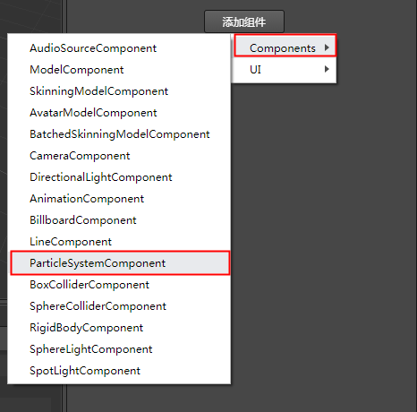
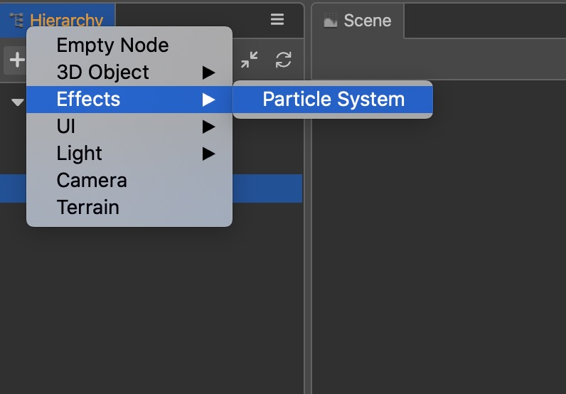

# Particle System Overview

The particle system is the basis of the game engine's special effects. It can be used to simulate natural phenomena such as fire, smoke, water, clouds, snow, and fallen leaves. It can also be used to simulate abstract visual effects such as luminous tracks and speed lines.

## Basic Structure

The basic unit of a particle system is a particle. A particle generally has attributes such as position, size, color, velocity, acceleration, and life cycle. In each frame, the particle system generally performs the following steps:

1. Generate new particles and initialize.
2. Delete particles beyond the life cycle.
3. Update the dynamic properties of particles.
4. Render all valid particles.

The general particle system will consist of the following parts:

1. Emitter, used to create particles and initialize particle properties.
2. Influencer, used to update the properties of particles.
3. Renderer, render particles.
4. Particle class, which stores the properties of particles.
5. The particle system class manages the above modules.

## Adding a particle system

There are two ways to add a particle system:

1. Use the editor to add particle system components (recommended).

    - By clicking __Add Component__ button on the **Inspector** panel, as shown below:

      

    - You can also right-click the **Hierarchy** panel and select __Create -> Effects-> Particle System__, as shown below:

      

2. Call `addComponent` via a script to dynamically add particle system components (not recommended).

## Particle Modules

The __Cocos Creator__ particle system uses modules to organize functions, including the following modules:

| Module | Description |
| :--- | :--- |
| [ParticleSystem](main-module.md) | It is used to store all the data displayed in the Inspector, manage the related modules of particle generation, update and destruction, and control the particle playback. |
| [ShapeModule](emitter.md) | Used to control particle emission, including emission direction and speed, and supports predefined emission directions including squares, circles, cones, balls, and hemispheres. |
| [AnimatorModule](module.md) |  Used to control the state update after particle emission. The supported functions are: size, color, rotation, speed, acceleration, speed limit, texture animation. |
| [ParticleSystemRenderer](renderer.md) |  Used to generate the data needed for particle rendering. Including control related to vb, ib, rendering state. |
