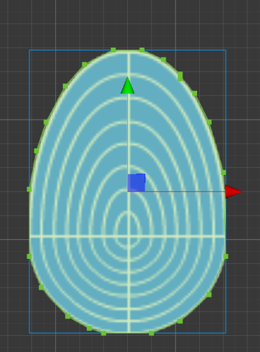
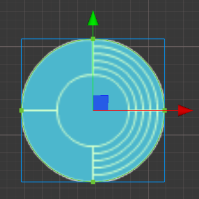

# Physics Collision Components

## Physics Collision Component Properties

- __sensor__ - specifies whether the collider is a sensor type. A sensor type collider will produce collision callbacks, but no physics collision effects will occur.
- __density__ - density of colliding bodies. Mass calculation for rigid bodies.
- __friction__ - friction of colliding bodies. The movement of colliding bodies is influenced by friction when they touch.
- __restitution__ - restitution of colliding bodies. Indicates whether the colliding body is affected by the elasticity of the collision.

### Box2D Physics Collision Component Interior Details

The __Box2D__ physics collision component is composed of the __Box2D__ `b2Fixture` internally. Due to some limitations within __Box2D__, a polygon physics collision component may be composed of multiple `b2Fixtures` objects.

A few examples:

1. When the vertices of a polygonal physics collision component form a concave shape, the physics system automatically divides these vertices into convex edges.
2. When the polygon physics collision component has more vertices than `b2.maxPolygonVertices` (typically 8), the physics system automatically splits these vertices into multiple polygons.

Normally these details are of no concern, but when using ray detection and the detection type is `ERaycast2DType.All`, a collision body may detect multiple collision points because multiple `b2Fixtures` are detected.

## Edit Collider Component

Click the **editing** checkbox of a collider component to edit collider shape freely.

### Polygon Collider

For editing **Polygon Collider** all green points of the collider can be moved freely by dragging. All changes to the points can be seen in **Points** property of Polygon Collider.

Moving the mouse over the line between two points, the mouse pointer changes to **Add** style. Then clicking the mouse to add a new point to the Polygon Collider.

The polygon collision component also has a **Regenerate Points** function. This function automatically generates the vertices of the contour based on the pixels of the **Sprite** component's texture on the node to which the component is attached.

**Threshold** specifies the minimum distance between the vertices of the generated map contour, the larger the value the fewer points are generated, and can be adjusted as desired.

### Circle Collider

Enable editing for a **Circle Collider** will show the circle editing area like below:

Left mouse button dragging the displayed dots modifies the radius of **circular collision components**. Dragging an area inside a circle can drag a circular area.

### Box Collider

Enable editing for a **Box Collider** will show the box editing area like below:

When the mouse is hovering over the **points of the box collider**, clicking the left mouse button and drag to modify the length and width of the box collider component.

When the mouse is hovering over the **rectangular collision area**, clicking and dragging will modify the offset of the **rectangular collision component**.

While holding down **Alt**, the **rectangular center point position** will remain unchanged during dragging.

### Modifying the Collision Component Offset

In the editing mode of all kinds of Colliders you can drag the center of the collider to move it off the center of the node. The **Offset** property of the collider will change as well.

