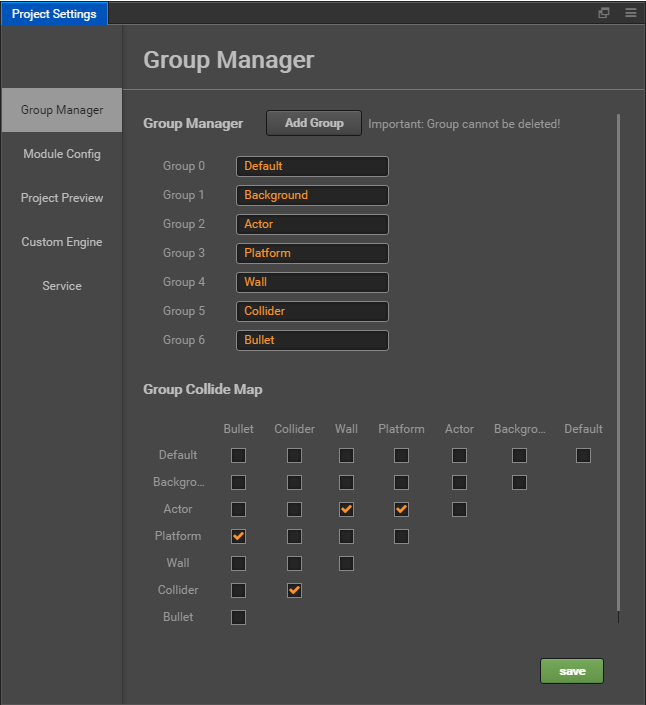

# Collision Group Management

Ideally we want to control which collides with which, to reduce unnecessary collision callbacks (for both performance and gameplay). We can control the collision relationship with **Group Manager** panel.

This panel has two sections:

## Group Management

We use node groups to categorize colliders. Set a group for a node will mark all colliders on this node with this specific group.

Let's select main menu's **Project -> Project Settings...** and open **Project Settings** panel. Then you can see the configuration items of the group list in the **Group Manager**, as shown below:

In the **Group Manager** section we can add new groups by click **Add Group** button, and there will be a **Default** group by default.

**Notice**: After the group is added, it cannot be deleted, but you can arbitrarily modify the name of the group.

## Group Collide Map

In the **Group Collide Map** section we can control whether collide is allowed for each group with any other groups. The Collide map looks like this:

Each column and row of this table has all the group listed. If you make modification to the **Group List** this table will be updated accordingly. Each checkbox in the table represent whether the group from the column will collide with the group from the row. 
After the runtime modifies the node's group, it is necessary to invoke collider apply for the modification to take effect.

So as the checkboxes stated, we have following groups that can collide with each other:   

Platform - Bullet   
Collider - Collider   
Actor - Wall   
Actor - Platform   

---

Go ahead and read [Collision Scripting](collision-manager.md)
