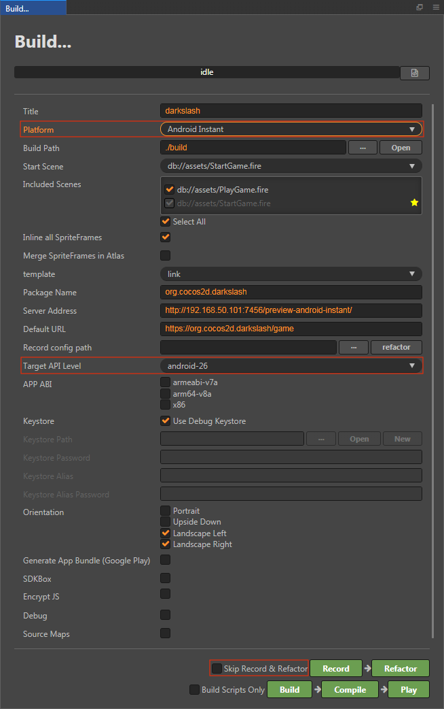
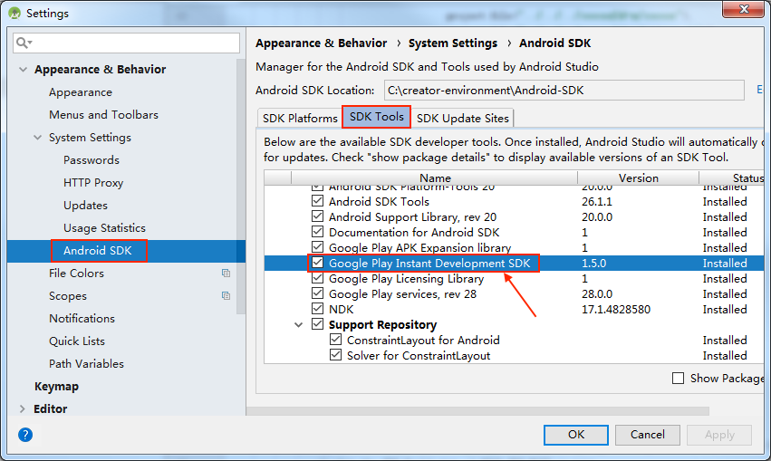
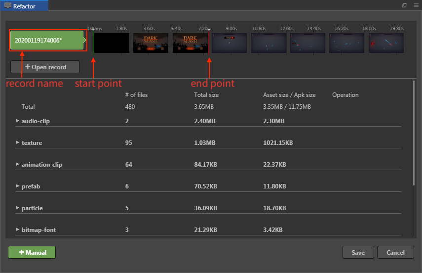
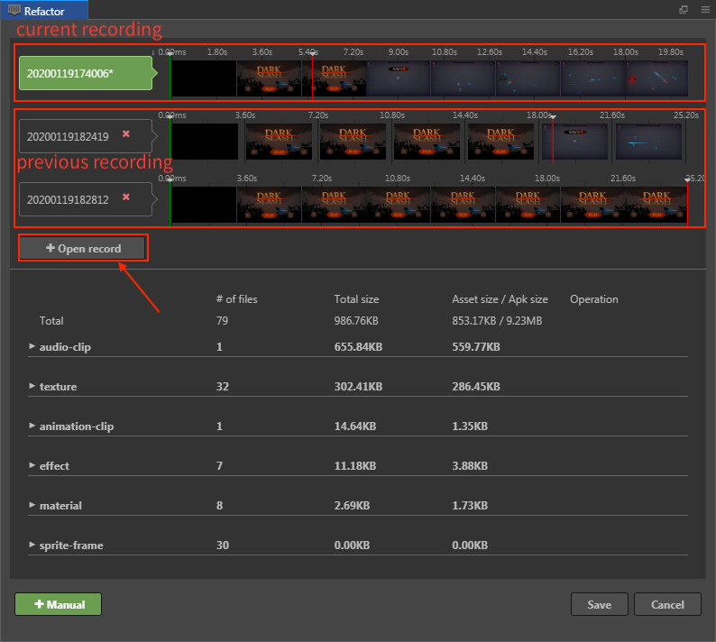

# Publish to Google Play Instant

Starting with Cocos Creator v2.0.4, creating games for the Google Play Instant platform is officially supported. Google Play Instant relies on Google Play, and it is not a new distribution channel, but closer to a game micro-end solution. It can realize the game to be played without installing, which is useful for game'demo, sharing and conversion. The main differences between Google Play Instant and the Android Instant App are:

- Both the first package and the APK add-on are limited to 10MB (instead of 4MB)
- Dynamically load resources without binary code from third-party CDN (JS is also available)
- APK add-on packages can only be downloaded from the Google Play Store, can contain binary code and resources, can be loaded in the background, do not need to switch activity

With games developed by Cocos Creator, just choose Google Play Instant as the publishing platform, which can automatically complete the standard adaptation work. Developers can quickly publish games that meet the Google Play Instant technical standards

## Using Cocos Creator publish to Google Play Instant with one click

### Requirement

- Android Studio 3.0+
- Android Phone 6.0+ 
**Attention**: Devices with Android SDK version between 6.0 and 7.0 need to install Google Service Framework. And Android 8.0 or higher does not need.
- NDK r10c +

### Instant Games Publish Process

1. Using Cocos Creator open the project that needs to be published. Open the **Build** panel from the Menu bar. Select **Android Instant** in the **platform** of the **Build** panel, choose **android-instant** in the **template**, and the **API Level** selects **android-26** and above.

    

2. If you want to package directly without using the refactor feature, you can hook the **Skip Record & Refactor** box, then click **Build -> Compile**, connect android phone to the computer and then click the **Play** button, when process complete you can run Google Play Instant on the phone.

    If you compile for the first time, you need to open the post-built project with Android Studio to download **Google Play Instant Development SDK (windows platform)** Support package, Mac platform is the **Instant Apps Development SDK** support package. If the download fails, it is recommended to set up an HTTP proxy for Android Studio.

    

3. If you need **refactor**, you can click the **Record** button in the **build** panel, and simulator will be opened. The simulatior will automatically record the resources used. What we need to do is to play the game according to the game flow and let the simulator record resources information.

    

4. After the recording is completed, click **Refactor**, and the Refactor panel will be opened to complete the refactor operation. For specific refactor steps, please refer to [Refactor](../publish/publish-android-instant.md#%E5%88%86%E5%8C%85%E5%99%A8).

5. After the refactor is complete, select the **Record config path -> ...** in the **Build** panel. This step will open the **profiles** folder to select the path where the refactor record is located (Refactor records are saved in the `path_to_your_project/temp/android-instant-games/profiles` directory). We can delete unwanted refactor records by deleting the corresponding folder.

    

6. Clicking **Build** in the **Build** panel will use the refactor record to split the first package. Then click **Compile -> Play** and make sure the phone is on the same LAN as the PC, and you can test the Google Play Instant running.

    **If you have already run a game, to run the new project again, you need to close the previous game process on your phone, otherwise the new project will not run on the phone because the port is occupied.**

### Related configuration instructions

The main configuration notes in the **Build** panel about publishing to Google Play Instant are as follows:
- **Server Address**: The download address of the remote resource, can be a CDN address. Put the `build/android-instant/remote_res` folder into the server or CDN, Cocos Creator will go to this address to download the resources that are not in the first package.
- **Default URL**: Android will load your instant app by this URL. See [Google Instant App documentation](https://developer.android.com/topic/google-play-instant/getting-started/first-instant-app) for details.
- **Record config path**: Cocos Creator will use this record config to generate first package and remote_res folder.

## Refactor

The **Refactor** is used to edit the first package of the game and select the resources to be placed into the first package.

### Useage

1. When you finish the Record, Click **Refactor** to open Refactor panel.

2. The **Refactor** opens the latest record by default. If you need to open another record, you can click **+ Open record**. The **Refactor** can also open multiple records at the same time for comparison.

    

3. Drag the **end point**, you can choose to divide the resources into the first package. When you drag the end point, you can find the data of the file list and the total size and other data changes. Select the size of the first package suitable for the game and we can finish the first step of the record.

4. **Refactor** can adjust all resources, on the page of the file list, expand the nodes of each category, and we can see the size of each file, we can remove the resource by uncheck the resource item.

    

5. If some resources are not in the first package, but we want to put it in the first package, we can click the **+ Manual** button to open the **Manual** panel, the rest of the resources will be presented here. Check the resources that you need to put into the first package and tick the resource, then click the **Add** button, you will find that it has been added to the **Refactor** panel.

    

6.  If you need to add other resources to the first package, you can also select resources from the **Assets** panel and drag them into the **Refactor** panel.

7. Finally, click **Save** button to save the first package info into record.

8. In the **Record config path** option of the **Build** panel, select the record we just edited, and then click the **Build** button, Cococs Creator will use this record to generate the first package and other resources.

## Android Studio support

- Cocos Creator recommends compiling with Android Studio.
- For other modifications to the Android project, we can use Android Studio to open the project directly and integrate other code for Android project. (The project path: `path_to_your_project/build/android-instant/frameworks/runtime-src/proj.android-studio`)
- The SDK version can be modified in Android Studio. The modified path and the minimum supported version are as follows:

## Instant Cookie API

We have provided some APIs to make it easier for developers to call some of Google's API directly. At the same time, we also provide Cocos Creator Cookie API Demo: [AndroidInstantCookieDemo](https://github.com/wuzhiming/AndroidInstantCookieDemo)

- `cc.androidInstant.showInstallPrompt()` For details, please refer to [showInstallPrompt](https://developers.google.com/android/reference/com/google/android/gms/instantapps/InstantApps.html#showInstallPrompt(android.app.Activity,%20android.content.Intent,%20int,%20java.lang.String))

- `cc.androidInstant.isInstantApp()` For details, please refer to [isInstantApp](https://developers.google.com/android/reference/com/google/android/gms/instantapps/PackageManagerCompat#isInstantApp())

- `cc.androidInstant.getInstantAppCookie()` For details, please refer to [getInstantAppCookie](https://developers.google.com/android/reference/com/google/android/gms/instantapps/PackageManagerCompat#getInstantAppCookie())

- `cc.androidInstant.setInstantAppCookie()` For details, please refer to [setInstantAppCookie](https://developers.google.com/android/reference/com/google/android/gms/instantapps/PackageManagerCompat#setInstantAppCookie(byte%5B%5D))

- `cc.androidInstant.getInstantAppCookieMaxSize()` For details, please refer to [getInstantAppCookieMaxSize](https://developers.google.com/android/reference/com/google/android/gms/instantapps/PackageManagerCompat#getInstantAppCookieMaxSize())

## Related reference links

1. [Instant App](https://developer.android.com/topic/google-play-instant/getting-started/first-instant-app)

2. [Google InstantApps API](https://developers.google.com/android/reference/com/google/android/gms/instantapps/InstantApps)

3. [Google Instant App Samples](https://github.com/googlesamples/android-instant-apps)

4. [CocosCreator AndroidInstantCookieDemo](https://github.com/wuzhiming/AndroidInstantCookieDemo)
