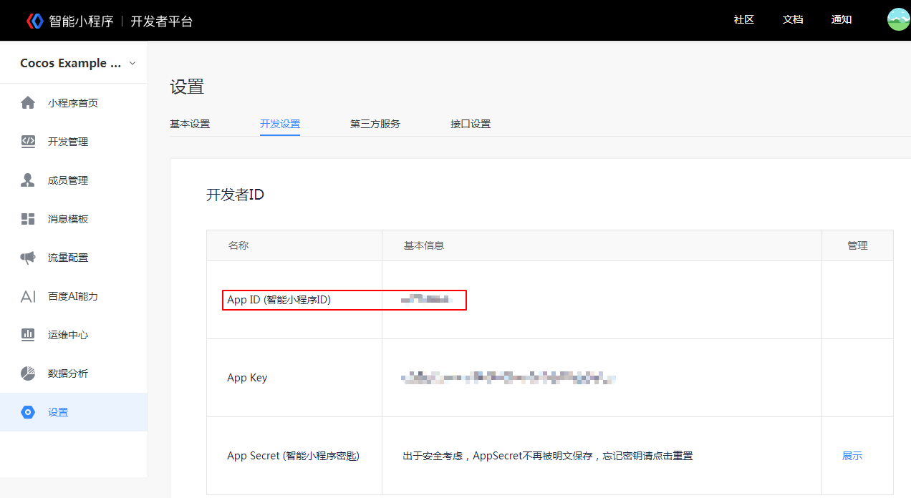
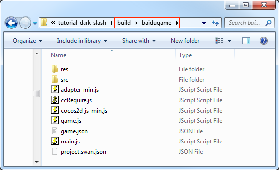

# Publish to Baidu Mini Games

The runtime environment of the **Baidu Mini Game** is an extension of the **Baidu Smart Mini Program**. This provides a WebGL interface encapsulation based on the mini program environment. This greatly improves the rendering capabilities and performance. However, since these interfaces are encapsulated by the Baidu team, they are not equivalent to the browser environment.

On the engine side, in order to make the developers' workload as easy as possible, our main tasks for developers include the following:

- The engine framework is adapted to the Baidu Mini Game API, pure game logic level, users don't need any additional modifications.
- **Cocos Creator** editor provides a fast packaging process, directly released as a **Baidu Mini Game**.
- Automatic loading of remote resources, cache resources and cache resource versioning.

For specific Baidu Mini Game application, station development, game submission, review and release process can refer to [Baidu Mini Game Developer Documentation](https://smartprogram.baidu.com/docs/game/).

## Prerequisites

- Download and install **Baidu Developer Tools** in [Baidu Developer Tools Documentation](https://smartprogram.baidu.com/docs/game/tutorials/howto/dev/).
- Download and install the **Baidu app** in the app store of your phone.
- Log in to [Smart Mini Progame Platform](https://smartprogram.baidu.com/developer/index.html) and find **App ID**.

    

## Release process

Select the **Baidu Mini Game** in the Platform of the **Build** panel, fill in the mini game **appid**, and then click **Build**.

### Configuration Options

The specific filling rules for the relevant options configuration are as follows:

- **Main Bundle Compression Type**

  Set the compression type of the main package, please refer to the [built-in Asset Bundle — `main`](../asset-manager/bundle.md#the-built-in-asset-bundle) documentation for details.

- **Main Bundle Is Remote**

  This option is optional and needs to be used with the **Resource Server Address** option. 
  If set, the main package is configured as a remote package, and along with its related dependent resources are built into a built-in Asset Bundle — [main](../asset-manager/bundle.md#the-built-in-asset-bundle) under the **remote** folder of the release package directory. You need to upload the entire **remote** folder to the remote server.

- **Start Scene Asset Bundle**

  This option is optional. 
  If set, the start scene and its related dependent resources are built into the built-in Asset Bundle — [start-scene](../asset-manager/bundle.md#the-built-in-asset-bundle) to speed up the resource loading of the start scene. Please refer to the [Start Scene Loading](#speed-up-the-loading-of-the-start-scene) for details.

- **Resource Server Address**

  This option is optional and used to fill in the address of the remote server where the resources are stored. You need to manually upload the **remote** folder from the release package directory to the filled resource server after build.

- **Open Data Context Root**

  This option is optional and used to access the [Open Data Context of Baidu Mini Games](publish-baidugame-sub-domain.md).

### Run the Preview

- After the build is completed, a Baidu Mini Game project folder of **baidugame** will be generated under the project's build directory, which already contains the configuration files of Baidu Mini Game's environment: `game.json` and `project.swan.json`.

  

- Use the **Baidu Developer Tools** to open the **baidugame** folder to preview and debug the game. About how ​​to use Baidu Developer Tools, please refer to [Baidu Developer Tools Documentation](https://smartprogram.baidu.com/docs/game/tutorials/howto/dev/) for details.

  

  **Note**: When previewing and debugging, if a prompt appears stating: `The current version of the developer tool can't publish mini program, please update to the latest developer tools`. This means the **appid** filled in the **Build** panel is the **appid** of the **Baidu Mini Program**, not the **appid** of the Baidu Mini Game, please re-apply for the **appid** of the Baidu Mini Game.

## Resource Management for Baidu Mini Game Environment

Baidu Mini Game is similar to the WeChat Mini Game. There are restrictions on the package size. Resources over **4MB** must be downloaded via a network request.

Cocos Creator already helps developers with downloading, caching and version management of remote resources. The specific implementation logic and operation steps are similar to the WeChat Mini game. Please refer to the [Resource Management for WeChat Mini Game](./publish-wechatgame.md#resource-management-for-the-wechat-mini-games) documentation for details.

**Note**: Currently, Baidu Mini Game only supports loading resources from remote server via **HTTPS** on the physical device, so the resource file must be placed on the **HTTPS** server, otherwise the resource loading failure will occur.

## Baidu Mini Game Subpackage Loading

The subpackage loading method of Baidu Mini Game is similar to WeChat, with the following package restrictions:

- The size of all subpackage of the entire Mini Game can not exceed **8MB**.
- The size of single subpackage / main package can not exceed **4MB**.

Please refer to the [Mini Game Subpackage](subpackage.md#wechat-mini-games) for details.

## Platform SDK Access

In addition to pure game content, the Baidu Mini Game environment also provides a very powerful native SDK interface, these interfaces are only exist in the Baidu Mini Game environment, equivalent to the third-party SDK interface of other platforms. The porting of such SDK interfaces still needs to be handled by developers at this stage. Here are some of the powerful SDK capabilities offered by Baidu Mini Game:

1. User interface: login, authorization, user information, etc.
2. Baidu cashier payment
3. Forwarding information
4. File upload and download
5. Other: images, locations, ads, device information, etc.

## Access to the Open Data Context of Baidu Mini Games

Similar to WeChat Mini Game, in order to protect its social relationship chain data, Baidu Mini Game also implements an **Open Data Context**, which can get friends information that is both playable and two-way attention. This is a separate game execution environment. The resources, engines, and programs in the **Open Data Context** are completely isolated from the main game. Developers can only access the `swan.getUserInfo()`, `swan.getUserCloudStorage()`, and `swan.getFriendCloudStorage()` APIs provided by Baidu Mini Games in the Open Data Context, which are used to obtain the corresponding user data.

For details about the Baidu Mini Game Open Data Context process, please refer to [Access Baidu Mini Game Open Data Context](./publish-baidugame-sub-domain.md).

## Baidu Mini Games known issues

Currently, the adaptation work of Baidu Mini Game is not completely finished, and the following components are not supported for the time being:

- VideoPlayer
- WebView

If needed, you can directly call Baidu's [API](https://smartprogram.baidu.com/docs/game/api/openApi/authorize/) as needed.

## Reference link

- [Baidu Mini Game Registration Guide](https://smartprogram.baidu.com/docs/game/)
- [Baidu Developer Tools documentation](https://smartprogram.baidu.com/docs/game/tutorials/howto/dev/)
- [Baidu Mini Game API documentation](https://smartprogram.baidu.com/docs/game/api/openApi/authorize/)
