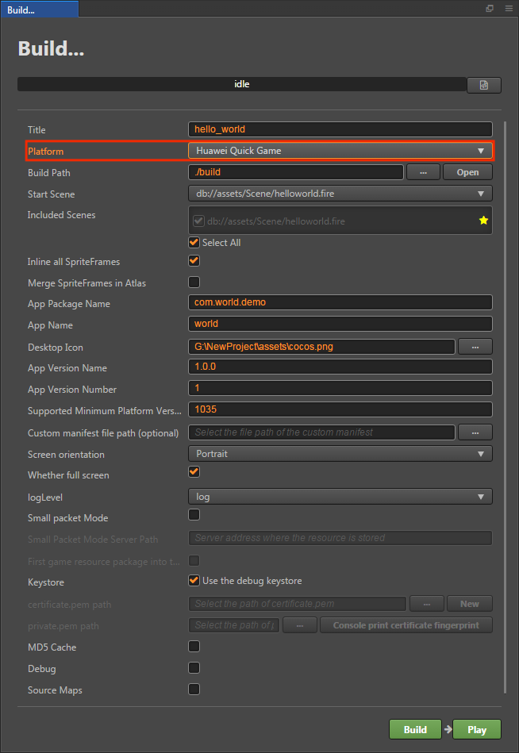
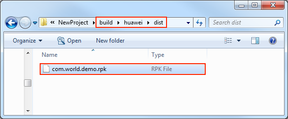
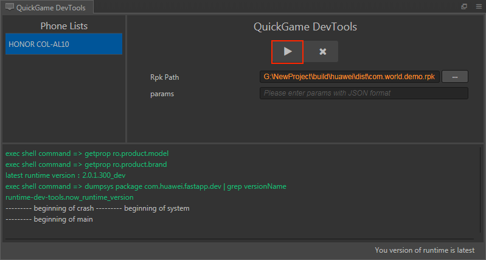

# Publish to Huawei Quick Games

## Environment Configuration

- Download [Huawei Quick APP Loader](https://developer.huawei.com/consumer/en/doc/development/quickApp-Guides/quickapp-installtool) and install it on your Android device (Android Phone 6.0 or above is recommended)

- Install [nodejs-8.1.4](https://nodejs.org/en/download/) or above, globally.

## Release Process

1. Use **Cocos Creator** to open the project that needs to be released. Select **Huawei Quick Game** in the **Platform** dropdown of the **Build...** panel.

    

The specific filling rules for the relevant parameter configuration are as follows:

- **App Package Name**

  **App Package Name** is filled in according to the user's needs. It's required.

- **App Name**

  **App Name**, the name of the Huawei Quick Game, is required. And the **Title** at the top of the **Build** panel does not participate in the Huawei Quick Game packaging process.

- **Desktop Icon**

  **Desktop Icon** is required. Click the **...** button at the back of the input box to select the icon you want. When building, the Desktop Icon will be built into the **Huawei Quick Game** project. Desktop Icon suggest using PNG pictures.

- **App Version Name**

  This item is required. **App Version Name** is the real version, such as: 1.0.0.

- **App Version Number**

  This item is required. **App Version Number** is different from the **App Version Name**, and the **App Version Number** is mainly used to distinguish the version update. Each time when you submit audit, the App version number is at least 1 higher than the value of the last submitted audit. It must not be equal to or less than the value of the last submitted audit, and it is recommended that the **App Version Number** be recursively incremented by 1 each time when the audit is submitted. **Note**: The **App Version Number** must be a positive integer.

- **Supported Minimum Platform Version Number**

  This item is required. According to the requirements of Huawei Quick Games, this value must be greater than or equal to **1035** at present.

- **Custom manifest file path (optional)**

  This is an optional item, which is the expansion function of Huawei Quick Game. When you use it, you need to select a json file, and the data type in the file is required to be in json format. **Note**: The json data is not available when the key value are `package`, `appType`, `name`, `versionName`, `versionCode`, `icon`, `minPlatformVersion`, `config`, `display`, otherwise it will be overwritten by data such as **App Package Name**, **App Name**, **Desktop Icon**, **App Version Name**, **pp Version Number** during the build.

- **Small Packet Mode**

  This item is optional. The in-package volume of the quick game contains code and resources that cannot exceed 10M, and resources can be loaded via network requests. **Small Packet Mode** is to help users keep the script files in the quick game package, other resources are uploaded to the remote server, and downloaded from the remote server as needed. And the download, cache and version management of remote resources, Cocos Creator has already done that for developers. What the developer needs to do are the following steps:

  1. When building, check the **Small Packet Mode** and fill in the **Small Packet Mode Server Path**.

  2. **First game resource package into the game package**, this item is optional (New in v2.1.3).

      In the Small Packet Mode, due to too many resources on the launch scene, downloading and loading resources for a long time may result in a short black screen when entering the game for the first time. If **First game resource package into the game package** is checked, you can reduce the black screen time when you first enter the game. However, it should be noted that the `res/import` resource does not support split resource downloading at this time, and the entire `import` directory is also packaged into the first package.
  
      Developers can choose whether to check this item according to their needs. Then click on **Build**.

  3. After the build is complete, click the **Open** button after the **Build Path** to upload the **huawei/res** directory under the release path to the packet mode server. For example, if the default publishing path is build, you need to upload the **build/huawei/res** directory.

  At this point, the **res** folder will no longer be included in the `.rpk` file which is generated after the build, and the resources in the **res** folder will be downloaded from the filled **Small Packet Mode Server Path** through the network request.

- **Keystore**

  When you check the **Keystore**, the default is to build the rpk package with a certificate that comes with Creator, which is used only for **debugging**. **Note**: When the rpk package is to be used to submit an audit, do not check the **Keystore** to build it.

  If you don't check the **Keystore**, you need to configure the signature files **certificate.pem path** and **private.pem path**, where you build a rpk package that you can **publish directly**. The user can configure two signature files by using the **...** button to the right of the input box. **Note**: These two signature files are not recommended to be placed in the **build/huawei** directory of the publish package, otherwise the build directory will be emptied each time when it is built, resulting in file loss.

  There are two ways to generate a signature files:

    - Generated by the **New** button after the **certificate.pem path** in the **Build** panel.

    - Generated by the command line.

      The user needs to generate the signature file **private.pem**, **certificate.pem** through tools such as **openssl**.

      ```bash
      # Generate a signature file with the openssl command tool
      openssl req -newkey rsa:2048 -nodes -keyout private.pem   -x509 -days 3650 -out certificate.pem
      ```

      **Note**: **openssl** can be opened directly in the terminal in Linux or Mac environment, and in the Windows environment you need to install `openssl` and configure system environment variables. Restart Creator after the configuration is complete.

- **Custom node folder path**

  This item is optional. Starting with **v2.0.10**, the global node of the operating system can be automatically obtained and without manual setting. The way to obtain node is:
  - **Windows**: Gets the path in the environment variable from the system.
  - **Mac**: Gets the path in the environment variable from the configuration file of Shell.

  If not, make sure the node is properly installed and can be started directly in the command line environment. The obtained node is used to provide an environment for building rpk. 

  The node filling rules below **v2.0.10** are as follows:

  - If you do not fill out this item, the Creator will read the node path in the environment variable by default on the Windows system, and the node in the **/usr/bin/local** directory is read by default on the Mac system to build the exported quick game rpk package that can be run.
  - If your PC environment does not have node installed or cannot read the node path in the system, you will need to fill out the **Custom node folder path** to build and exported rpk package. Fill in the rules as follows:

    - Windows system

      ```bash
      # Get local node folder path
      where node
      # If the output is
      C:\Program Files\nodejs\node.exe
      # Then the local node folder path is filled in as:
      C:\Program Files\nodejs
      ```

    - Mac system

      ```bash
      # Get local node folder path
      which node
      # If the output is
      /Users/yourname/.nvm/versions/node/v8.1.4/bin/node
      # Then the local node folder path is filled in as:
      /Users/yourname/.nvm/versions/node/v8.1.4/bin
      ```

**2. Build**

After the relevant parameters of the **Build** panel are set, click **Build**. After the build is complete, click the **Open** button behind the **Build Path** to open the build release package. You can see that the **huawei** directory is generated under the default release path `build` directory, which is the exported Huawei Quick Game project directory and **rpk**, **rpk** package are in the **/build/huawei/dist** directory.

  

**3. Run the built rpk to the phone**. There are two ways:

  - Click the **Play** button in the bottom right corner of the **Build** panel to bring up a **QuickGame DevTools** panel. Select the Android device in the **Phone Lists** column (if multiple Android devices are connected), and then click the **Run** button in the **QuickGame DevTools** column.

    At this time, rpk will be pushed to the previously installed **Huawei Quick APP Loader** (If there is a permission box, please click allow), and then rpk can be opened on the Android device.

    

  - Copy the rpk package generated by the build to the **sdcard** directory of the Android device. Open the **Huawei Quick APP Loader** that has been installed before, clicking the back button on the Android device will bring up a list, select the **Local Install**, select the path of place rpk, and then you can run the rpk on the Android device.

**4. Subpackage rpk**

Subpackage rpk can be used according to your needs. 

Subpackage loading, that is, splitting the game content into several packages according to certain rules, only downloading the necessary packages when starting up for the first time. This necessary package is called **main package**. And the developer can trigger in the main package to download other sub-packages, which can effectively reduce the time spent on the first boot. To use this function, you need to set [Subpackage Configuration](../scripting/asset-bundle.md) in **Cocos Creator**, and the package will be automatically subpackaged when the setting is completed.

After the build is complete, the generated subpackages and main package are merged into one rpk, which is in the `/build/huawei/dist` directory.

## Related Reference Links

[Huawei Quick Game development documentation](https://developer.huawei.com/consumer/en/doc/development/quickApp-Guides/quickgame-develop-runtime-game)
